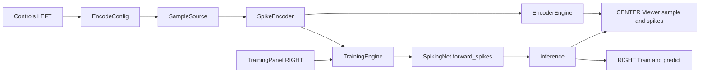

# SNN Interpreter — Left → Center → Right Integration Plan

Design/spec only. **No production code is changed by this document.** Every recommendation below is grounded in the current source (file/line references included). A Code-mode agent should be able to execute this file-by-file without further interpretation.

---

## 1. Goal, scope, non-goals

### Goal
Make **one selected sample** flow LEFT → CENTER → RIGHT through a single shared pipeline:

- LEFT chooses `dataset`, `sample_index`, and spike-encoding settings.
- CENTER renders the raw sample, its encoded spike frames/raster, and (when a model exists) the network's own hidden/output layer activity.
- RIGHT trains / loads a checkpoint and shows the prediction and per-class output-spike activity **for that same displayed sample**.

The left-hand coding controls (`gain`, `tau`, `threshold`, `delta_threshold`, `coding`, `num_steps`, `vector_value`, `clip`, `normalize`, `linear`) become **real training and inference hyperparameters**, not a standalone animation.

### Non-goals / deferred
- No new network architectures or layer types (still FC `28*28 → hidden → classes`).
- No convolutional or recurrent structural changes.
- No per-step hidden-layer *animation* streaming during `run` (raster snapshots are enough). Deferred.
- No change to the exported matplotlib artifacts' look/feel.
- No multi-user session sharing.

---

## 2. Current state (grounded facts)

| Concern | Current reality | Anchor |
|---|---|---|
| Encoder factory | `EncoderEngine(config)` builds `SSNTrainer` / `LatencyTrainer` / `DeltaTrainer` / `RandomSpikeGenerator` | [`server/encoder.py`](server/encoder.py:18), [`_build_trainer()`](server/encoder.py:120) |
| Encoder dataset | Hard-coded MNIST via `trainer.SSNTrainer`; `EncodeConfig.dataset` ignored | [`server/encoder.py`](server/encoder.py:130) |
| Encoder sample | `sample_image()` uses `sample_index`; spikes/raster always use batch index `0` | [`EncoderEngine.spike_frame()`](server/encoder.py:47), [`_spike_sample_matrix()`](server/encoder.py:108) |
| Delta source | Hard-coded `[0,1,0,2,8,-20,20,-5,0,1,0]` | [`delta_trainer.py`](snn_interpreter/delta_trainer.py:19) |
| Random source | Pure noise, `(num_steps, 28, 28)` | [`random_spikegen.py`](snn_interpreter/random_spikegen.py:22) |
| Trainer input | Raw normalized pixels, re-applied every step | [`SpikingNet.forward()`](snn_interpreter/spiking_net.py:23), [`_train_batch()`](snn_interpreter/training_engine.py:120) |
| Training dataset | Registry via `build_loader` → `build_dataset` | [`build_loader()`](snn_interpreter/training_engine.py:16), [`datasets.build_dataset()`](snn_interpreter/datasets.py:52) |
| Training sample | Shuffled loader; unrelated to encoder sample | [`TrainingEngine.train()`](snn_interpreter/training_engine.py:100) |
| Inference | Held-out batch of 32, not the displayed sample | [`predict_sample()`](snn_interpreter/training_engine.py:138) |
| Checkpoint meta | `dataset, hidden, beta, lr, num_steps, num_classes` (no input mode) | [`TrainingEngine.save()`](snn_interpreter/training_engine.py:60) |
| Protocol | JSON WS; `ClientMessage`/`ServerMessage` unions | [`schemas.py`](server/schemas.py:46), [`types.ts`](client/src/types.ts:127) |
| Stream | `spike_frame` per step, no `source` field | [`messages.emit_frame()`](server/messages.py:75) |
| Style limits | Python files < 200 lines, functions < 20 lines, one class per file | convention |

### Exporter compatibility surface (must not break)
`*_exporter.py` read these trainer attributes/properties: `spike_data`, `spike_data_low_gain`, `spike_targets`, `input_data`, `rate_coded_vector`, `subset_size`, `data_size`, `num_steps`, `interval`, `gain` ([`SSNTrainer`](snn_interpreter/trainer.py:106)); `latency_data`, `latency_targets`, `latency_input`, `tau`, `threshold`, `latency_steps` ([`LatencyTrainer`](snn_interpreter/latency_trainer.py:66)); `data`, `spike_data`, `spike_data_off`, `threshold`, `off_spike` ([`DeltaTrainer`](snn_interpreter/delta_trainer.py:34)); `spike_rand`, `num_steps`, `size`, `scale` ([`RandomSpikeGenerator`](snn_interpreter/random_spikegen.py:28)).

**Invariant:** the four trainer classes keep their constructor defaults, positional compatibility (`main_encodings.py` calls `LatencyTrainer(animation_interval=100)`, `DeltaTrainer()`, `RandomSpikeGenerator(num_steps=100)`), and full property surface. The server stops *using* them, but they remain importable and unchanged in behavior.

---

## 3. Target architecture



Core idea: **`SpikeEncoder` is the single source of truth for encoding math.** Both the viewer (`EncoderEngine`) and training/inference (`TrainingEngine`) call it. Nothing else re-implements rate/latency/delta/random.

---

## 4. Design decisions and invariants

1. **One encoding function, two consumers.** `SpikeEncoder.encode_image()` feeds the viewer; `SpikeEncoder.encode()` feeds training batches. Same code path ⇒ identical normalization.
2. **One transform.** All datasets go through [`datasets.transform()`](snn_interpreter/datasets.py:31) via [`build_dataset()`](snn_interpreter/datasets.py:52). `SampleSource` and `build_loader` both use it; no per-class transforms.
3. **One selected dataset + sample.** `EncodeConfig.dataset` and `EncodeConfig.sample_index` are authoritative. Training consumes the same `dataset` (the trainer learns on all samples; the *displayed* sample is what inference scores).
4. **Spikes into the network.** The model consumes `(time, batch, features)` spike tensors. Legacy raw-pixel behavior is preserved through a delegation shim so old checkpoints and `main.py` keep working.
5. **`num_steps` flows from the encoder.** For spike input, `T = encode.num_steps = spikes.shape[0]`; `TrainConfig.num_steps` is retained only for legacy raw mode.
6. **Back-compat via `input_mode`.** New checkpoints store `input_mode = coding`. Missing field ⇒ `"raw"`.
7. **Smallest cohesive change.** New small modules; minimal splices into existing files; no architecture growth.

---

## 5. Required design contents

### 5.1 Shared data layer (dataset + sample index)

**New module `snn_interpreter/sample_source.py`** — one class per file:

```python
class SampleSource:
    def __init__(self, dataset="mnist", train=True, download=True):
        self._data = build_dataset(dataset, train=train)
        self._dataset = dataset
    def clamp(self, index) -> int: ...          # wrap/limit into [0, len)
    def image(self, index) -> Tensor: ...       # build_dataset applies transform() -> [1,28,28] in [0,1]
    def label(self, index) -> int: ...
    def __len__(self) -> int: ...
    @property
    def size(self) -> tuple: return (28, 28)
    @property
    def dataset(self) -> str: return self._dataset
```

- Uses the registry ⇒ honors `EncodeConfig.dataset` and fixes the MNIST-only encoder.
- `transform()` yields grayscale 28×28 in `[0,1]` — the range `spikegen.latency`/`delta` expect.

**`EncoderEngine` generalization** — [`server/encoder.py`](server/encoder.py:18) is rewritten to build `SampleSource` + `SpikeEncoder` instead of trainer classes:

```python
class EncoderEngine:
    def __init__(self, config: EncodeConfig):
        self._config = config
        self._source = SampleSource(config.dataset)
        self._index = self._source.clamp(config.sample_index)
        self._encoder = SpikeEncoder.from_encode_config(config)
        self._image = self._source.image(self._index)          # [1,28,28]
        self._spikes = self._encoder.encode_image(self._image)  # [T,1,784]
```

The existing method names consumed by [`server/messages.py`](server/messages.py:12) stay: `sample_image()`, `reconstruction()`, `spike_frame(step)`, `raster()`, `num_steps()`, `target_label()`. New methods: `sample_label()`, `sample_index()`, `spike_input()`.

**Sample selection (index / next / prev):**
- Left `Controls` renders `dataset` dropdown + `sample_index` numeric/prev/next.
- Prev/next compute `(index ± 1)` and send a new `select_sample` message (Section 5.7).
- `handle_select_sample` rebuilds the engine and re-pushes static payloads; if a model is loaded it also re-runs inference (so all three columns move together).
- Navigation range is `[0, len(SampleSource))`; `subset` still only limits the training loader.

**Shared sample between encoder and trainer:** training is intentionally over the dataset (shuffled loader); the *displayed* sample is passed explicitly to inference. Both draw from the same `dataset` + `transform()`, so the encoding is consistent.

### 5.2 Spike-encoded inputs into the network

**New module `snn_interpreter/spike_encoder.py`** — one class per file:

```python
class SpikeEncoder:
    def __init__(self, coding="rate", num_steps=100, gain=0.25, vector_value=0.5,
                 tau=5.0, threshold=0.01, clip=False, normalize=True, linear=True,
                 delta_threshold=4.0, random_scale=0.5, seed=None): ...
    @classmethod
    def from_encode_config(cls, cfg) -> "SpikeEncoder": ...
    def encode(self, images) -> Tensor: ...        # [T, B, 784]
    def encode_image(self, image) -> Tensor: ...   # [T, 1, 784]
    @property
    def num_steps(self) -> int: ...
    @property
    def coding(self) -> str: ...
    def _rate(self, images) -> Tensor: ...         # spikegen.rate(gain=1.0)
    def _latency(self, images) -> Tensor: ...      # spikegen.latency(tau, threshold, clip, normalize, linear)
    def _delta(self, images) -> Tensor: ...        # sample-derived ramp, see 5.6
    def _random(self, images) -> Tensor: ...       # noise baseline, see 5.6
```

All encoders return **`[T, B, 784]`** float tensors (`[T,B,1,28,28]` reshaped). `num_steps` is the encoder's `num_steps`.

**`SpikingNet` change** — [`snn_interpreter/spiking_net.py`](snn_interpreter/spiking_net.py:23). Add a spike path and keep the raw path as a delegation shim (no callers break):

```python
def forward(self, x, num_steps):
    """Legacy raw-pixel path: repeat the static frame, identical to old behavior."""
    frames = x.view(x.size(0), -1).unsqueeze(0).repeat(num_steps, 1, 1)  # [T,B,F]
    return self.forward_spikes(frames)

def forward_spikes(self, spikes, track=False):
    """Consume [T,B,F] (or [T,B,C,H,W]) spikes, re-injecting frame t each step."""
    frames = spikes.reshape(spikes.size(0), spikes.size(1), -1)
    mem1 = self._lif1.init_leaky()
    mem2 = self._lif2.init_leaky()
    out_sum = torch.zeros(spikes.size(1), self._num_classes)
    hidden, output = [], []
    for t in range(frames.size(0)):
        spk1, mem1, spk2, mem2 = self._step(frames[t], mem1, mem2)
        out_sum = out_sum + spk2
        if track:
            hidden.append(spk1); output.append(spk2)
    return self._pack(out_sum, frames.size(0), hidden, output, track)

def _step(self, x_t, mem1, mem2): ...     # <= 4 lines: fc1/lif1 then fc2/lif2
def _pack(self, out_sum, steps, hidden, output, track): ...
```

- `track=False` returns `out_sum / steps` (a tensor — same contract as today).
- `track=True` returns `{"logits":..., "hidden":[T], "output":[T], "steps":T}`.
- `forward(x, num_steps)` reproduces the old static-pixel semantics exactly, so legacy raw checkpoints still infer correctly.

**`TrainingEngine` change** — [`snn_interpreter/training_engine.py`](snn_interpreter/training_engine.py:24):

```python
def __init__(self, ..., num_steps=10, subset=10, batch_size=64,
             checkpoint=None, encode=None, input_mode=None):
    self._encode = encode
    self._encoder = SpikeEncoder.from_encode_config(encode) if encode else None
    self._input_mode = "raw"          # overwritten by checkpoint meta
    ...
    if checkpoint:
        self._restore(checkpoint)     # sets _input_mode from meta

def _encode_batch(self, inputs) -> Tensor:      # [T,B,784]; raw mode repeats pixels
def _train_batch(self, inputs, targets):
    spikes = self._encode_batch(inputs)
    outputs = self._net.forward_spikes(spikes)
    loss = F.cross_entropy(outputs, targets)
    ...
def predict(self, inputs):
    outputs = self._net.forward_spikes(self._encode_batch(inputs))
    return outputs.argmax(dim=1)
```

- `_input_mode` resolution order: explicit `input_mode` arg → checkpoint `meta["input_mode"]` → `"raw"` (legacy) → otherwise `encode.coding` for new trainings.
- `num_steps` provenance: for spike mode, `T` comes from `self._encoder.num_steps` (i.e. `EncodeConfig.num_steps`); for `"raw"` mode, from `self._num_steps` (checkpoint meta / `TrainConfig.num_steps`).
- Move [`build_loader()`](snn_interpreter/training_engine.py:16) into a new **`snn_interpreter/data_loader.py`** so `training_engine.py` stays under 200 lines.

### 5.3 Inference on the displayed sample

**New module `snn_interpreter/inference.py`** (functions, kept small):

```python
def infer_spikes(net, spikes, num_classes, true_label=None, coding="rate") -> dict:
    result = net.forward_spikes(spikes, track=True)
    logits = result["logits"][0]
    probs = torch.softmax(logits, dim=0)
    class_spikes = _class_totals(result["output"])       # [num_classes]
    return {
        "predicted": int(logits.argmax()),
        "confidence": float(probs.max()),
        "true_label": None if true_label is None else int(true_label),
        "class_spikes": [float(x) for x in class_spikes],
        "output_over_time": _over_time(result["output"]),  # [T][num_classes]
        "coding": coding,
        "num_steps": int(result["steps"]),
    }

def layer_raster(frames, max_neurons) -> dict:  # [T,B,N] -> {time,neurons,num_steps,num_neurons}
```

- `confidence` = softmax max over time-averaged output spikes.
- `class_spikes` = per-class output spike **totals over time** for the displayed sample (length `num_classes`).

**Host-side entry point** (`server/training.py`):
```python
def infer(self, spikes, true_label=None) -> dict:
    engine = self._engine
    return inference.infer_spikes(engine.net, spikes, engine.num_classes, true_label, engine.input_mode)
```
(the `TrainingEngine` gains an `infer(spikes, true_label=None)` wrapper and a `num_classes` property).

**WS action & payload** — new client message `"infer"`:

```jsonc
{ "type": "infer", "config": EncodeConfig, "train": TrainConfig }
```
Server (`handle_infer`): require a trained/loaded engine; take `spikes = session.engine.spike_input()` (the displayed sample under current coding); call `session.training.infer(spikes, session.engine.sample_label())`; attach `input_mode`, `dataset_match`; send `inference` + activity rasters.

`inference` payload:
```jsonc
{
  "predicted": 7,
  "confidence": 0.91,
  "true_label": 7,
  "class_spikes": [3,0,0,0,0,1,0,18,0,2],
  "output_over_time": [[...10 floats] ... T rows],
  "coding": "rate",
  "input_mode": "rate",
  "num_steps": 25,
  "dataset_match": true
}
```

**Frontend overlay:** `App` stores `inference`; `ViewerPanels` overlays predicted/true badge on the input sample and the output raster; `TrainingPanel` shows predicted vs true and the per-class spike bars **for the displayed sample** (replacing the old held-out-batch `prediction` flow — see 5.8).

### 5.4 Network-activity panels

Reuse the existing message kinds with a `source` field rather than adding many new kinds:

- `raster` message gains optional `source: "input" | "hidden" | "output"` (default `"input"`).
- `spike_frame` message gains optional `source: "input" | "hidden"` (default `"input"`); per-step hidden frame streaming is **deferred**.
- Payload struct `RasterPayload` unchanged (`{time, neurons, num_steps, num_neurons}`), so [`RasterCanvas`](client/src/components/RasterCanvas.tsx:12) is reused as-is.

Server emits on `infer`:
1. `raster` `source="input"` (already sent by `send_initial`).
2. `raster` `source="hidden"` from `result["hidden"]`, truncated to `max_neurons` (default 256 = `hidden`).
3. `raster` `source="output"` from `result["output"]`, neurons = `num_classes`.
4. `inference` with `class_spikes` + `output_over_time`.

Frontend holds three raster slots; `ViewerPanels` renders “Input spikes”, “Hidden layer”, “Output layer” stacked (each only when present). Truncation matches the existing `max_neurons=784` policy to keep JSON small.

### 5.5 Checkpoint / config coupling and back-compat

**`TrainingEngine.save()` meta** ([`training_engine.py`](snn_interpreter/training_engine.py:60)) gains:

```python
meta = {
    "dataset", "hidden", "beta", "lr", "num_steps", "num_classes",
    "input_mode": self._input_mode,          # "raw" or coding
    "coding": self._coding,                  # convenience mirror
    "encode": self._encode.model_dump() if self._encode else None,
}
```

**Back-compat / migration:**
- Existing `.pt` files have no `input_mode` ⇒ `_restore` sets `self._input_mode = "raw"` and `TrainingEngine._encode_batch` repeats normalized pixels across `num_steps` (old behavior).
- `model_store._describe()` ([`model_store.py`](snn_interpreter/model_store.py:60)) is extended to copy `meta.get("input_mode", "raw")` and `meta.get("coding", "raw")` into the summary so the list can label each checkpoint (“trained on raw pixels”, “trained on rate coding”).
- `model_loaded` payload adds `input_mode`, `coding`, `hidden`, `beta`, `num_steps`, `meta`, and a `compatibility` object:
```jsonc
"compatibility": { "dataset_match": true, "coding_match": false,
                   "expected_input_mode": "rate", "current_coding": "latency" }
```
- **UI behaviour:** when `coding_match` is false or `expected_input_mode == "raw"`, `TrainControls`/`TrainingPanel` shows a banner (e.g. “Checkpoint trained under rate coding — encoding controls are ignored for legacy raw checkpoints”). `Predict`/`Infer` is disabled when `dataset_match` is false and class counts differ (would be shape-unsafe). Otherwise infer is allowed with a warning.

### 5.6 Delta and random on real signal

**Delta (sample-derived, trainable).** `SpikeEncoder._delta(images)`:
```python
pixels = images.reshape(images.size(0), -1)                    # [B,784] in [0,1]
ramp = torch.linspace(0, 1, self._num_steps).view(T, 1, 1) * pixels.unsqueeze(0)
spikes = spikegen.delta(ramp, threshold=self._delta_threshold / 100.0)  # [T,B,784]
```
- Rationale: a static image becomes a per-pixel intensity ramp; `spikegen.delta` emits an on-spike when a pixel's change crosses `delta_threshold/100` per step ⇒ brighter pixels spike earlier. Uses the real sample, produces a trainable `[T,784]` tensor, and reuses the existing `delta_threshold` control (UI 1–10 ⇒ 0.01–0.10 intensity delta).
- The half-scale `/100` is the documented normalization contract between the `[0,1]` transform and the `1–10` UI range.
- `off_spike` is retained for **display only** (produce a second signed tensor for the delta raster); the network consumes the on-spike binary tensor. The `DeltaTrainer` fake tensor stays for `main_encodings.py`; the server no longer uses it.
- Alternative explicitly deferred: a scanline (row-scan) 1-D delta for a more “event-camera” look.

**Random (noise baseline).** `SpikeEncoder._random(images)` produces `spikegen.rate_conv(rand * random_scale)` at `[T,B,784]`, ignoring sample content.
- Presented in the UI as **“Noise baseline (no sample signal)”**, next to the sample so users see the sample is not used.
- Guard: training with `coding="random"` is disallowed (returns an `error` message) because the input carries no label-bearing signal; random remains a display-only baseline. `RandomSpikeGenerator` stays for `main_encodings.py`.

### 5.7 Protocol / API changes (exhaustive)

#### `server/schemas.py`
| Symbol | Change |
|---|---|
| `EncodeConfig` | Add `random_seed: Optional[int] = None`. Existing `dataset`, `sample_index`, `coding`, `num_steps`, `gain`, `tau`, `threshold`, `vector_value`, `clip`, `normalize`, `linear`, `delta_threshold`, `random_scale`, `interval_ms` all flow into `SpikeEncoder`. |
| `TrainConfig` | Add `encode: EncodeConfig = Field(default_factory=EncodeConfig)`. Keep `num_steps`/`dataset` for legacy raw mode (documented precedence: `encode.num_steps` wins in spike mode; `dataset` is mirrored from `encode.dataset`). |
| `ClientMessage.type` | Add `"infer"` and `"select_sample"`. |
| `ServerMessage.type` | Add `"inference"`. |
| `ServerMessage` | Add `source: Optional[str] = None` (for `raster`/`spike_frame`). |

#### `server/messages.py`
| Function | Change |
|---|---|
| `emit_frame(ws, session, engine, step, source="input")` | Add `source`; include it in the message. |
| `send_inference(ws, session, result)` | **New** — sends `{type:"inference", payload: result}`. |
| `send_activity(ws, session, result)` | **New** — sends `raster` messages with `source="hidden"` and `source="output"`. |
| `send_initial(...)` | Unchanged call list; `raster` now carries `source="input"`. |
| `send_status(...)` | Add `dataset`, `sample_index`, `true_label` to the payload. |

#### `server/handlers.py`
| Function | Change |
|---|---|
| `handle_infer(ws, session, cfg)` | **New** — require engine; `spikes = session.engine.spike_input()`; `result = session.training.infer(spikes, session.engine.sample_label())`; add `input_mode`, `dataset_match`; `send_inference` + `send_activity`. |
| `handle_select_sample(ws, session, cfg)` | **New** — `session.set_engine(EncoderEngine(cfg))`; `send_initial`; if a model exists, `handle_infer`. |
| `handle_configure(...)` | After `send_initial`, if `session.training.engine` is set, call `handle_infer` so CENTER/RIGHT stay in sync. |
| `handle_train(...)` | Pass the encode settings: `session.training.start(cfg, message.encode)`. |
| `handle_predict(...)` | Repoint to the displayed sample: delegate to `handle_infer` (keeps the button working) rather than held-out batch. |
| `dispatch(...)` | Add `elif message.type == "infer"` and `elif message.type == "select_sample"`. |

#### `server/session.py`
| Symbol | Change |
|---|---|
| `Session` | Store the last `EncodeConfig` (`self._encode_config`) via `set_engine`/`set_config`; expose `encode_config` property so `handle_infer` can build payload context. No new concurrency primitives. |

#### `server/training.py`
| Function | Change |
|---|---|
| `TrainingService.start(config, encode)` | Accept `encode`; pass into `TrainingEngine(..., encode=encode)`. |
| `TrainingService.adopt(checkpoint, config, encode)` | Accept `encode`; pass through. |
| `TrainingService.infer(spikes, true_label=None)` | **New** — delegate to the engine. |
| `TrainingService.input_mode` | **New** property. |

#### `client/src/types.ts`
| Symbol | Change |
|---|---|
| `EncodeConfig` | Add `random_seed: number | null`. |
| `RasterPayload` | Add `source?: "input" | "hidden" | "output"`. |
| `TrainConfig` | Add `encode: EncodeConfig`. |
| `ServerMsg` | Add `source?: string` to the `raster` and `spike_frame` members; add `{ type: "inference"; payload: InferencePayload }`. |
| `InferencePayload` | **New** — `{predicted, confidence, true_label, class_spikes, output_over_time, coding, input_mode, num_steps, dataset_match}`. |
| `ModelLoadedPayload` | Add `input_mode`, `coding`, `hidden`, `beta`, `num_steps`, `meta`, `compatibility: {dataset_match, coding_match, expected_input_mode, current_coding}`. |
| `StatusPayload` | Add `dataset`, `sample_index`, `true_label`. |
| `defaultTrainConfig` | Add `encode: defaultConfig`. |

No changes to `ClientMessage` TS — outbound payloads are plain objects in [`useWebSocket.ts`](client/src/useWebSocket.ts:28).

### 5.8 Frontend wiring

- **`Controls.tsx`** ([`Controls.tsx`](client/src/components/Controls.tsx:75)) gains: dataset `<select>` (from the catalog sent in `model_list`), `sample_index` numeric field + ◀/▶ prev/next buttons, and a “Noise baseline” label when `coding==="random"`. Dataset selection moves here (LEFT) so there is one dataset source of truth.
- **`TrainControls.tsx`** ([`TrainControls.tsx`](client/src/components/TrainControls.tsx:59)): dataset is shown read-only (mirrors `config.encode.dataset`); `num_steps` is shown read-only (mirrors `config.encode.num_steps`) with a note that the encoder controls the network time steps; add the input-mode/legacy-checkpoint banner.
- **`App.tsx`** ([`App.tsx`](client/src/App.tsx:39)): `ViewerState` adds `hiddenRaster`, `outputRaster`, `inference`; `handleMessage` routes `raster`/`spike_frame` by `source`; add `infer()` (sends `"infer"` with the current encode + train config) and `selectSample(index)` (patches `config.sample_index` then sends `"select_sample"`); `train()` sends `{...trainConfig, dataset: config.dataset, encode: config}`.
- **`useTraining.ts`** ([`useTraining.ts`](client/src/useTraining.ts:46)): handle `"inference"` → store `inference`; keep `model_list`/`model_loaded`; remove reliance on `"prediction"` for the displayed-sample flow.
- **`ViewerPanels.tsx`** ([`ViewerPanels.tsx`](client/src/components/ViewerPanels.tsx:13)): props add `hiddenRaster`, `outputRaster`, `inference`; render “Hidden layer” and “Output layer” `RasterCanvas` panels when present, plus a pred/true badge over “Input sample”.
- **`TrainingPanel.tsx`** ([`TrainingPanel.tsx`](client/src/components/TrainingPanel.tsx:33)): replace the held-out “Predictions” panel with a displayed-sample panel: predicted vs true, confidence, and `ClassSpikeBars`.
- **New `client/src/components/ClassSpikeBars.tsx`**: small canvas bar chart of `class_spikes` (one bar per class, highlighted predicted/true). Reuses `LineChart` styling conventions; no new dependencies.
- **`helpText.ts`**: add strings for `dataset`, `sample_index`, `input_mode`, and the compatibility banner.

---

## 6. File-by-file change plan

### New files
| File | Contents |
|---|---|
| `snn_interpreter/sample_source.py` | `class SampleSource` — dataset-backed `image/label/clamp/len/size/dataset`; uses `build_dataset` + `transform`. |
| `snn_interpreter/spike_encoder.py` | `class SpikeEncoder` — `from_encode_config`, `encode`, `encode_image`, `_rate`, `_latency`, `_delta`, `_random`; returns `[T,B,784]`. |
| `snn_interpreter/data_loader.py` | `build_loader(dataset, subset, batch_size, train)` (moved out of `training_engine.py`). |
| `snn_interpreter/inference.py` | `infer_spikes(net, spikes, num_classes, true_label, coding)`, `layer_raster(frames, max_neurons)`, `_class_totals`, `_over_time`. |
| `client/src/components/ClassSpikeBars.tsx` | Per-class output-spike bar visualization. |

### Modified files
| File | Changes |
|---|---|
| `snn_interpreter/spiking_net.py` | Add `forward_spikes`, `_step`, `_pack`; rewrite `forward` to delegate (repeat frames). Keep properties. |
| `snn_interpreter/training_engine.py` | Add `encode`/`input_mode`; `_encode_batch`; use `forward_spikes` in `_train_batch`/`predict`; add `infer`, `num_classes`, `input_mode`, `coding`; extend `save` meta; `_restore` reads `input_mode`; import `build_loader` from new module. |
| `snn_interpreter/model_store.py` | `_describe` copies `input_mode`/`coding` from meta. |
| `snn_interpreter/trainer.py` | Optional: add `dataset="mnist"` kwarg routed through `build_dataset` (keeps parity for tutorials/exporters). Defaults unchanged. |
| `server/encoder.py` | Rewrite `EncoderEngine` on `SampleSource` + `SpikeEncoder`; drop trainer imports; add `sample_index`, `sample_label`, `spike_input`; keep existing method names/signatures. |
| `server/schemas.py` | Per Section 5.7. |
| `server/messages.py` | `emit_frame(..., source)`, `send_inference`, `send_activity`, `send_status` fields. |
| `server/handlers.py` | `handle_infer`, `handle_select_sample`; `handle_configure`/`handle_train`/`handle_predict` updates; `dispatch` branches. |
| `server/session.py` | Store `encode_config`. |
| `server/training.py` | Thread `encode` through `start`/`adopt`; add `infer`, `input_mode`. |
| `client/src/types.ts` | Per Section 5.7. |
| `client/src/useWebSocket.ts` | Add `sendInfer(config, train)` and reuse `send("select_sample", config)`. |
| `client/src/App.tsx` | Source-routed rasters, `inference` state, `infer()`, `selectSample()`, pass `encode` to training. |
| `client/src/useTraining.ts` | Handle `inference`; store it. |
| `client/src/components/Controls.tsx` | Dataset + sample index + noise-baseline label. |
| `client/src/components/TrainControls.tsx` | Read-only dataset/num_steps from encode config; compatibility banner. |
| `client/src/components/ViewerPanels.tsx` | Hidden/output rasters + pred/true overlay. |
| `client/src/components/TrainingPanel.tsx` | Displayed-sample prediction + `ClassSpikeBars`. |
| `client/src/helpText.ts` | New help strings. |
| `client/src/styles.css` | Banner + bar styles. |

**Line-budget note:** every new class is in its own file; `SpikeEncoder` methods stay under 20 lines by keeping each coding as a one-liner wrapper around `spikegen`. `training_engine.py` loses `build_loader` and gains `infer`, staying < 200 lines. If `server/encoder.py` or `server/handlers.py` approaches 200 lines, split payload assembly into `server/payloads.py` and model routing into `server/model_handlers.py` (both listed as optional).

---

## 7. Phasing / milestones

### M1 — Shared data layer
Build `SampleSource`, `SpikeEncoder`, `data_loader`; rewrite `EncoderEngine`; add `select_sample`.
**Acceptance:** configuring `dataset="fashion"`, `sample_index=7` returns the fashion sample image and non-empty spikes/raster; changing coding changes the raster; `select_sample` re-renders without restarting the server; `EncodeConfig.dataset` is honored (no MNIST hard-coding).

### M2 — Spike-input training
Add `SpikingNet.forward_spikes` + delegation; encode batches in `TrainingEngine`; extend `save` meta with `input_mode`/`coding`/`encode`.
**Acceptance:** a 1-epoch `mnist` run shows decreasing loss; the saved checkpoint meta has `input_mode` equal to the chosen coding; loading a checkpoint with no `input_mode` sets `"raw"` and training/inference still runs; `main.py` and `main_encodings.py` still execute (exporters unchanged).

### M3 — Inference + activity streams
Add `inference.infer_spikes`, `TrainingService.infer`, `handle_infer`, `send_inference`, `send_activity`; add `source` to rasters.
**Acceptance:** `infer` on the displayed sample returns `predicted`, `confidence` in [0,1], `class_spikes` of length `num_classes`, and `output_over_time` of shape `[T][num_classes]`; WS receives `inference`, plus `raster` messages with `source="hidden"` and `source="output"`; dataset mismatch is reported via `dataset_match`.

### M4 — Frontend wiring
LEFT dataset/sample controls; CENTER hidden/output panels + pred badge; RIGHT displayed-sample prediction + `ClassSpikeBars`; compatibility banner.
**Acceptance:** pressing ▶/◀ or changing the dataset updates sample, spike raster, hidden/output rasters, and prediction together; loading a legacy raw checkpoint shows the banner; loading a rate checkpoint while `coding="latency"` warns and disables infer on dataset mismatch.

### M5 — Verification
Cross-check style and compatibility.
**Acceptance:** every Python file < 200 lines and every function < 20 lines; `python -m server` serves and the WS round-trip for `configure`/`run`/`train`/`infer`/`load_model` succeeds; `python main.py` and `python main_encodings.py` still produce exporter output; the TypeScript client builds with no type errors (union covers all emitted `type` strings).

---

## 8. Risks and deferred items

- **Memory:** `SpikeEncoder.encode` for a full batch at high `num_steps` is large (`T×B×784`). Training encodes per batch (small); the viewer encodes a single sample. Keep `interval_ms` streaming as-is.
- **Legacy raw checkpoints:** inference feeds repeated normalized pixels; they cannot benefit from encoding controls. Explicitly surfaced in the UI, not silently mixed.
- **Delta semantics:** the ramp design is an intentional teaching approximation; the scanline/camera alternative is deferred.
- **`num_steps` duplication:** `TrainConfig.num_steps` is retained only for raw mode; the UI mirrors `encode.num_steps` to avoid two competing controls.
- **Deferred:** per-step hidden-frame animation during `run`; scanline delta; any convolutional feature extractor.
