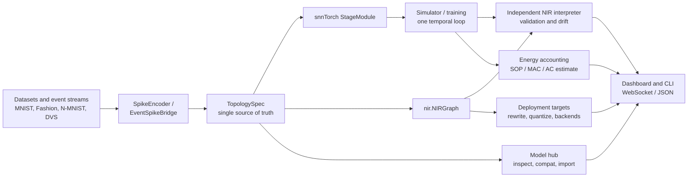

# snn-interpreter

A rate-coding and spike-encoding playground for spiking neural networks
(SNNs), built on [snnTorch](https://snntorch.readthedocs.io/) and PyTorch.
It loads MNIST subsets, converts samples into **rate**, **latency**, and
**delta** spike codes (plus random spike generation), and renders them
through matplotlib exports and a live **browser dashboard** served by
FastAPI + React over WebSockets.

The encoding pipeline mirrors [snnTorch Tutorial 1](https://snntorch.readthedocs.io/en/latest/tutorials/tutorial_1.html).

> **Read first:** the consequences of the project's deliberate limits are
> collected in [Implications and boundaries](#implications-and-boundaries) —
> read that section to know what a result does and does not tell you.
> Runnable, copy-pasteable recipes live in [`COOKBOOK.md`](COOKBOOK.md), the
> end-to-end runnable scripts are in [`examples/`](examples/), and
> pre-release readiness is tracked in
> [`OPEN_SOURCE_CHECKLIST.md`](OPEN_SOURCE_CHECKLIST.md).

## Quickstart

Install a minimal set — the core package plus the extras the examples use —
then run one headless example and launch the dashboard:

```bash
# 1. Install the core distribution plus the extras the examples use.
pip install -e "./packages/snn-interpreter[dev,nir,events,onnx,hub,norse,tracking]"

# 2. Install the server distribution (pulls core + the FastAPI stack).
pip install -e ./packages/snn-interpreter-server

# 3. Run one headless example (no browser needed).
python examples/04_nir_export_validate.py

# 4. Launch the dashboard (FastAPI + WebSocket on :8877).
python -m server
```

Open <http://localhost:8877> for the single-port build, or run the Vite dev
server for hot reload (`cd client && npm install && npm run dev`; its proxy
target is `:8877`). Ten runnable journeys — training, encoding, NIR/ONNX,
the hub, backends, energy, sequence experiments, and reproducibility — are
listed in [`examples/README.md`](examples/README.md), and the
copy-pasteable recipes are in [`COOKBOOK.md`](COOKBOOK.md).

## Architecture

A model is declared once as a
[`TopologySpec`](snn_interpreter/topology/spec.py:1) and rendered twice —
into the snnTorch module that trains and into the `nir.NIRGraph` that
exports and validates — so the two cannot silently diverge. Every surface
(CLI, WebSocket, dashboard) renders from the same payload shapes.



The same spine powers the recipes in [`COOKBOOK.md`](COOKBOOK.md) and the
scripts in [`examples/`](examples/).

The browser dashboard is extracted to its own repository,
[`w4ffl35/snn-dashboard`](https://github.com/w4ffl35/snn-dashboard)
(ARCH-0001 Phase 2). [`client/`](client) stays here for one release as a
read-only mirror; the pinned dashboard bundle version is recorded in
[`compatibility.json`](compatibility.json), and the server serves a pinned
prebuilt bundle when `SNN_DASHBOARD_DIST` is set. The versioned WebSocket
contract lives under `protocol/` (see its `README.md`).

## Features

- MNIST loading + `snntorch.utils.data_subset` reduction
- Rate coding (`spikegen.rate`) at gain 1 and a lower gain
- Latency coding (`spikegen.latency`) with `tau`, `threshold`, `linear`,
  `normalize`, and `clip` variants (tutorial 2.3)
- Delta modulation (`spikegen.delta`) with on/off spikes (tutorial 2.4)
- Random spike generation from scratch via `spikegen.rate_conv` (tutorial 3)
- Matplotlib exports (MP4s, GIFs, rasters, reconstructions) into `build/`
- **Training**: a fully-connected LIF spiking network with a
  surrogate-gradient cross-entropy loss, streaming live loss and both
  batch + held-out accuracy
- **Datasets**: train on MNIST, Fashion-MNIST, KMNIST, QMNIST, USPS,
  EMNIST digits/letters, or (grayscaled) CIFAR-10, all normalised to
  28x28 so one architecture fits all
- **Model management**: save checkpoints, list/load/delete them, and
  continue training an already-trained model
- **Browser interface**: a dark-themed grid dashboard that streams encoded
  spike data over WebSockets and renders plots live in the client, with a
  training panel (dataset picker, network config, live charts, model
  management, predictions)
- **Compute selection**: a CPU/GPU device dropdown (GPU by default, with
  automatic CPU fallback) and a live CPU-RAM / VRAM resource monitor
- **Interpreter spine (Phase 1)**: topology presets, a neuron registry, NIR
  export, an independent NIR interpreter, and numerical drift validation
  (see below)
- **Dual-mode introspection (Phase 2)**: an educational mode that records
  per-step `U[t]`/`I[t]`/`S[t]`, trajectory metrics, encoding/decoding
  reports, surrogate-gradient curves, a neuron comparison lab, and a
  production-mode benchmark harness (see below)
- **Unified dashboard (Phase 3)**: an Educational/Production mode toggle,
  topology/neuron/surrogate pickers, neuron-state trajectory and NIR graph
  viewers, a drift-validation panel, trajectory-metrics/encoding/surrogate/
  benchmark analysis panels, and seven guided walkthroughs (see below)
- **Event datasets (Phase 4)**: N-MNIST, DVS128 Gesture, CIFAR10-DVS, and
  Spiking Speech Commands through Tonic, with a modality-aware dataset
  picker, an event-to-spike bridge, and polarity-aware rasters (see below)
- **Targets and interoperability (Phase 5)**: a deployment-target registry
  with an honest capability matrix, per-target deployment reports, external
  NIR import/export, and a round-trip fidelity guarantee (see below)
- **Production workflows (Phase 6)**: a reproducibility manifest and config
  hash, a searchable checkpoint registry with metadata diffing, opt-in
  training scale-ups (AMP, gradient checkpointing, truncated BPTT,
  multi-GPU), a stored benchmark suite with regression gating, opt-in JSON
  logging and a metrics snapshot, packaged console scripts, and Docker
  CPU/GPU profiles (see below)
- **Model hub (WS-A)**: a bundled curated catalog (10 verified entries across
  five frameworks) plus optional live Hugging Face access, an isolated
  downloader with progress/cancel and checksum verification, and an
  inspect → compat → promote import funnel, surfaced through `snn-hub`, six
  WebSocket actions, and the `HubPanel` browser (see below)
- **Backend execution (WS-B)**: a substitution executor that applies a
  target's declared rewrites with a report and drift check, and executable
  `reference`, `norse`, and `lava_loihi2` backends behind one `compile_run`
  entry point, surfaced through `deploy`/`rewrite`/`run` (see below)
- **Sequence primitives (WS-C)**: per-stage heterogeneous neurons, ten new
  stage kinds with explicit NIR contracts, and the `sequence_mlp`/`sequence_attn`
  demonstration presets (see below)
- **Event runtime and energy (WS-D)**: a sparse/event-driven runner with a
  dense-parity check, SOP/MAC/AC counting, and a `snn-energy` report that maps
  op counts to a declared per-target cost table (see below)
- **Operational maturity (WS-E)**: opt-in persisted metrics, optional
  TensorBoard/W&B tracking sinks, determinism tooling, and a generated docs
  site (see below)
- **Interop fold-ins (WS-F)**: event-dataset training, an ONNX bridge,
  `nirtorch` extraction of third-party PyTorch modules, weight-level
  quantization, non-square sensor geometry, and per-step hidden-layer
  animation (see below)

## Interpreter spine (Phase 1)

Phase 1 lifts the models onto the Neuromorphic Intermediate Representation
([NIR](https://github.com/neuromorphs/NIR)) and proves the translation. A
model is declared once as a `TopologySpec` and rendered twice: into the
snnTorch module that trains, and into the `nir.NIRGraph` that exports.

### Topology presets

Pick a topology by name — the training server takes a `topology` field and
the CLI takes `--topology`:

| Preset | Shape |
|---|---|
| `fc_legacy` | The original two-layer FC LIF `SpikingNet` (default) |
| `fc_small` | Small FC LIF with an explicit flatten entry stage |
| `conv_net` | Conv/pool feature extractor with a linear LIF readout |
| `recurrent_net` | FC LIF with a one-step delayed feedback edge |

`fc_legacy` stays the default and keeps `SpikingNet`'s
`_fc1`/`_lif1`/`_fc2`/`_lif2` state-dict keys, so existing checkpoints load
and infer unchanged.

### Neuron registry

`snn_interpreter/neurons/` maps a neuron name to its snnTorch factory and
its canonical NIR parameter contract. The registry ships `leaky`,
`lapicque`, `synaptic`, and `recurrent` (RLeaky) neurons.

### NIR export, interpretation, and validation

- `to_nir(spec, module)` exports a JSON-able `nir.NIRGraph`; `graph_summary`
  describes its nodes and edges.
- `NirInterpreter` executes the exported graph independently of snnTorch, so
  `validate(spec, module, spikes)` reports a genuine `ValidationReport`
  (per-layer max/mean/relative error plus spike agreement, and an overall
  `within_tolerance` flag). Every shipped preset validates with bit-exact
  spikes.
- All `nir`/`nirtorch` imports are confined to `nir_bridge/api.py`.

### Verify CLI

Headless `export` and `validate` commands. `validate` exits non-zero when a
report falls outside tolerance, so it doubles as a CI gate:

```bash
python -m snn_interpreter.cli.verify export --topology conv_net
python -m snn_interpreter.cli.verify export --topology fc_legacy --out g.json
python -m snn_interpreter.cli.verify validate --topology conv_net
python -m snn_interpreter.cli.verify validate --topology recurrent_net
```

### WebSocket actions

The server answers two new client actions: `nir_export` returns the graph
summary for the active or configured topology, and `nir_validate` returns a
drift report for the active model.

## Dual-mode introspection (Phase 2)

Phase 2 adds the educational/professional execution split and full
neuron-state introspection behind one shared code path.

### Execution modes

`ExecutionMode` ([`runtime/execution_mode.py`](snn_interpreter/runtime/execution_mode.py))
is a flag on the single temporal loop, not a fork:

- `EDUCATIONAL` records every per-step trace; `PRODUCTION` records none and
  runs lean.
- [`simulator.run()`](snn_interpreter/simulator/runner.py:21) takes
  `mode=...` and also exposes `track` / `membrane` / `current` for
  finer-grained capture.
- [`simulator.run_production()`](snn_interpreter/simulator/production.py:14)
  returns a `ProductionResult(trajectory, compiled, status)`. `compiled` is
  opt-in (`torch.compile`) and falls back transparently to eager, with
  `status` in `{"eager", "unavailable", "compiled", "fallback"}`.

Both paths share one loop, so the difference is recording overhead, not
behaviour.

### Trajectory capture

`Trajectory` ([`simulator/trajectory.py`](snn_interpreter/simulator/trajectory.py:9))
carries the averaged readout `logits` plus per-neuron-stage traces of spikes
`S[t]`, membrane `U[t]`, and input current `I[t]` (`currents` is the merged
inbound activation each stage received before its update). Educational mode
fills all three; production mode leaves them empty.

### Trajectory metrics

[`introspection.metrics.trajectory_metrics()`](snn_interpreter/introspection/metrics.py:28)
gathers, per stage:

- **firing rate** — mean spikes per neuron per step.
- **sparsity** — fraction of silent entries.
- **ISI** — count/mean/median/std/cv of inter-spike intervals (`null` when
  fewer than two spikes).
- **histogram** — per-neuron firing-rate bin edges and counts.

The result holds only plain JSON types.

### Encoding and decoding introspection

[`introspection.encoding.encoding_report()`](snn_interpreter/introspection/encoding.py:142)
encodes one image, reconstructs it where the coding is invertible, and
reports firing rate, sparsity, and coding-specific stats. The reconstruction
is explicitly approximate, documented in the report's `approximation` field:

- **rate** — mean spike count; a Bernoulli estimate of the clamped intensity
  that converges as `num_steps` grows.
- **latency** — inverts the time-to-first-spike map; quantised to integer
  steps and saturating at the threshold ceiling for sub-threshold pixels.
- **delta** — integrates the on/off stream crediting one threshold per
  spike; a lower bound, exact only when each step rises by exactly the
  threshold.
- **random** — carries no image signal, so `reconstruction` is `null` and
  `reconstruction_supported` is `false`.

### Surrogate gradients

[`introspection.surrogate`](snn_interpreter/introspection/surrogate.py:1)
discovers the selectable surrogate factories from the installed
`snntorch.surrogate` (so the list always matches what snnTorch provides).
`list_surrogates()` names them and
[`surrogate_curve()`](snn_interpreter/introspection/surrogate.py:94) samples
the backward-pass derivative `dS/dU` into parallel `x`/`y` lists. Neurons
accept an optional `surrogate` build parameter; leaving it unset (the
default) keeps the build byte-identical to before.

### Neuron comparison lab

[`introspection.comparison.compare_neurons()`](snn_interpreter/introspection/comparison.py:59)
runs the same seeded input through every registered neuron kind (Leaky,
Lapicque, Synaptic, recurrent LIF, and Alpha) and returns
`{kind: Trajectory}` for side-by-side diffing.

### Benchmark harness

[`snn_interpreter/benchmark/`](snn_interpreter/benchmark/__init__.py:1)
measures wall time and memory of forward and backward passes for each mode
(and, with `--compiled`, the compiled production path):

```bash
python -m snn_interpreter.benchmark                     # tiny default fixture
python -m snn_interpreter.benchmark --topology conv_net --steps 16 --compiled
python -m snn_interpreter.benchmark --out bench.json
```

The same report is available from Python via
`benchmark.run_benchmark(BenchmarkConfig(...))`; every measurement is seeded
and warmed up, and unavailable metrics are reported as `null`.

### WebSocket actions

Six data-only actions were added, with client types in
[`client/src/introspectionTypes.ts`](client/src/introspectionTypes.ts:1):

| Action | Server reply | Payload |
|---|---|---|
| `trajectory` | `trajectory` | Bounded `U[t]`/`I[t]`/`S[t]` rows (≤8 stages, ≤64 neurons) |
| `metrics` | `metrics` | Firing rate, sparsity, ISI, histogram per stage |
| `encoding_report` | `encoding_report` | Reconstruction + approximation note for the sample |
| `surrogates` | `surrogate_list` | Selectable surrogate names |
| `surrogate_curve` | `surrogate_curve` | Derivative `x`/`y` samples for one surrogate |
| `benchmark` | `benchmark` | Config, environment, and per-mode results |

All are read-only; precondition failures emit the existing `error` message.
The `stats` action's `system_stats` reply now also carries an additive
`metrics` snapshot (Phase 6); its existing `cpu`/`gpu`/`device` keys are
unchanged.

## Dashboard (Phase 3)

Phase 3 turns the browser dashboard into the go-to surface for both
audiences. Every panel below renders from live server payloads over the
existing WebSocket protocol, so nothing needs a page reload.

### Screenshots (placeholder — not yet captured)

> **Maintainer note — deliberate placeholder; no image is committed.** The
> dashboard screenshots and the demo GIF were **not** captured, because this
> repository is prepared in a headless environment with no browser. Do not
> fake an image; capture the following from a real browser session and link
> them from this section:
>
> - **Dashboard overview** — the full three-column layout (model controls,
>   introspection panels, analysis panels) with a sample encoded.
> - **Training run** — the live loss/accuracy charts mid-run.
> - **NIR graph viewer and drift-validation panel** — a topology graph and
>   its `within_tolerance` report.
> - **Hub panel** — entry cards, a compat badge, and an import verdict.
> - **Demo GIF** — apply-and-run streaming spike frames into the raster.
>
> To reproduce: `pip install -e ./packages/snn-interpreter-server`, then
> `python -m server` (port
> 8877) and `cd client && npm install && npm run dev`; open
> <http://localhost:5173>. Commit the captures under a top-level `assets/`
> directory (the gitignored `build/` and `docs/` trees are not suitable) and
> link them here.

### Execution-mode toggle

The top bar carries an **Educational / Production** toggle wired to
`TrainConfig.mode` — the same `ExecutionMode` the runtime uses. It changes
what a run *records*, not what it computes:

- **Production** (the default) skips trajectory capture and runs lean, so
  the introspection panels show their gated empty state.
- **Educational** records per-step `U[t]`/`I[t]`/`S[t]` and unlocks the
  trajectory viewer, the metrics panel, and the firing-rate histogram.

The mode is applied when the engine is built, so switch it and then start a
run (`train`) or load a checkpoint (`load_model`) to see the panels fill in.

### LEFT column — model controls

- **Topology** picker -> `TrainConfig.topology` (`fc_legacy`, `fc_small`,
  `conv_net`, `recurrent_net`).
- **Neuron** picker -> `TrainConfig.topology_params.neuron` (registry kinds).
- **Surrogate** picker -> `TrainConfig.topology_params.surrogate`; it also
  drives the surrogate-curve panel's initial selection.
- The existing **dataset** and **coding** controls (rate / latency / delta /
  random) and the model-zoo browser.

The hardware-target picker is deferred to Phase 5 (see Notes).

### CENTER column — introspection panels

- **Neuron-state trajectory viewer** — `U[t]` (membrane) and `I[t]` (input
  current) per stage, with a stage selector and the shared time cursor.
- **NIR topology graph viewer** — the graph summary drawn as nodes and edges,
  with non-linear (skip/conv) and delayed (recurrent) edges rendered
  distinctly.
- **NIR drift-validation panel** — the independent-interpreter
  `ValidationReport`, per layer and overall `within_tolerance`.
- The existing sample / spike-frame / reconstruction / raster panels.

### RIGHT column — analysis panels

- **Trajectory metrics** — firing rate, sparsity, and ISI per stage, plus a
  firing-rate histogram.
- **Encoding report** — reconstruction plus the approximation note for the
  current sample (see the Phase 2 decoding caveats).
- **Surrogate-derivative curve** — sampled `dS/dU` for the selected
  surrogate gradient.
- **Benchmark readout** — config, environment, and per-mode timing/memory.
- The training and prediction panels.

### Guided walkthroughs

Seven short in-app lessons (one per tutorial theme) launch from the **Tours**
menu in the top bar. Each step highlights its target control or panel and
explains what it does:

| Lesson | Theme |
|---|---|
| `encoding` | Spike encoding |
| `datasets` | Neuromorphic datasets |
| `snn` | Spiking neural networks (neuron model, mode, state viewer) |
| `training` | Training SNNs (surrogate, curve, loss/accuracy) |
| `cnn` | Spiking CNNs (topology, graph viewer) |
| `recurrent` | Recurrent SNNs (delayed edges) |
| `nir` | NIR export, validation, and benchmarking |

Targets are marked with `data-tour` attributes on the panels. A step whose
target is gated (for example the trajectory viewer in production mode) shows
its explanatory note instead of a highlight. The help tips are expanded to
cover topology, neuron model, mode, and NIR concepts.

### WebSocket actions

The dashboard drives the server with the actions below; precondition
failures emit the existing `error` message rather than raising.

| Action | Reply | Mode / precondition |
|---|---|---|
| `configure` | `config_ack`, sample panels | needs an encode config |
| `run` / `stop` | `run_state`, rasters | needs a configured sample |
| `select_sample` | sample panels | needs a configured sample |
| `infer` | `inference` | needs a trained/loaded model |
| `train` / `stop_train` | `train_metrics`, `train_state` | builds the engine; applies `mode` |
| `save_model` | `model_saved` | needs a name |
| `load_model` | `model_loaded` | needs a saved name; applies `mode` |
| `delete_model` / `new_model` | `model_list` / `model_cleared` | — |
| `list_models` | `model_list` | — |
| `stats` | `system_stats` | — |
| `cancel_download` | `download_state` | — |
| `nir_export` | `nir_graph` | active or configured topology |
| `nir_validate` | `nir_validation` | needs a configured sample |
| `trajectory` | `trajectory` | **educational** mode + active model |
| `metrics` | `metrics` | **educational** mode + active model |
| `encoding_report` | `encoding_report` | needs a configured sample |
| `surrogates` | `surrogate_list` | — |
| `surrogate_curve` | `surrogate_curve` | needs a surrogate name |
| `benchmark` | `benchmark` | runs the tiny default fixture |
| `model_search` / `model_diff` | `model_search` / `model_diff` | registry search and metadata diffing |
| `deployment_report` | `deployment_report` | capability matrix for a target |
| `deploy_run` | `backend_run` | compile + run on a backend, with rewrite/compare |
| `energy_report` | `energy_report` | SOP/MAC/AC accounting for a target |
| `hub_list` / `hub_search` | `hub_list` / `hub_search` | curated catalog browse + search |
| `hub_download` / `hub_cancel` | `hub_download_state` | isolated download with progress/cancel |
| `hub_inspect` / `hub_import` | `hub_inspect` / `hub_import` | structure report + compat verdict |

The schema also still declares a legacy `predict` type, but the client no
longer sends it and the server does not dispatch it.

## Event datasets (Phase 4)

Phase 4 adds an **event** (neuromorphic) data modality beside the static
image path. Datasets such as N-MNIST, DVS128 Gesture, CIFAR10-DVS, and
Spiking Speech Commands load through [Tonic](https://tonic.readthedocs.io/),
and their recordings flow through the same simulator and NIR validation as
encoded images.

### Installing the `events` extra

Event loading is opt-in so the default install stays lean:

```bash
pip install -e "./packages/snn-interpreter[events]"
```

`tonic` is deliberately kept out of `requirements.txt`; without it the
event datasets are reported unavailable rather than silently broken. The
picker marks them "unavailable (install the events extra)", the loader
raises the typed `EventsExtraMissingError`, and the server falls back to
the explicit synthetic path described below.

### Datasets, modality, and availability

Every registry entry is now a `DatasetSpec` carrying a `modality` (`image`
or `event`). `catalog()` reports `modality` and `available` per dataset,
and the same fields ride on the `config_ack` and `status` payloads, so the
picker only offers valid options:

| Dataset | Modality | Classes | Available when |
|---|---|---|---|
| `n_mnist` | event | 10 | the `events` extra is installed |
| `dvs128_gesture` | event | 11 | the `events` extra is installed |
| `cifar10_dvs` | event | 10 | the `events` extra is installed |
| `ssc` | event | 35 | the `events` extra is installed |
| image datasets | image | 10-26 | always |

Event datasets download through the existing isolated worker, so tonic's
cache writes under `DATA_DIR/events/` (the gitignored `build/`) and the
progress/cancel UI keeps working.

### How event data flows

```
source -> EventSample -> frames -> bridge -> simulator / NIR
```

1. **Source** — `EventSampleSource` (`events/event_source.py`) serves a
   `(EventSample, label)` pair per index. It uses tonic whenever the
   dataset is loadable and otherwise the deterministic generators in
   `events/synthetic.py`. The chosen backend is recorded in `origin` and
   `description`, so a synthetic stream is never presented as a recording.
2. **`EventSample`** — a validated sparse stream in `(x, y, t, p)` form
   (`x` column, `y` row, `t` 0-based time bin, `p` `+1` ON / `-1` OFF)
   with an `(H, W)` sensor layout.
3. **Frames** — `events/dense.py` accumulates the stream into a time-major
   `[T, 2, H, W]` tensor: `to_frames` binarises and `to_voxel` keeps raw
   counts. Channel 0 is ON and channel 1 is OFF.
4. **Bridge** — `EventSpikeBridge.encode(sample, spec)` lays the frames
   out for the target topology: `[T, B, F]` for feature inputs and
   `[T, B, C, H, W]` for spatial ones, exactly what `simulator.run()`
   already consumes. It reuses the shared `input_shape` and sparsity
   helpers rather than re-implementing coding math.
5. **Simulator / NIR** — because the bridge emits the same spike-tensor
   contract, a topology runs and NIR-validates an event sample unchanged.

The server exposes this through `EventEngine` (`server/event_engine.py`),
which presents the same method surface as `EncoderEngine` (frame, raster,
spike input, label), so `engine_factory` routes a dataset to the right
engine by modality and every downstream handler stays shared.

### Polarity-aware raster and playback

The event raster puts ON events at neuron indices `[0, H*W)` and OFF
events at `[H*W, 2*H*W)`, so the shared `RasterPayload` shape is reused
while the two polarities stay distinguishable. The viewer shows the
recording's own whole-sample ON/OFF frame (`kind: "event_frame"` on the
existing `image` message) beside the playback frame, and `send_initial`
skips reconstruction for events because there is no image coding to
invert.

### Coding controls are gated for events

Event recordings are already spike trains in their own time bins, so
rate/latency/delta/random coding does not apply. The Encoding section
disables the coding and per-coding controls with an explicit note ("events
are already spikes") and leaves only the playback interval adjustable. The
`encoding_report` action rejects an event sample with a typed error instead
of decoding a missing image.

### Limitations

> The consequences of the extras-gated boundaries below are reasoned about in
> [Implications and boundaries](#implications-and-boundaries).

- **Training on event datasets needs the `events` extra.** Event-mode
  training shipped in WS-F through `EventTrainingEngine`, which batches a
  stream of event samples into the shared training loop; without `tonic` it
  raises the typed `EventsExtraMissingError` rather than silently running.
- **Spatial topologies need 28x28-like geometry.** `conv_net` consumes
  `[T, B, 1, H, W]`; the bridge passes a polar frame through unchanged and
  never reshapes a non-square frame. Use a feature-input topology
  (`fc_legacy`, `fc_small`, `recurrent_net`) for other sensor geometries.
- **The synthetic path is explicitly labelled.** With no `tonic`, or with
  `synthetic_only=True`, the source serves deterministic moving-dot
  streams and says so in `origin`/`description` — they are offline
  fixtures, not real recordings.

## Targets and interoperability (Phase 5)

Phase 5 turns an exported NIR graph into a *deployment story* and consumes
graphs from other frameworks. It adds a deployment-target registry, a
capability matrix, a per-target deployment report, and an external NIR
import/export surface with a round-trip fidelity guarantee. Every surface
(CLI, WebSocket, dashboard) renders from the same payload shapes.

### Target registry and availability model

[`snn_interpreter/targets/`](snn_interpreter/targets/__init__.py:1) declares
what each target *can* run as a [`TargetSpec`](snn_interpreter/targets/target_spec.py:10):
its kind, the pip `extra` that would install its SDK, the primitives it
supports, its substitutions, and its constraints (dtype, timestep,
quantization). The registry ships:

| Target | Kind | Extra | Notes |
|---|---|---|---|
| `reference` | reference | — | In-process NIR interpreter; always available |
| `lava_loihi2` | hardware | `lava` | Lava SDK path to Intel Loihi 2 |
| `spinnaker2` | hardware | `spinnaker2` | SpiNNaker2 digital hardware |
| `speck` | hardware | `speck` (`sinabs`) | SynSense Speck edge chip |
| `xylo` | hardware | `xylo` (`rockpool`) | SynSense Xylo LIF fabric |
| `norse` | simulator | `norse` | Norse PyTorch simulator |

SDKs are optional and are reported **honestly**. Availability is resolved on
demand through isolated probes
([`targets/probe.py`](snn_interpreter/targets/probe.py:1) and
[`targets/backends/api.py`](snn_interpreter/targets/backends/api.py:1) — the
only modules that import a backend SDK; both import nothing at module load
time). A target whose SDK is absent is returned with `"available": false` and
named in the report notes; it is never hidden or silently treated as ready.
The `reference` target is always available, and `norse`/`lava_loihi2` gain
executable backends when their extras are installed (see WS-B above).

### Capability matrix

[`classify(graph_or_spec, target)`](snn_interpreter/targets/capability_matrix.py:13)
places every node of a graph in exactly one
[`CapabilityMatrix`](snn_interpreter/targets/matrix_result.py:10) bucket:

- **supported** — the target runs the node's primitive natively.
- **substituted** — the target lacks the primitive but declares a replacement
  (for example Loihi 2 maps `AvgPool2d` to `SumPool2d`; Norse maps `IF` to a
  `beta=0` `LIF`). The record names the node, the primitive, and its
  substitute.
- **unsupported** — no native support and no declared substitute; the node
  name is reported explicitly.

The three buckets partition the node set, so a node is **never silently
dropped**.

### Deployment report and `deployable`

[`deployment_report(spec_or_graph, target)`](snn_interpreter/targets/report.py:47)
returns JSON carrying the classified `nodes` (with per-bucket counts), the
target's `constraints`, an optional `validation` drift section, and
human-readable `notes`. `deployable` is true **only** when the target is
`available` and has zero unsupported nodes; a target with a missing SDK or a
gap is reported `deployable: false` rather than raising. The `deploy` CLI
command and the WebSocket `deployment_report` action emit the same payload.

### External NIR import/export and round-trip fidelity

[`snn_interpreter/nir_bridge/`](snn_interpreter/nir_bridge/__init__.py:1)
grows a cross-library surface:

- [`save_graph`](snn_interpreter/nir_bridge/serialization.py:52) /
  [`load_graph`](snn_interpreter/nir_bridge/serialization.py:125) persist a
  graph in a version-stamped JSON envelope. Node semantics stay owned by
  `nir`'s own `to_dict`/`dict2NIRNode`; numpy values are tagged with dtype and
  shape, so a reload reconstructs the exact array rather than a rounded list.
- [`load_external`](snn_interpreter/nir_bridge/ingest.py:21) /
  [`interpret_graph`](snn_interpreter/nir_bridge/ingest.py:30) /
  [`interpret_file`](snn_interpreter/nir_bridge/ingest.py:35) ingest a graph
  produced elsewhere and run it on the independent interpreter, which never
  touches snnTorch.
- [`roundtrip`](snn_interpreter/nir_bridge/roundtrip.py:84) persists, reloads,
  and compares the reloaded interpretation against the in-memory export. The
  report is `identical: true` only when every spike and membrane trace and the
  readout match with zero maximum absolute error.

Failures are typed and named, never silent:
`GraphNotFoundError`, `MalformedGraphError`, `UnknownNodeKindError`, and
`UnsupportedNodeError` ([`errors.py`](snn_interpreter/nir_bridge/errors.py:1)).

### CLI subcommands

The `verify` CLI gains four subcommands (all print JSON; they exit non-zero
on a negative result so they double as CI gates):

```bash
python -m snn_interpreter.cli.verify targets
python -m snn_interpreter.cli.verify deploy --topology conv_net --target reference
python -m snn_interpreter.cli.verify deploy --topology conv_net --target xylo
python -m snn_interpreter.cli.verify roundtrip --topology conv_net --out build/graph.json
python -m snn_interpreter.cli.verify ingest --file build/graph.json
```

`targets` lists the registry with live availability; `deploy` classifies a
topology against a target and exits `0` only when `deployable`; `roundtrip`
exits `0` only when the persisted graph is `identical`; `ingest` runs a saved
external graph and prints its traced nodes, or a typed error with a non-zero
exit. `ingest` reads the version-stamped JSON envelope written by
`roundtrip --out` (or `nir_bridge.save_graph`), **not** the node/edge summary
that `export --out` writes.

### WebSocket actions

Two read-only actions were added, with client types in
[`client/src/targetTypes.ts`](client/src/targetTypes.ts:1):

| Action | Reply | Payload |
|---|---|---|
| `targets` | `target_list` | Availability-annotated target registry |
| `deployment_report` | `deployment_report` | Capability matrix, constraints, optional drift |

An unknown target or topology emits the existing `error` message. A report is
still produced when no sample is loaded — the drift section is simply omitted,
never fabricated.

### TargetsPanel

The dashboard renders a
[`TargetsPanel`](client/src/components/TargetsPanel.tsx:19): it lists the
registry (kind, extra, availability), lets you select a target, and shows its
deployment report as supported/substituted/unsupported buckets, a constraint
table, and the optional drift table. A report is only shown when its target
matches the current selection, so a stale reply can never imply support for a
different target.

### Limitations

> **See also** [Implications and boundaries](#implications-and-boundaries) for
> why each boundary below exists and what it implies for a user.

- **Availability, not capability.** The in-process `reference` target is
  always available. `norse` and `lava_loihi2` now have executable backends
  (WS-B) that compile and run when their extras are installed; without the SDK
  they report `available: false` and `run` returns `status: "unavailable"`.
  `spinnaker2`, `speck`, and `xylo` remain declarative placeholders.
- **Substitutions are executed.** The declared mapping stays the source of
  truth; the rewrite executor (WS-B) applies it and reports a post-rewrite
  drift check.
- **No on-device measurement.** `reference`, `norse`, and `lava_loihi2` compile
  and run, but no physical device is attached, so hardware timing and energy
  are not measured.
- **Graph exchange uses NIR's node vocabulary.** Import/export round-trips a
  graph in this project's version-stamped JSON envelope, and `nirtorch`
  extraction of third-party PyTorch modules ships in WS-F.

## Production workflows (Phase 6)

Phase 6 closes the gap between "works" and "trustworthy in production": a run
records how to reproduce itself, checkpoints become searchable, training
scales up behind opt-in flags, performance is tracked over time, and logs and
metrics become machine-readable. Every addition is opt-in and the default
workflow is unchanged.

### Reproducibility manifest and config hash

[`snn_interpreter/tracking/`](snn_interpreter/tracking/__init__.py:1) records
what a run needs to be recreated and compared. A
[`ReproducibilityManifest`](snn_interpreter/tracking/manifest.py:35) captures
the dataset, topology and params, encode config, hyperparameters, the resolved
`TopologySpec`, the library versions, the seed, and the metric history.
[`config_hash()`](snn_interpreter/tracking/config_hash.py:19) hashes the
reproducibility-relevant config as canonical JSON (sorted keys, tight
separators), so two runs with identical settings compare equal regardless of
when they ran or what their histories show, and
[`set_seed()`](snn_interpreter/tracking/seed.py:31) seeds Python, PyTorch, and
every CUDA device.

Reproducibility is stated honestly in the manifest's `reproducible` block; it
is **not** claimed to be bit-exact. Guaranteed to reproduce from the manifest
alone: the topology structure and resolved spec, the dataset/encode config and
hyperparameters, the library versions and seed, and the initial parameter
values for the same library build on CPU. **Not** guaranteed bit-for-bit: CUDA
kernels (cuDNN, parallel reductions), hardware thread scheduling and any float
summation order that follows, and dataset contents if the source files change
between runs. `set_seed` deliberately leaves the global deterministic flags
alone so seeding never slows the default training path.

### Searchable registry, `records` CLI, and metadata diffing

The file-based `MODEL_DIR` registry stays the source of truth, but two
read-only helpers make it searchable and comparable.
[`search_models(...)`](snn_interpreter/network/model_search.py:87) filters
checkpoint summaries by dataset, topology, coding, device, minimum accuracy,
and a case-insensitive name substring; each result carries the newest non-null
test accuracy and the stored manifest (or `null` for a legacy checkpoint).
[`checkpoint_diff(...)`](snn_interpreter/network/model_diff.py:102) classifies
every metadata key as `added`, `removed`, `changed`, or `same` and compares the
two manifests' config hashes. `list_models` and its payload shape are
untouched, so existing callers are unaffected.

The `snn-records` console script (also `verify records ...`) exposes both:

```bash
snn-records list --dataset mnist --topology conv_net --min-accuracy 90
snn-records diff old_model new_model
snn-records manifest my_model
```

The server mirrors this with read-only `model_search` and `model_diff`
WebSocket actions (`model_search`/`model_diff` replies); a diff without exactly
two names emits the existing `error` message.

### Training scale-ups (opt-in, default-off)

[`ScaleUpMixin`](snn_interpreter/training/scaleup_mixin.py:29) adds four
additive options to `TrainConfig`. Every default reproduces the previous
behaviour exactly:

| Flag | Default | What it does |
|---|---|---|
| `amp` | `False` | Autocast float16 on CUDA / bfloat16 on CPU, with a CUDA `GradScaler`; falls back to fp32 when the device rejects the dtype |
| `grad_checkpoint` | `False` | Recomputes each step's activations during the backward pass (smaller activation footprint, more compute) |
| `bptt_steps` | `None` | Detaches the carried neuron state every N steps (truncated BPTT); `None` keeps full backprop-through-time |
| `multi_gpu` | `False` | `DataParallel` fan-out when more than one CUDA device is visible |

AMP numerics are close to, but not bit-identical to, fp32.
[`MultiDeviceManager`](snn_interpreter/training/multi_device.py:26) reports an
honest status (`disabled`, `unavailable: ...`, or `active: N cuda devices`)
instead of failing, and both gradient policies live in the one shared temporal
loop via [`GradPolicy`](snn_interpreter/simulator/grad_policy.py:44), so the
forward values are untouched when either is off.

### Performance suite: store, suite, and compare

Runs can be recorded and regressions caught over time. A
[`BenchmarkStore`](snn_interpreter/benchmark/store.py:40) keeps one JSON record
per run under `SNN_BENCHMARK_DIR` (default `<DATA_DIR>/benchmarks`), and
[`run_suite(...)`](snn_interpreter/benchmark/suite.py:55) benchmarks a set of
topologies, attaches the library versions plus a timestamp, and saves the
record:

```bash
# record a CI-sized suite (the saved run id is <timestamp>-<label>)
python -m snn_interpreter.benchmark --topology fc_small --topology conv_net \
    --steps 8 --repeats 3 --save --label main

# list every stored run, newest first (the list prints each run_id)
python -m snn_interpreter.benchmark --list

# compare a stored baseline against a fresh run; exit 1 on regression
python -m snn_interpreter.benchmark --compare <run-id> --threshold 0.1 \
    --fail-on-regression

# or diff two stored runs
python -m snn_interpreter.benchmark --compare <baseline-id> --against <run-id>
```

[`compare_runs(...)`](snn_interpreter/benchmark/compare.py:123) matches records
on `(topology, mode)` and reports the relative change in `ms/step`, `steps/s`,
and peak memory, flagging a regression when a metric moves the wrong way past
the threshold (`--fail-on-regression` turns that into a non-zero exit, so the
command works as a CI gate). `--compare` takes a stored **run id, not a
label**; `--list` prints the ids. The contract is JSON-able end to end.

### Observability: opt-in logs and metrics

[`snn_interpreter/observability/`](snn_interpreter/observability/__init__.py:1)
adds two opt-in surfaces, neither enabled unless asked:

- **Structured logging.** `configure_logging()` attaches one handler to the
  `snn_interpreter` logger (never the root) and `reset_logging()` restores the
  exact prior state. Set `SNN_LOG_JSON=1` for JSON lines (`timestamp`,
  `level`, `event`, `logger`, plus optional `run_id` / `config_id` /
  `config_hash` / `fields`) or `SNN_LOG_LEVEL=DEBUG` for a level. With neither
  variable set the default human-readable behaviour is untouched, and no entry
  point calls `configure_logging()` for you.
- **Metrics snapshot.** `snn_interpreter.observability.metrics` is a
  process-wide [`MetricsRegistry`](snn_interpreter/observability/registry.py:27)
  of counters, gauges, and timers. The training loop records `train.steps`,
  `train.encode_seconds`, `train.forward_seconds`, and
  `train.backward_seconds`; the validation path records `validation.runs`,
  `validation.seconds`, and `validation.accuracy` (plus `validation.drift` on
  the NIR interpreter). `metrics.snapshot()` returns JSON-able data and is
  surfaced additively as the `metrics` key of the `system_stats` payload.

### Console scripts

Packaging installs a console script per surface, so every headless command has
a stable name:

| Script | Equivalent |
|---|---|
| `snn-interpreter` | `python main.py` |
| `snn-interpreter-encodings` | `python main_encodings.py` |
| `snn-verify` | `python -m snn_interpreter.cli.verify` |
| `snn-records` | `python -m snn_interpreter.cli.verify records` |
| `snn-targets` | `python -m snn_interpreter.cli.verify targets` |
| `snn-hub` | `python -m snn_interpreter.hub.cli` |
| `snn-energy` | `python -m snn_interpreter.energy.cli` |
| `snn-benchmark` | `python -m snn_interpreter.benchmark` |

### Docker CPU/GPU profiles

Two opt-in Compose [profiles](docker-compose.yml) (`cpu`, `gpu`) select
explicit CPU-only / CUDA builds of the same service without changing the
default `docker compose up --build` (CUDA image, dashboard on port 8877, host
GPU reserved). Only one profile can own port 8877 at a time; see the
[Docker profiles](README.md#docker-profiles-cpu-and-gpu) subsection in Usage.

## Model hub (WS-A)

The hub discovers and obtains SNN models across the landscape and funnels
every artifact through an honest compatibility gate.

### Curated catalog + optional live Hugging Face

[`snn_interpreter/hub/models.json`](snn_interpreter/hub/models.json) bundles
**10 curated entries across five frameworks** (NIR, snnTorch, SpikingJelly,
Norse, Lava): ten NIR graphs rendered from this project's own presets. It
renders fully offline. Entries are validated into a
[`HubEntry`](snn_interpreter/hub/entry.py:1); a malformed entry is *reported*
in `issues()` rather than silently skipped. The catalog ships **only verified
entries** — a remote entry must name a real repository/reference and a concrete
SPDX-style license, and a known-but-unverified candidate is marked
`"unverified-candidate"` and reported `available: false`. The full policy is in
`snn_interpreter/hub/CURATION.md`.

Live Hugging Face search/download is opt-in behind the `hub` extra
(`huggingface_hub`), isolated in
[`hub/hf_api.py`](snn_interpreter/hub/hf_api.py:1) and
[`hub/probe.py`](snn_interpreter/hub/probe.py:1). Without the extra, `search`
returns `available: false` with an explicit reason — never an error and never
a fabricated hit.

### Downloading

Downloads reuse the isolated child-process worker pattern so the FastAPI loop
never blocks: [`hub/download_cli.py`](snn_interpreter/hub/download_cli.py:1)
fetches one entry into the offline cache and
[`hub/verify.py`](snn_interpreter/hub/verify.py:1) checks its sha256 and size.
[`hub/downloads.py`](snn_interpreter/hub/downloads.py:1) streams progress and
supports cancellation, exactly like the dataset downloader. The cache lives
under `HUB_CACHE_DIR` (`SNN_HUB_DIR`, default `<DATA_DIR>/hub`), kept separate
from the trained-model store. A source that publishes no checksum is reported
**unverified**, not passed silently.

### Inspect → compat → promote

[`hub/import_model.py`](snn_interpreter/hub/import_model.py:1) runs a
three-gate funnel:

1. **Inspect** ([`hub/inspect.py`](snn_interpreter/hub/inspect.py:1)) detects
   the artifact kind (`nir_graph`, `state_dict`, `framework_weights`) and
   describes its structure.
2. **Compat** ([`hub/compat.py`](snn_interpreter/hub/compat.py:1)) returns a
   verdict — `exact`, `mappable` (with a stage mapping), or `incompatible`
   (with the specific mismatches named).
3. **Promote** loads weights via
   [`hub/weight_map.py`](snn_interpreter/hub/weight_map.py:1), runs a drift
   check, and only then saves into `MODEL_DIR` with hub provenance in `meta`.

A NIR-only artifact that matches no preset is still runnable through the
reference interpreter, so import is useful even without a weight mapping.

### `snn-hub` CLI

```bash
snn-hub list [--framework nir] [--kind nir_graph] [--available]
snn-hub search <query> [--limit 20]
snn-hub download <id> [--no-verify]
snn-hub inspect <id>
snn-hub import <id> [--topology conv_net]
```

Every command prints JSON; `download` and `import` exit non-zero on a failed
verification or an `incompatible` verdict, so they double as CI gates.

### WebSocket + client

Six additive actions: `hub_list`, `hub_search`, `hub_download`, `hub_cancel`,
`hub_inspect`, `hub_import` (replies `hub_list`, `hub_search`,
`hub_download_state`, `hub_inspect`, `hub_import`). The
[`HubPanel`](client/src/components/HubPanel.tsx:1) browser renders entry cards,
a compat badge, a download progress row with cancel, and an inline import
verdict ([`HubVerdictView`](client/src/components/HubVerdictView.tsx:1)) that
names every mismatch.

## Backend execution (WS-B)

Capability *declaration* becomes executable *deployment*.

### Substitution executor

[`targets/rewrite.py`](snn_interpreter/targets/rewrite.py:1) applies a target's
**declared** substitutions to produce a target-ready graph and reports what
changed ([`rewrite_report.py`](snn_interpreter/targets/rewrite_report.py:1)):
`applied`, `skipped`, `unfixable`. Two rules ship — `IF`→`beta=0` `LIF` for
`norse` and `AvgPool2d`→`SumPool2d`+`Scale` for `lava_loihi2`. An unfixable
primitive is named, never dropped, and a post-rewrite **drift check** quantifies
any residual.

### Real backends: reference, norse, lava_loihi2

[`targets/backends.compile_run()`](snn_interpreter/targets/backends/__init__.py:137)
is the single entry point. It rewrites, optionally quantizes, gates on the
backend's availability, then compiles, runs, and compares the result to the
reference interpreter — returning a `BackendResult` whose `status` is `ok`,
`unavailable`, or `error`. Nothing raises and nothing is faked.

| Backend | Extra | Behavior |
|---|---|---|
| `reference` | — | In-process NIR interpreter; always available |
| `norse` | `norse` | Pure-PyTorch simulator; runs when the extra is installed |
| `lava_loihi2` | `lava` | Lava/Loihi 2 path; runs when the SDK is installed |

An absent SDK yields `status: "unavailable"` with a note naming the extra. SDK
imports are confined to
[`backends/api.py`](snn_interpreter/targets/backends/api.py:1).

### `deploy` / `rewrite` / `run`

```bash
snn-verify deploy  --topology conv_net --target reference   # capability view
snn-verify rewrite --topology conv_net --target norse       # substitutions + drift
snn-verify run     --topology conv_net --target reference   # compile + run + compare
```

The same commands are on `snn-targets`. `deploy` exits `0` only when
`deployable`; `run` exits non-zero unless `status == "ok"` and the comparison
to the reference is within tolerance.

### WebSocket + client

A `deploy_run` action (`backend_run` reply) adds the *executed* view beside the
existing `deployment_report`. The
[`BackendRunPanel`](client/src/components/BackendRunPanel.tsx:1) renders the
status, the rewrite report, the drift, and the reference comparison.

## Sequence primitives and per-stage neurons (WS-C)

### Per-stage heterogeneous neurons

Every neuron stage can now choose its own kind, params, and surrogate. The
presets accept additive `neurons` (per-stage kind) and `stage_params`
(per-stage `beta`/`threshold`/`reset`/`surrogate`) maps, and `TrainConfig` gains
additive `stage_neurons`/`stage_params`. A default build is byte-identical to
before, and `fc_legacy` keeps its `_fc1/_lif1/_fc2/_lif2` contract.

### New stage kinds

[`topology/kinds.py`](snn_interpreter/topology/kinds.py:8) grows `conv1d`,
`maxpool1d`, `maxpool2d`, `embedding`, `layer_norm`, `batch_norm`, `dropout`,
`positional_encoding`, `attention`, and `multihead_attention`, each with a
module factory and an explicit NIR contract — `mapped`, `passthrough`
(`dropout` is identity at inference), or `unexportable`.

### `sequence_mlp` and `sequence_attn`

- `sequence_mlp` is built only from NIR-mappable kinds over a `[T, B, L, D]`
  sequence and **validates end to end**. Its neurons default to `reset="zero"`,
  rendering a single `nir.LIF` with no `Delay`, so it is runnable by the Norse
  target too.
- `sequence_attn` is the spiking-transformer-shaped demo (`embedding` →
  `positional_encoding` → `multihead_attention` → `layer_norm` → `linear` →
  neuron). The installed `nir` has no embedding, attention, or normalisation
  primitive, so export raises the typed `UnsupportedStageError` naming the
  first unexportable stage. It stays available for simulation and
  introspection — the honest `alpha` precedent, applied to stages.

The toy token task
([`data/sequence_source.py`](snn_interpreter/data/sequence_source.py:1))
supplies `[T, B, L, D]` frames, and the client
[`StageNeuronEditor`](client/src/components/StageNeuronEditor.tsx:1) edits the
per-stage configuration. This enables sequence/attention *experimentation*, not
production LLM training.

## Event-driven runtime and energy accounting (WS-D)

### Sparse runner

[`event_runtime.sparse_run()`](snn_interpreter/event_runtime/sparse_runner.py:1)
is a parallel, training-free inference path that propagates spike events
instead of dense MACs. It returns a `SparseResult` with the same readout
contract as the dense `Trajectory`, and
[`dense_compare`](snn_interpreter/event_runtime/dense_compare.py:1) proves
parity within tolerance. The dense path stays the untouched default.

[`SynapticCounter`](snn_interpreter/event_runtime/counters.py:1) tallies **SOP**
(synaptic ops), **MAC** (dense baseline), **AC**, and timesteps; for a sparse
input `SOP < MAC` by the active-spike ratio.

### Declared per-target cost tables

Each target carries a declared cost table under
[`energy/costs/`](snn_interpreter/energy/costs/reference.json:1) (`reference`,
`norse`, `lava_loihi2`, `spinnaker2`, `speck`, `xylo`), giving energy per
SOP/MAC/AC and latency per timestep. Every table is `"measured": false` and
carries its `source`.

### `snn-energy`

```bash
snn-energy account --topology conv_net --target reference --sparse
snn-energy report  --topology conv_net --target reference
```

`account` prints the report; `report` adds the sparse-vs-dense parity block.
The `energy_report` WebSocket action and the benchmark `--energy` path carry
the same payload; [`EnergyPanel`](client/src/components/EnergyPanel.tsx:1)
renders it with a prominent estimate badge.

### The estimate-vs-measured rule

Every report carries `estimate: true` and a `basis` (`"declared cost table"`,
or `"unavailable"` when a target has no table — never a fabricated number).
Numbers are **estimates from declared tables**, never presented as measured,
until a device reports its own timing.

## Operational maturity (WS-E)

### Persisted metrics

The in-process registry can be snapshotted to disk. Persistence is **opt-in**
via `SNN_METRICS_PERSIST`; with it unset, `flush()` is a no-op and behaviour is
unchanged. Snapshots
([`MetricSnapshot`](snn_interpreter/observability/snapshot.py:14)) are written
under `METRICS_DIR` (`SNN_METRICS_DIR`, default `<DATA_DIR>/metrics`).
`system_stats` gains additive `metrics_persisted` and `metrics_last_flush`
keys; existing keys are untouched.

### External tracking sinks

`TrainConfig.tracking` selects `tensorboard` (extra `tracking`) or `wandb`
(extra `tracking-wandb`), default `null`. The **local manifest is always
written first**, so a tracker outage never loses a run; an absent backend
becomes a recorded `reason` in the manifest's `tracking` block
([`sinks.describe()`](snn_interpreter/tracking/sinks.py:68)). Probes are
isolated in [`tracking/sink_probe.py`](snn_interpreter/tracking/sink_probe.py:1).

### Determinism

[`tracking.determinism.enable_deterministic()`](snn_interpreter/tracking/determinism.py:82)
seeds Python/NumPy/torch and sets the deterministic-algorithm flags, returning
a report of what it could and could not enforce;
[`bit_exactness_check()`](snn_interpreter/tracking/determinism.py:117) reruns a
fixture and reports exactness. `TrainConfig.deterministic` (default off) opts a
run in, and the manifest gains an additive `determinism` block. This narrows
the bit-exactness gap; it does not claim universal bit-exactness.

### Docs site

[`mkdocs.yml`](mkdocs.yml) and [`scripts/build_docs.sh`](scripts/build_docs.sh)
render `plans/` and this README into a browsable Material site:

```bash
scripts/build_docs.sh          # build into build/docs
scripts/build_docs.sh --check  # fail on broken documentation links
```

The markdown remains authoritative; the site is a rendering of it. The `docs`
extra provides MkDocs Material.

## Interop fold-ins (WS-F)

### Event-dataset training

[`training/event_engine.py`](snn_interpreter/training/event_engine.py:1) and
[`training/event_batches.py`](snn_interpreter/training/event_batches.py:1)
batch an event stream through the existing bridge into the `[T, B, …]`
contract the training loop already consumes, so the loss/optimizer/metrics/
checkpointing path is shared. A checkpoint records `modality: event`; without
`tonic` the engine raises the typed `EventsExtraMissingError`, and a synthetic
stream is never presented as a recording.

### ONNX bridge

[`onnx_bridge/`](snn_interpreter/onnx_bridge/__init__.py:1) exports a topology's
**single forward step** to ONNX (the time loop stays in the simulator) with the
spec in metadata, and imports a third-party graph by mapping ops to stage kinds
— or failing with a typed error naming the op. The `onnx` extra provides
`onnx`/`onnxruntime`; imports are confined to `onnx_bridge/api.py`.

```bash
snn-verify onnx-export    --topology conv_net --out build/model.onnx
snn-verify onnx-import    --file build/model.onnx
snn-verify onnx-roundtrip --topology conv_net
```

### `nirtorch` extraction

[`nir_bridge/extract.py`](snn_interpreter/nir_bridge/extract.py:1) lifts an
arbitrary `torch.nn.Module` into NIR through the isolated `nirtorch` wrapper,
then runs it on the independent interpreter:

```bash
snn-targets extract --module model.pt
```

[`torch_map.NODE_MAP`](snn_interpreter/nir_bridge/torch_map.py:39) maps only
`nn.Linear` and `nn.Flatten`; any other module raises the typed
`UnsupportedNodeError` naming the class — no silent truncation.

### Quantization

[`targets/quantize.py`](snn_interpreter/targets/quantize.py:103) applies a
target's **declared** scheme (`none`, `weight_int8`, `weight_uint8`) to a
graph's weights, reporting per-layer before/after ranges and the induced drift.
It is **weight-level only** (no activations, no device), a `none` target is a
reported no-op, and an unknown scheme is reported unapplied.

### Non-square geometry and `input_size`

[`data/image_size.py`](snn_interpreter/data/image_size.py:16) normalises a
geometry declared as an `int` side or an explicit `(H, W)` pair, and
`EncodeConfig.input_size` propagates it. Presets keep 28×28 by default, so
every shipped preset is byte-identical until a shape is requested.

### Hidden-layer animation

`EncodeConfig.animate_hidden` (default off) streams a per-step hidden-layer
frame over the existing `spike_frame`/`animation_state` channel;
[`network/hidden_frames.py`](snn_interpreter/network/hidden_frames.py:1) caps
the width so an oversized layer cannot flood the socket. With the flag unset,
the payload stream is identical to before.

## Implications and boundaries

This section states, for the six cross-cutting limitations that shape real
use, **what** each one is, **why** it exists, and **what it implies for you**.
The per-phase "Limitations" notes elsewhere in this README describe
phase-specific behaviour; when a limit reaches beyond one phase it is reasoned
about once, here, and those notes link back to it instead of restating the
consequence.

### 1. Energy and latency are modelled, not measured

- **Why it exists.** The tool runs on x86/GPU through PyTorch, which exposes
  no per-operation energy counters. A real energy number needs a physical
  neuromorphic device with on-board instrumentation (for example Loihi 2
  energy probes) or an external power monitor, and none is attached.
- **What it does instead.** It counts operations deterministically (SOP/MAC/AC
  and timesteps) and multiplies them by per-target cost coefficients declared
  from published, cited literature.
- **Implication.** Every number is an order-of-magnitude *planning* estimate:
  it is sound for comparing models and targets and for sparse-vs-dense
  trade-offs, but it is **not** valid for procurement, thermal, or power-budget
  guarantees. Reports are labelled `estimate: true` with a `basis` and a
  `source`; a single integration point (`account(..., measurement=...)`, or a
  target probe) lets a real device report a measurement and flip the label to
  `estimate: false` without changing any other code.

### 2. `sequence_attn` is simulation-only

- **Why it exists.** The installed `nir` standard has no primitives for
  embedding, attention, layer-norm, or positional encoding, so a faithful
  export is impossible; inventing a lossy mapping would violate the project's
  honesty rule and could silently misbehave on hardware.
- **What it does instead.** It keeps those stage kinds available for
  simulation and raises a typed `UnsupportedStageError` that names the first
  unexportable stage when export is attempted.
- **Implication.** You can build, train, and introspect `sequence_attn` in the
  snnTorch simulator, but you cannot export it to NIR or deploy it:
  `snn-verify export`/`validate --topology sequence_attn` exit non-zero with the
  named stage (for the shipped preset, `embedding`). `sequence_mlp` is the
  NIR-exportable sequence preset because it uses only mappable kinds.

### 3. Quantization is weight-level only

- **What it does.** It restricts the weight tensors of affine/conv NIR nodes
  to the target's declared scheme (int8 symmetric per-tensor, uint8 asymmetric
  per-tensor), with a per-layer before/after range report and an optional
  post-quantize drift check. The original graph is never mutated.
- **Implication.** There is no activation or membrane quantization, no
  calibration dataset, no integer-accumulation/saturation modelling, no
  per-channel schemes, and no device kernel — so it *estimates* a target's
  precision impact; it does not reproduce the vendor compiler's numerics, and
  executing a quantized graph still requires the target SDK. A target whose
  declared scheme is `none` is a reported no-op, and an unsupported scheme
  (for example `int4`) is reported unapplied rather than silently ignored.

### 4. ONNX is a single-step structural bridge

- **What it does.** It exports the per-step module (the time loop stays in the
  simulator) stamped with topology/spec/temporal metadata, and imports by
  reading that metadata exactly or by mapping a limited op set (`Gemm`/`MatMul`,
  `Conv`, `Flatten`, `AveragePool`, `Dropout`, and the `Identity` passthrough),
  rejecting every other op by name. The round-trip reports `identical` only on
  structural equality.
- **Implication.** An exported ONNX file is **not** a complete temporal SNN:
  running it in another runtime will not reproduce multi-timestep dynamics.
  Importing an arbitrary ONNX model works only for the mapped op set, and
  neuron-internal ops (`Greater`/`Sub`/`Clip`) are rejected by name — so a
  model exported *with* metadata round-trips through the bridge, while the op
  mapper only accepts the mapped set. Use it for interop and visualization of
  the feed-forward math and for structural round-trips, not for cross-runtime
  time execution.

### 5. Hub weights are fetched on demand

- **What it does.** The catalog stores metadata (source, expected size, and a
  checksum when one is published) for **verified entries only**; bundled NIR
  preset graphs materialize locally and remote artifacts a user chooses to add
  download into a cache on first use.
- **Implication.** The repository does not redistribute weights, for licensing
  and size reasons, so **you** are responsible for honouring each model's
  license. An entry with no published checksum verifies as `unverified` rather
  than trusted, network access (plus the `hub` extra for Hugging Face) is
  required unless the artifact is already cached, and integrity checking is
  best-effort.

### 6. Hardware backends are declared until their SDKs are installed

- **Why it exists.** The hardware and simulator SDKs are heavyweight and
  platform-specific and are not installed.
- **Implication.** `reference` is always available; `norse`, `lava_loihi2`,
  `spinnaker2`, `speck`, and `xylo` report `available: false` with a named
  reason (see `snn-verify targets`), and no deployment report claims a device
  result that was not produced — `compile_run` returns `status: "unavailable"`
  with a note naming the enabling extra. Note that `norse` is pip-installable
  and pure-PyTorch, so it is usable for CPU cross-checking even without any
  neuromorphic hardware.

## Requirements

- Python 3.10-3.13 (matching `python_requires` and CI)
- `torch`, `torchvision`, `snntorch`
- `matplotlib`, `Pillow`, `numpy`
- Node.js 18+ and npm (for the `client/` dashboard)
- `ffmpeg` (only when exporting MP4s)

Install the core distribution, and the server distribution for the dashboard:

```bash
# Core library only (headless).
pip install -e ./packages/snn-interpreter

# The FastAPI dashboard/WebSocket server (installs core as a dependency).
pip install -e ./packages/snn-interpreter-server
```

### Optional event datasets (Tonic)

Neuromorphic/event datasets (N-MNIST, DVS128 Gesture, CIFAR10-DVS, Spiking
Speech Commands) are powered by [Tonic](https://tonic.readthedocs.io/) and
gated behind the optional `events` extra so the default image stays lean:

```bash
pip install -e "./packages/snn-interpreter[events]"
```

`tonic` is deliberately kept out of `requirements.txt`; the event loader and
its capability probe work without it, reporting the event datasets as
unavailable and raising a clear typed error that names the missing extra
until it is installed.

### Optional extras

Every capability beyond the core is an opt-in extra; each has an isolated
probe, so a missing package is *reported* rather than raising at import. The
dashboard/WebSocket server is **not** a core extra: it ships as its own
distribution, `packages/snn-interpreter-server`.

| Extra | Enables | Absent behavior |
|---|---|---|
| `nir` | NIR export, interpretation, `nirtorch` extraction | typed unavailable error |
| `events` | Tonic event datasets (+ event training) | datasets reported unavailable |
| `onnx` | ONNX export/import bridge | typed unavailable error |
| `hub` | live Hugging Face search/download | catalog still works offline |
| `norse` | real Norse simulator backend | `norse` target `available: false` |
| `lava` | Lava/Loihi 2 backend path | `lava_loihi2` target `available: false` |
| `tracking` | TensorBoard sink | local manifest remains the default |
| `tracking-wandb` | Weights & Biases sink | local manifest remains the default |
| `docs` | MkDocs Material for the docs site | `build_docs.sh` reports the gap |
| `dev` | `pytest`, `pytest-cov`, `ruff` | — |

```bash
pip install -e "./packages/snn-interpreter[dev,nir,events,onnx,hub,norse,tracking,docs]"
pip install -e ./packages/snn-interpreter-server
```

## Usage

### 🐳 Run everything with Docker (recommended)

The whole stack — React dashboard, FastAPI server, WebSocket streaming —
builds into a single container and is served from **one port**.

```bash
docker compose up --build
```

Or use the dedicated runner, which selects the CPU/GPU image, builds it,
waits for the server to report healthy, and follows the logs:

```bash
scripts/docker_server.sh            # build + run the CUDA image (default)
scripts/docker_server.sh --cpu      # build + run the CPU-only image
scripts/docker_server.sh --gpu      # explicit CUDA build
scripts/docker_server.sh -d --follow  # run detached, then tail logs
scripts/docker_server.sh --port 9000  # serve the dashboard on :9000
```

Run `scripts/docker_server.sh --help` for every option.

Then open **http://localhost:8877**. The dashboard auto-connects to the
WebSocket on the same host/port (no separate backend or proxy to run).
Datasets download on first use into a Docker volume, so they persist across
restarts.

> Port 8877 was chosen to avoid clashing with other apps (e.g., 8000 is
> commonly used by other dev servers). To change it, edit the
> `ports:` mapping in [`docker-compose.yml`](docker-compose.yml).

### Compute device & resources

The training panel has a **Device** dropdown (CPU / GPU) that defaults to
GPU and falls back to CPU automatically when CUDA is unavailable. A live
**System resources** panel shows host CPU RAM and GPU VRAM
(used / total / free). The Docker image installs CUDA PyTorch (`cu132`) and
requests the host GPU, so `docker compose up --build` trains on the GPU out
of the box; build a smaller CPU-only image with:

```bash
docker compose build --build-arg TORCH_INDEX_URL=https://download.pytorch.org/whl/cpu
```

#### Docker profiles (CPU and GPU)

The default `docker compose up --build` is unchanged: it builds the CUDA
image and serves the dashboard on port 8877. Two opt-in
[profiles](docker-compose.yml) select explicit builds of the same service —
neither is started by a plain `up`:

```bash
docker compose --profile cpu up --build   # CPU-only torch (smaller image)
docker compose --profile gpu up --build   # explicit CUDA torch build
```

Because profiles are standard Compose, `scripts/dev.sh docker-up` honours
`COMPOSE_PROFILES` too:

```bash
COMPOSE_PROFILES=cpu scripts/dev.sh docker-up
```

### Local (non-Docker) development

#### CLI exports (rate pipeline)

```bash
python main.py
```

### Additional encoding demos (latency / delta / random)

```bash
python main_encodings.py
```

Both write PNGs/GIFs/MP4s into `build/`.

### Local dev (server + Vite)

```bash
# terminal 1 - FastAPI on the canonical dev port :8877 (same port as Docker)
venv/bin/python -m server   # defaults to 8877 with reload

# terminal 2 - Vite (proxy target in client/vite.config.ts must match :8877)
cd client && npm install && npm run dev
```

Open the printed `http://localhost:5173` URL. Pick a coding type (rate,
latency, delta, or random), tune parameters, then hit **Apply & Run** to
stream spike frames into the raster and image panels in real time. The Vite
dev server proxies `/ws` to the FastAPI server on port 8877 (see
[`client/vite.config.ts`](client/vite.config.ts) and
[`server/__main__.py`](server/__main__.py)).

## Developer script

[`scripts/dev.sh`](scripts/dev.sh) bundles the common tasks (setup, lint,
tests, dev servers, dataset cache, Docker),
and [`scripts/docker_server.sh`](scripts/docker_server.sh) builds and runs the
server from the Docker container:

```bash
scripts/dev.sh help          # list every command
scripts/dev.sh check         # ruff + client type-check + client build
scripts/dev.sh bench         # run the benchmark suite (snn-benchmark)
scripts/dev.sh dev           # run the API and Vite dev server together
scripts/dev.sh data          # show the dataset cache and sizes
scripts/dev.sh data-clear    # clear dataset caches (keeps models)
scripts/dev.sh docker-server # run the server from the Docker container
scripts/dev.sh docker-reset  # rebuild the Docker volume from scratch
```

## Project layout

```
main.py                      Thin entry point: rate pipeline -> exporters
main_encodings.py            Extra tutorial-1 encodings (latency/delta/random)
packages/snn-interpreter/    Core distribution (pyproject.toml authority)
packages/snn-interpreter-server/  Server distribution (pulls core)
examples/                    Small runnable scripts (see examples/README.md)
snn_interpreter/
  config.py                  Paths/settings resolved from the environment
  data/                      Dataset registry, loaders, sample access
    datasets.py              Dataset registry (MNIST/Fashion/KMNIST/...)
    dataset_spec.py          DatasetSpec: registry metadata + modality
    data_loader.py           Loader construction with subset reduction
    sample_source.py         Single transformed images/labels for the viewer
    event_loader.py          Tonic (x,y,t,p) stream -> EventSample
    event_errors.py          EventsExtraMissingError for a missing extra
    event_geometry.py        Event frames -> a topology's input geometry
    image_size.py            int / (H, W) sensor geometry normalisation
    sequence_source.py       Synthetic (tokens, label) toy sequence task
  events/                    Event-modality model, dense forms, bridge
    event_sample.py          EventSample: sparse (x, y, t, p) stream
    dense.py                 to_frames / to_voxel -> [T, 2, H, W]
    synthetic.py             Deterministic offline event generators
    event_bridge.py          EventSample -> simulator/NIR spike tensor
    event_source.py          EventSampleSource: tonic or explicit synthetic
    tonic_api.py             The only module importing tonic
  encoding/                  Spike-encoding transforms
    spike_encoder.py         SpikeEncoder: rate/latency/delta/random
    latency_trainer.py       LatencyTrainer (tutorial 2.3)
    delta_trainer.py         DeltaTrainer (tutorial 2.4)
    random_spikegen.py       RandomSpikeGenerator (tutorial 3)
  network/                   Model, inference, and persistence
    spiking_net.py           SpikingNet: fully-connected LIF model
    inference.py             Per-sample prediction + layer activity
    model_store.py           Save/load/list/delete model checkpoints
    model_search.py          Filter checkpoints by stored metadata
    model_diff.py            Classify metadata changes between checkpoints
    hidden_frames.py         Per-step hidden-layer frames for animation
  training/                  Training loop and its collaborators
    trainer.py               SSNTrainer: MNIST loading + rate coding
    logger.py                SNNTrainerLogger: diagnostic prints
    training_engine.py       TrainingEngine: train loop yielding metrics
    checkpoint_mixin.py      Checkpoint save/restore behaviour
    encoding_mixin.py        Raw-pixel / spike input encoding
    eval_mixin.py            Periodic held-out evaluation
    scaleup_mixin.py         Opt-in AMP/grad-ckpt/BPTT/multi-GPU wiring
    amp_controller.py        Resolve and apply autocast/GradScaler AMP
    multi_device.py          DataParallel decision + honest status
    topology_mixin.py        Resolve the spec/module for a training run
    event_engine.py          EventTrainingEngine: steps over an event source
    event_batches.py         Batch an event stream into [T, B, ...] frames
  topology/                  Topology specs, presets, module builder
    spec.py                  TopologySpec: stages + edges (+ chain helpers)
    presets.py               fc_legacy / fc_small / conv_net / recurrent_net
    sequence_presets.py      sequence_mlp / sequence_attn demo presets
    sequence_stages.py       embedding / norm / attention factories
    attention.py             Single-head self-attention module
    multihead_attention.py   Multi-head self-attention module
    positional_encoding.py   Deterministic sinusoidal positional encoding
    sum_pool.py              SumPool2d used by the Loihi substitution
    stage_module.py          StageModule: one (input, state) step per stage
    stage_modules.py         Module-kind factory table
    registry.py              name -> builder; build_topology/resolved_params
    builder.py               build_module(spec) -> snnTorch StageModule
  neurons/                   Neuron registry + canonical NIR param contract
    registry.py              NEURONS: name -> factory (incl. alpha); build()
    alpha.py                 snn.Alpha handler (simulation/introspection only)
    spike_grad.py            Optional `surrogate` param -> spike_grad callable
  simulator/                 The single temporal loop and trajectory capture
    execution.py             execute(...): one loop, both execution modes
    runner.py                run(module, spikes, mode=...) -> Trajectory
    compiled_step.py         Opt-in torch.compile wrapper + eager fallback
    production.py            run_production(...) -> ProductionResult
    trajectory.py            Per-stage S[t] / U[t] / I[t] traces
    grad_policy.py           Opt-in grad checkpoint + truncated BPTT
    parallel_runner.py       DataParallel wrapper around the temporal loop
  introspection/             Educational mode: metrics, codings, surrogates
    metrics.py               trajectory_metrics(...) -> JSON-able metrics
    firing_rate.py           Per-stage firing rate
    sparsity.py              Per-stage sparsity
    isi.py                   Inter-spike-interval statistics
    histogram.py             Per-neuron firing-rate histograms
    encoding.py              encoding_report(...) + reconstruction
    decoding.py              Approximate per-coding image inverses
    surrogate.py             Surrogate registry + derivative curve
    comparison.py            compare_neurons(...) across every kind
  benchmark/                 Production-mode timing and memory harness
    config.py                BenchmarkConfig fixture
    harness.py               run_benchmark(...) -> JSON-able report
    timing.py                Warmup/repeat call timing
    memory.py                CUDA/RSS/tracemalloc snapshots
    store.py                 BenchmarkStore: file-based JSON run records
    suite.py                 run_suite(...): multi-topology run + metadata
    compare.py               compare_runs(...) + regression exit code
    cli.py                   save / list / compare CLI (snn-benchmark)
    __main__.py              python -m snn_interpreter.benchmark
  observability/             Opt-in structured logging + metrics
    logging_setup.py         configure_logging / reset_logging (reversible)
    json_formatter.py        JsonFormatter: one JSON object per log line
    registry.py              MetricsRegistry: counters/gauges/timers
    timer.py                 Context-manager timer recording into a registry
    metrics.py               Shared registry + snapshot/JSON helpers
    snapshot.py              MetricSnapshot: metrics + run id + timestamp
    store.py                 SnapshotStore: write/read metric snapshots
    persistence.py           Opt-in flush/load hook (SNN_METRICS_PERSIST)
  nir_bridge/                NIR export, interpreter, validation, interop
    api.py                   The only module importing nir/nirtorch
    exporter.py              to_nir(spec, module); graph_summary(...)
    interpreter.py           NirInterpreter: runs a graph without snnTorch
    validator.py             validate(...) -> ValidationReport
    drift.py                 Error metrics between two trajectories
    serialization.py         save_graph / load_graph (version-stamped JSON)
    array_codec.py           Tagged numpy encoding for an exact reload
    ingest.py                load_external / interpret_graph / interpret_file
    roundtrip.py             Persist + reload + compare graph fidelity
    extract.py               nirtorch: third-party torch module -> NIR graph
    torch_map.py             nn.Linear/nn.Flatten -> NIR for extraction
    mapper.py                Stage -> NIR node(s); consults the tables below
    node_builders.py         Builder table for mapped module kinds
    neuron_nodes.py          Neuron-kind -> NIR node(s); alpha precedent
    stage_builders.py        Builder table for the new stage kinds
    stages_unmappable.py     kind -> honest reason export cannot map it
  targets/                   Deployment targets: spec, matrix, reports
    target_spec.py           TargetSpec: support, substitutions, constraints
    catalog.py               Built-in targets (reference + placeholders)
    registry.py              name -> spec; live availability lookup
    primitives.py            EMITTED_PRIMITIVES: the mapper's NIR vocabulary
    probe.py                 The only module importing a backend SDK
    capability_matrix.py     classify(...) -> per-node CapabilityMatrix
    matrix_result.py         Buckets, counts, and deployable() semantics
    node_view.py             Node name/kind view of a spec or graph
    substitution.py          Substitution record
    rewrite.py               rewrite(graph, target) -> RewriteResult
    rewrite_report.py        JSON-able applied/skipped/unfixable deltas
    substitute_ops.py        One rewrite function per declared substitution
    rewrite_drift.py         Post-rewrite drift check vs. the original
    quantize.py              Apply a target's declared weight quantization
    quantize_schemes.py      none / weight_int8 / weight_uint8 schemes
    report.py                deployment_report(...) -> JSON
    summary.py               Availability-annotated registry summaries
    backends/                Executable backends behind one isolated probe
      __init__.py            compile_run(...) -> BackendResult (never raises)
      reference_backend.py   In-process NIR interpreter (always available)
      norse_backend.py       Norse PyTorch simulator (norse extra)
      lava_backend.py        Lava / Loihi 2 path (lava extra)
      compare.py             Backend result vs. reference comparison
  tracking/                  Reproducibility: manifest, hash, seed, versions
    manifest.py              ReproducibilityManifest: config/seed/history
    config_hash.py           Canonical-JSON SHA-256 of the run config
    seed.py                  set_seed: Python/torch/CUDA deterministic seed
    versions.py              Library versions recorded in a manifest
    determinism.py           enable_deterministic + bit_exactness_check
    sink.py / sinks.py       Sink protocol + active-sink resolution
    tensorboard_sink.py      TensorBoard SummaryWriter sink (tracking extra)
    wandb_sink.py            Weights & Biases sink (tracking-wandb extra)
    sink_probe.py            Isolated tensorboard / wandb probes
  hub/                       Curated model catalog, download, import
    models.json              Bundled catalog (10 entries, five frameworks)
    entry.py / catalog.py    Validate and list/search the catalog
    probe.py / hf_api.py     Isolated huggingface_hub probe + live access
    download_cli.py          Isolated child-process downloader + verify
    downloads.py             Async download manager: progress + cancel
    inspect.py / compat.py   Structure report + exact/mappable/incompatible
    weight_map.py            Load compatible weights into a preset module
    import_model.py          inspect -> compat -> promote into MODEL_DIR
    cli.py                   snn-hub entry point
  energy/                    Declared cost tables + energy accounting
    cost_table.py            Load/validate a target's declared costs
    target_costs.py          Bundled per-target cost-table lookup
    accounting.py            account(...) -> EnergyReport (estimate: true)
    report.py                JSON-able report assembly
    costs/*.json             reference / norse / lava_loihi2 / ... tables
    cli.py                   snn-energy entry point
  event_runtime/             Sparse / event-driven execution path
    spike_view.py            SparseSpikes: indices/values per frame
    ops.py / sparse_step.py  Event-driven ops for one temporal step
    counters.py              SynapticCounter: SOP / MAC / AC / timesteps
    sparse_runner.py         sparse_run(...) -> SparseResult
    dense_compare.py         Sparse-vs-dense readout parity check
  onnx_bridge/               Optional ONNX import/export (onnx extra)
    api.py                   The only module importing onnx/onnxruntime
    export.py                One-step topology export with spec metadata
    import_onnx.py           Map ONNX ops to stage kinds, or name the op
    roundtrip.py             Export + re-import fidelity check
  cli/                       Headless commands
    verify.py                export / validate + the shared subcommands
    records_cli.py           records list / diff / manifest (snn-records)
    target_cli.py            targets / deploy / roundtrip / ingest
    backend_cli.py           rewrite / run backend commands
    extract_cli.py           extract a torch module via nirtorch
    onnx_cli.py              onnx-export / onnx-import / onnx-roundtrip
    fixture.py               Offline spike fixtures shaped per topology
  exporters/                 matplotlib/GIF/MP4 output -> build/
    exporter.py              Exporter base + build/ output resolution
    plot_utils.py            shared fig/GIF helpers
    *_exporter.py            per-visual exporters
  runtime/                   Compute environment
    device.py                CPU/GPU selection + auto benchmark
    execution_mode.py        Educational/Production execution flag
    system_stats.py          CPU RAM / GPU VRAM snapshots
server/
  app.py                     FastAPI app + WebSocket endpoint
  handlers.py                Inbound message routing (encode + train)
  protocol_handlers.py       Router for the NIR + introspection actions
  nir_handlers.py            nir_export / nir_validate handlers
  target_handlers.py         targets / deployment_report handlers
  target_payloads.py         JSON payloads for the target actions
  backend_handlers.py        deploy_run handler (compile + run)
  backend_payloads.py        JSON payloads for the backend actions
  energy_handlers.py         energy_report handler
  energy_payloads.py         JSON payloads for the energy actions
  hub_handlers.py            hub_list/search/download/inspect/import
  hub_payloads.py            JSON payloads for the hub actions
  hub_downloads.py           Hub download manager singleton + emitter
  model_handlers.py          model_search / model_diff handlers
  model_payloads.py          JSON payloads for the registry actions
  introspection_handlers.py  trajectory / metrics / encoding / surrogate
  introspection_payloads.py  JSON payload builders for introspection
  payloads.py                Model-list / model-load / NIR payload builders
  messages.py                Outbound WS message helpers
  encoder.py                 Config -> encoder engine (JSON payloads)
  event_engine.py            Config -> event engine (ON/OFF frames, raster)
  training.py                Threaded training bridge -> asyncio queue
  session.py                 Per-connection state (engine/train/stream)
  schemas/                   Pydantic WS message/config schemas
    encode_config.py         EncodeConfig + CodingType
    train_config.py          TrainConfig
    client_message.py        ClientMessage
    server_message.py        ServerMessage
client/                      Vite + React + TypeScript dashboard
  src/                       app shell, theme, types, WS/training hooks
  src/hooks/                 viewer state, encode config, model/tour actions
  src/components/            controls, charts, canvas panels, plus the hub /
                             backend / energy / stage-editor panels
  src/hubTypes.ts            Typed hub payloads
  src/energyTypes.ts         Typed energy payloads
  src/tour/                  guided-walkthrough lessons + target highlighting
  src/styles/                split stylesheet (base/sections/controls/mode/
                             panels/analysis/targets/tour/...)
```

Code is kept tidy by construction: modules are grouped into focused
subpackages, almost every Python file is under 250 lines (the one exception,
[`server/messages.py`](server/messages.py:1), is tracked as style debt), every
Python function stays under 20 lines, and each class lives in its own file.

## Notes

- Dataset downloads run in an isolated worker process, so the dashboard stays
  responsive: it shows a progress overlay with a live byte counter and a
  **Cancel** button instead of appearing frozen.
- The Bernoulli encoder in `spikegen.rate` is stochastic, so the reported
  spiking percentage and spike patterns vary run to run — expected.
- Larger `num_steps` values (e.g., 100) produce longer, richer animations;
  `subset`/`batch_size` trade dataset coverage for encode speed.
- **Interpreter limitations (Phase 1d).** snnTorch's `Lapicque` uses a
  first-order Euler update while the reference interpreter uses the exact
  zero-order-hold form, and `Synaptic`'s subtract reset carries a small
  residual; both residuals are reported in the `ValidationReport` rather
  than hidden. Extracting NIR graphs from arbitrary external modules via
  `nirtorch` landed in WS-F (`snn-targets extract`; see below).
- **Introspection limitations (Phase 2).** Four behaviours are deliberate.
  (1) `snn.Alpha` is simulation/introspection-only: the installed `nir` has
  no alpha-function primitive that matches its three-state dynamics, so
  exporting an `alpha` stage raises the typed `UnsupportedStageError`
  instead of inventing a lossy mapping. (2) `torch.compile` is opt-in
  because dynamo retraces on the shape-changing neuron state, so eager stays
  the default and `ProductionResult.status` makes a genuine compiled run
  distinguishable from a transparent eager fallback. (3) The decoding
  inverses are approximate: latency is quantised to integer steps and
  saturates at the threshold ceiling for sub-threshold pixels, delta
  integrates to a lower bound that is exact only when each step rises by
  exactly the threshold, and rate is a noisy Bernoulli estimate; `random`
  carries no image signal at all. (4) Upstream's `LSO` surrogate is listed
  because snnTorch exposes it, but applying it raises `TypeError` from
  upstream's wrapper.
- **Dashboard limitations (Phase 3).** (1) The hardware-target picker is
  delivered by the `TargetsPanel`/`BackendRunPanel` (Phase 5/WS-B). (2) Event
  datasets landed in Phase 4 (see the event datasets section above), so that
  walkthrough step now describes the live path. (3) The trajectory viewer,
  metrics, and histogram are gated to educational mode and show an
  explanatory empty state in production.
- **Event limitations (Phase 4).** (1) Training on event datasets is now
  wired in WS-F (`EventTrainingEngine`), but it still needs the `events`
  extra; without `tonic` the engine raises the typed
  `EventsExtraMissingError`. (2) Spatial topologies such as `conv_net` expect
  28x28-like single-channel geometry; a polar or non-square sensor should use
  a feature-input topology or declare an explicit `input_size` (see the
  non-square geometry fold-in). (3) The offline synthetic path is labelled as
  such in `origin`/`description` and is never passed off as a recording.
  (4) Event datasets need the optional `events` extra; without it they show
  as unavailable and the loader raises `EventsExtraMissingError`.
- **Target limitations (Phase 5, updated in WS-B/WS-F).** (1) The in-process
  `reference` target is always available. `norse` and `lava_loihi2` now have
  real backends and compile and run when their extras (`norse`, `lava`) are
  installed; without them they report `available: false` and `run` returns
  `status: "unavailable"`. `spinnaker2`, `speck`, and `xylo` remain
  declared-only placeholders. (2) Substitutions are now *executed* by the
  rewrite executor with a report and a post-rewrite drift check (WS-B), so a
  declared substitute is applied, not merely stated. (3) No on-device runtime
  is wired: `lava_loihi2` requires the Lava SDK and no physical device is
  present, so nothing measures real hardware timing. (4) Graph exchange
  round-trips through this project's version-stamped JSON envelope over NIR's
  own node vocabulary, and `nirtorch` extraction of third-party PyTorch
  modules now ships (WS-F) with a typed error naming any unmappable node.
- **Production limitations (Phase 6).** (1) A manifest makes a run
  *reproducible*, not *bit-exact*: CUDA kernels, thread scheduling/summation
  order, and changed dataset files can still move results, and the manifest
  says so in its `reproducible` block. (2) The registry and its search/diff
  are local and file-based (`MODEL_DIR`); optional TensorBoard/W&B sinks
  (WS-E) forward a run *after* the local manifest is written, and an absent
  backend is a recorded reason, not an error.
  (3) Benchmark records are compared per `(topology, mode)` on `ms/step`,
  `steps/s`, and peak memory; wall-time noise on a shared CPU runner can move
  a metric a few percent, so CI regressions use a threshold (default 10
  percent) rather than bit-exact equality, and `--compare` takes a run id, not
  a label. (4) The metrics registry is per-process and in-memory by default;
  WS-E adds opt-in JSON snapshot persistence (`SNN_METRICS_PERSIST`) but does
  not aggregate across workers. (5) Structured logging is opt-in via `SNN_LOG_JSON` /
  `SNN_LOG_LEVEL`; nothing calls `configure_logging()` automatically, so the
  default log output is unchanged. (6) AMP, gradient checkpointing, truncated
  BPTT, and multi-GPU are all opt-in and default-off, so a default run is
  numerically identical; multi-GPU needs more than one visible CUDA device and
  otherwise reports an honest "unavailable" status. (7) The Docker `cpu`/`gpu`
  profiles are alternate services; only one can own port 8877 at a time.
- **Professionalization limitations (WS-A…WS-F).** These are the honest
  boundaries of the shipped program. The six that shape real use — no measured
  energy, simulation-only `sequence_attn`, weight-level-only quantization, the
  single-step ONNX bridge, fetch-on-demand hub weights, and SDK-gated hardware
  backends — are each reasoned about in
  [Implications and boundaries](#implications-and-boundaries), with *why* they
  exist and *what* they imply. One further boundary is not about any of those
  six: **determinism narrows, not closes, the bit-exactness gap** — hardware
  scheduling and some CUDA kernels remain outside the process's control.

## License

Released under the BSD 3-Clause License — see [`LICENSE`](LICENSE) and
[`AUTHORS`](AUTHORS).
