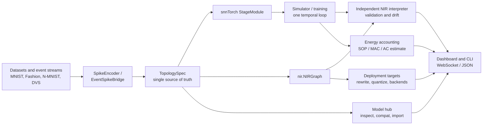

# Architecture

A model is declared once as a
[`TopologySpec`](../spikeforge/topology/spec.py:1) and rendered twice —
into the snnTorch module that trains and into the `nir.NIRGraph` that
exports and validates — so the two cannot silently diverge. Every surface
(CLI, WebSocket, dashboard) renders from the same payload shapes.

The same spine powers the recipes in [`COOKBOOK.md`](../COOKBOOK.md) and the
scripts in [`examples/`](../examples/).

The browser dashboard is extracted to its own repository,
[`capsize-games/spikeforge-dashboard`](https://github.com/capsize-games/spikeforge-dashboard)
(ARCH-0001 Phase 2). [`client/`](../client) stays here for one release as a
read-only mirror; the pinned dashboard bundle version is recorded in
[`compatibility.json`](../compatibility.json), and the server serves a pinned
prebuilt bundle when `SPIKEFORGE_DASHBOARD_DIST` is set. The versioned WebSocket
contract lives under `protocol/` (see its `README.md`).

The deploy layer — deploy backends, quantization, energy accounting, and the
sparse event runtime — is extracted to
[`capsize-games/spikeforge-targets`](https://github.com/capsize-games/spikeforge-targets)
(ARCH-0001 Phase 3; distribution `spikeforge-targets`, import root `spikeforge_targets`).
It depends on core (`spikeforge~=0.3.1`) but core never depends on it. The
top-level `spikeforge_targets/` package stays here as the `packages/spikeforge-targets`
workspace distribution.

The model hub is likewise extracted to
[`capsize-games/spikeforge-hub`](https://github.com/capsize-games/spikeforge-hub)
(ARCH-0001 Phase 4; distribution `spikeforge-hub`, import root `spikeforge_hub`),
also depending on `spikeforge~=0.3.1`. Core itself lives at
[`capsize-games/spikeforge`](https://github.com/capsize-games/spikeforge); the
`spikeforge-server` distribution (import root `server`) stays in that repository
because its extraction trigger T4 did not fire.

Because the project is pre-1.0 and unpublished, the extraction shipped without
back-compat aliases: the old `spikeforge.{targets,energy,event_runtime,hub}`
import paths were deleted rather than kept as shims.
