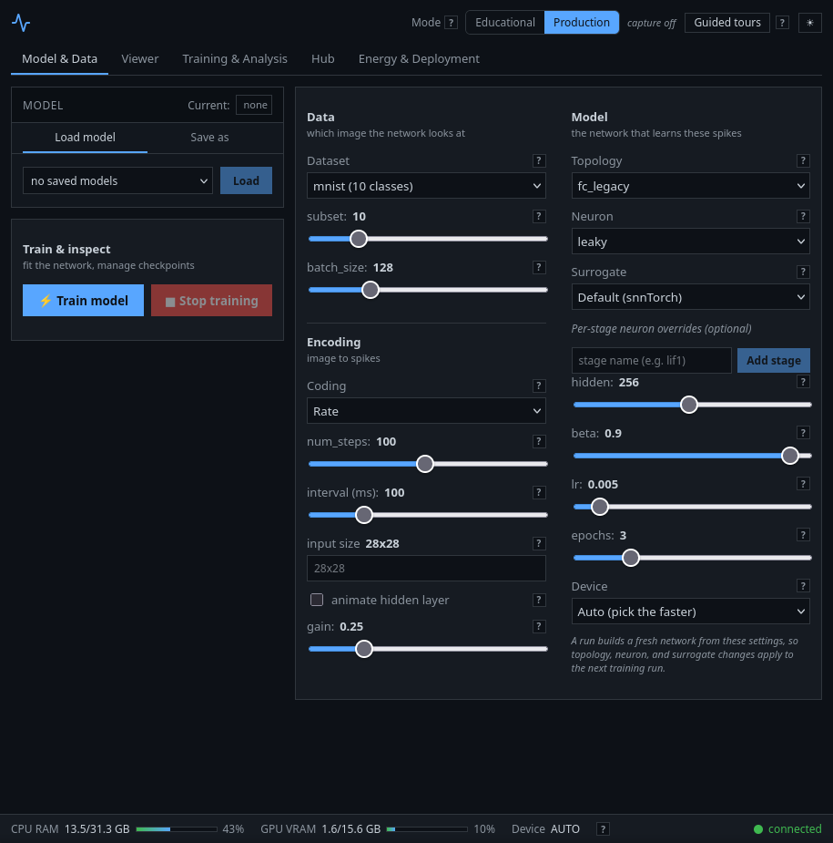

# Dashboard (Phase 3)

Phase 3 turns the browser dashboard into the go-to surface for both
audiences. Every panel below renders from live server payloads over the
existing WebSocket protocol, so nothing needs a page reload.

### Screenshots

The overview capture below exists
([`images/dashboard.png`](../images/dashboard.png)); the other four are
still open.

> **Maintainer note — partial: one of five captures done.** The overview
> above was captured from a real browser session. The remaining four were
> **not**, because this repository is often prepared in a headless
> environment with no browser. Do not fake an image; capture the following
> from a real browser session and link them from this section:
>
> - ~~**Dashboard overview**~~ — done, see above.
> - **Training run** — the live loss/accuracy charts mid-run.
> - **NIR graph viewer and drift-validation panel** — a topology graph and
>   its `within_tolerance` report.
> - **Hub panel** — entry cards, a compat badge, and an import verdict.
> - **Demo GIF** — apply-and-run streaming spike frames into the raster.
>
> To reproduce: `./install.sh`, then
> `spikeforge-server` (port
> 8877) and `cd client && npm install && npm run dev`; open
> <http://localhost:5173>. Commit the captures under the top-level
> `images/` directory (the gitignored `build/` and `docs/` trees are not
> suitable) and link them here.

### Execution-mode toggle

The top bar carries an **Educational / Production** toggle wired to
`TrainConfig.mode` — the same `ExecutionMode` the runtime uses. It changes
what a run *records*, not what it computes:

- **Production** (the default) skips trajectory capture and runs lean, so
  the introspection panels show their gated empty state.
- **Educational** records per-step `U[t]`/`I[t]`/`S[t]` and unlocks the
  trajectory viewer, the metrics panel, and the firing-rate histogram.

The mode is applied when the engine is built, so switch it and then start a
run (`train`) or load a checkpoint (`load_model`) to see the panels fill in.

### LEFT column — model controls

- **Topology** picker -> `TrainConfig.topology` (`fc_legacy`, `fc_small`,
  `conv_net`, `recurrent_net`).
- **Neuron** picker -> `TrainConfig.topology_params.neuron` (registry kinds).
- **Surrogate** picker -> `TrainConfig.topology_params.surrogate`; it also
  drives the surrogate-curve panel's initial selection.
- The existing **dataset** and **coding** controls (rate / latency / delta /
  random) and the model-zoo browser.

The hardware-target picker is deferred to Phase 5 (see Notes).

### CENTER column — introspection panels

- **Neuron-state trajectory viewer** — `U[t]` (membrane) and `I[t]` (input
  current) per stage, with a stage selector and the shared time cursor.
- **NIR topology graph viewer** — the graph summary drawn as nodes and edges,
  with non-linear (skip/conv) and delayed (recurrent) edges rendered
  distinctly.
- **NIR drift-validation panel** — the independent-interpreter
  `ValidationReport`, per layer and overall `within_tolerance`.
- The existing sample / spike-frame / reconstruction / raster panels.

### RIGHT column — analysis panels

- **Trajectory metrics** — firing rate, sparsity, and ISI per stage, plus a
  firing-rate histogram.
- **Encoding report** — reconstruction plus the approximation note for the
  current sample (see the Phase 2 decoding caveats).
- **Surrogate-derivative curve** — sampled `dS/dU` for the selected
  surrogate gradient.
- **Benchmark readout** — config, environment, and per-mode timing/memory.
- The training and prediction panels.

### Guided walkthroughs

Seven short in-app lessons (one per tutorial theme) launch from the **Tours**
menu in the top bar. Each step highlights its target control or panel and
explains what it does:

| Lesson | Theme |
|---|---|
| `encoding` | Spike encoding |
| `datasets` | Neuromorphic datasets |
| `snn` | Spiking neural networks (neuron model, mode, state viewer) |
| `training` | Training SNNs (surrogate, curve, loss/accuracy) |
| `cnn` | Spiking CNNs (topology, graph viewer) |
| `recurrent` | Recurrent SNNs (delayed edges) |
| `nir` | NIR export, validation, and benchmarking |

Targets are marked with `data-tour` attributes on the panels. A step whose
target is gated (for example the trajectory viewer in production mode) shows
its explanatory note instead of a highlight. The help tips are expanded to
cover topology, neuron model, mode, and NIR concepts.

### WebSocket actions

The dashboard drives the server with the actions below; precondition
failures emit the existing `error` message rather than raising.

| Action | Reply | Mode / precondition |
|---|---|---|
| `configure` | `config_ack`, sample panels | needs an encode config |
| `run` / `stop` | `run_state`, rasters | needs a configured sample |
| `select_sample` | sample panels | needs a configured sample |
| `infer` | `inference` | needs a trained/loaded model |
| `train` / `stop_train` | `train_metrics`, `train_state` | builds the engine; applies `mode` |
| `save_model` | `model_saved` | needs a name |
| `load_model` | `model_loaded` | needs a saved name; applies `mode` |
| `delete_model` / `new_model` | `model_list` / `model_cleared` | — |
| `list_models` | `model_list` | — |
| `stats` | `system_stats` | — |
| `cancel_download` | `download_state` | — |
| `nir_export` | `nir_graph` | active or configured topology |
| `nir_validate` | `nir_validation` | needs a configured sample |
| `trajectory` | `trajectory` | **educational** mode + active model |
| `metrics` | `metrics` | **educational** mode + active model |
| `encoding_report` | `encoding_report` | needs a configured sample |
| `surrogates` | `surrogate_list` | — |
| `surrogate_curve` | `surrogate_curve` | needs a surrogate name |
| `benchmark` | `benchmark` | runs the tiny default fixture |
| `model_search` / `model_diff` | `model_search` / `model_diff` | registry search and metadata diffing |
| `deployment_report` | `deployment_report` | capability matrix for a target |
| `deploy_run` | `backend_run` | compile + run on a backend, with rewrite/compare |
| `energy_report` | `energy_report` | SOP/MAC/AC accounting for a target |
| `hub_list` / `hub_search` | `hub_list` / `hub_search` | curated catalog browse + search |
| `hub_download` / `hub_cancel` | `hub_download_state` | isolated download with progress/cancel |
| `hub_inspect` / `hub_import` | `hub_inspect` / `hub_import` | structure report + compat verdict |

The schema also still declares a legacy `predict` type, but the client no
longer sends it and the server does not dispatch it.

### Access control & rate limiting

`/ws` and `GET /api/bundle/<name>` are open by default (unchanged from
earlier phases). An operator exposing the dashboard beyond localhost can
set `SPIKEFORGE_DASHBOARD_TOKEN` to gate both, and
`SPIKEFORGE_DASHBOARD_MAX_CONCURRENT_JOBS` to cap how many `train` /
`run_pipeline` jobs run at once server-wide -- a request past that cap gets
a `server busy` `error` message rather than queuing silently. See
[Usage — Access control & rate limiting](usage.md#access-control-rate-limiting)
for the docker-compose configuration.
