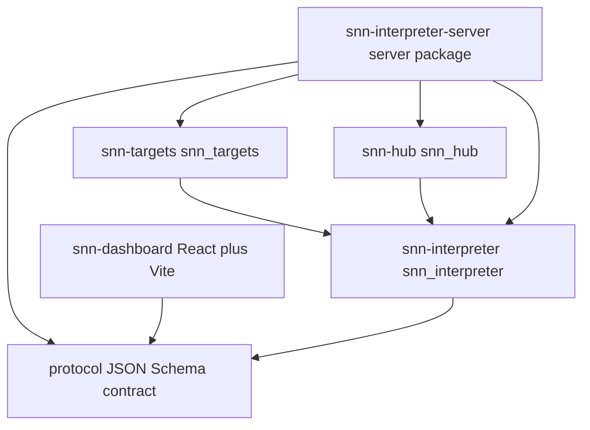

# ARCH-0001 target topology

**Status: accepted (proposed for maintainer sign-off).**
**Date:** 2026-09-11 · **Issue:** ARCH-0001 *Phased repo split: core library, deploy targets, dashboard*
**Owner:** w4ffl35 (maintainer) · **Depends on:** [`plans/arch-0001-adr-repo-topology.md`](plans/arch-0001-adr-repo-topology.md)

## Decision

Adopt the following distribution-to-import-root mapping. **No two distributions
ship into the same top-level namespace.** The plan's PEP 420 namespace-package
escape hatch (`plans/repo_topology_plan.md` §4) is deliberately **not** used.

| Distribution | Import root | Source of truth today | Owner phase |
|---|---|---|---|
| `snn-interpreter` | `snn_interpreter` | `snn_interpreter/` (minus any extracted subpackages) | Phase 1 |
| `snn-interpreter-server` | `server` (kept) | `server/` | Phase 1 |
| `snn-targets` | `snn_targets` | `snn_interpreter.targets`, `snn_interpreter.targets.backends`, `snn_interpreter.energy`, `snn_interpreter.event_runtime` | Phase 3 |
| `snn-hub` | `snn_hub` | `snn_interpreter.hub` | Phase 4 (go) |
| `snn-dashboard` (npm `snn-interpreter-client`, private) | n/a — npm | `client/` | Phase 2 |

### Core import root

The core distribution keeps the import root `snn_interpreter`. **The project
rename is explicitly out of scope for ARCH-0001.** No aliasing, no shim, no
namespace package is introduced for core.

### Server import root

Adopt the recommendation and **keep the existing top-level package `server`** as
the `snn-interpreter-server` import root. Rationale: `server/` is already a
top-level package with 30 modules and every one of its 24 library-importing
files imports `snn_interpreter`, so keeping `server` avoids churn in CI, Docker,
and the WS entry point while the boundary is being made real.

A future rename to `snn_server` is **documented as a possibility, not
scheduled**, and if it is ever performed it MUST follow this shim policy: ship
`snn_server/` as the new import root, retain `server/` as a deprecated alias
package that re-exports `snn_server` and emits `DeprecationWarning`, keep both
paths working for at least one minor release, and only then remove `server/`.

### Targets, hub, and dashboard import roots

- `snn-targets` owns `snn_targets` and absorbs `targets`, `targets/backends`,
  `energy`, and `event_runtime`. These four subpackages move together because
  `targets/backends` depends on `energy`/`event_runtime` and all carry the
  volatile backend SDK surface.
- `snn-hub` owns `snn_hub` and absorbs `hub`.
- The dashboard keeps the npm package name `snn-interpreter-client` even though
  its GitHub repository and product name become `snn-dashboard`. The npm package
  stays `private: true`.

## GitHub repository names

| Repository | Phase | Status |
|---|---|---|
| `w4ffl35/snn-dashboard` | Phase 2 | create when T1 fires |
| `w4ffl35/snn-targets` | Phase 3 | create when T2 fires |
| `w4ffl35/snn-hub` | Phase 4 | **go** — create when T3 fires |
| `w4ffl35/snn-server` | Phase 4 | **conditional** — create only when T4 fires |
| `w4ffl35/snn_interpreter` | — | existing core repository; not renamed |

New repositories use hyphenated names; the existing core repository keeps its
underscored name as published in [`setup.py`](setup.py:33).

## Dependency direction

The invariant is **dependency arrows point from a component to what it
requires**, and there is no cycle. A satellite may depend on `snn-interpreter`;
`snn-interpreter` never depends on a satellite.



Reading the edges as "depends on": `snn-targets`, `snn-hub`, and
`snn-interpreter-server` each depend on core; the server additionally depends on
`targets` and `hub` because 24 of its files import those capability roots today
(via `snn_interpreter.*` until Phase 3/4); and both the server and the dashboard
depend on the `protocol/` contract, never on each other's code.

### Why this direction is stable

- **Core is the floor.** It has no incoming packaging dependency on a
  satellite, which is what makes a headless `pip install snn-interpreter`
  provably free of the forbidden list in
  [`plans/arch-0001-core-boundary.md`](plans/arch-0001-core-boundary.md).
- **The protocol is a leaf, not a library.** Because `protocol/` is data (JSON
  Schema), the dashboard and the server can both depend on it without depending
  on each other — which is what makes the Phase 2 dashboard extraction safe.
- **Capabilities are siblings.** `snn-targets` and `snn-hub` do not depend on
  each other, so either can be extracted without ordering constraints beyond
  core.

## Layout mechanism

Each distribution is defined by its own PEP 621
[`pyproject.toml`](plans/arch-0001-packaging-versioning.md) under a top-level
`packages/` workspace directory. The distribution's build config selects its
import root via `package-dir`, so **Phase 1 moves no source files**: the
packages remain at their current paths and extraction is a later, explicit step.

```text
packages/
  snn-interpreter/
    pyproject.toml            # distribution snn-interpreter, import root snn_interpreter
  snn-interpreter-server/
    pyproject.toml            # distribution snn-interpreter-server, import root server
  snn-targets/                # created in Phase 3
    pyproject.toml
  snn-hub/                    # created in Phase 4
    pyproject.toml
```

The core distribution's `find` configuration explicitly excludes the roots it
does not own, so `server/` can no longer leak into the core wheel:

```toml
[tool.setuptools.packages.find]
where = ["../.."]
include = ["snn_interpreter*"]
exclude = ["server*", "tests*", "snn_targets*", "snn_hub*"]
```

This is the direct fix for the verified fact that
[`setup.py`](setup.py:37) currently packages `server/` into `snn-interpreter`.

## Related decisions

- [`plans/arch-0001-adr-repo-topology.md`](plans/arch-0001-adr-repo-topology.md) — why one repo, multiple distributions.
- [`plans/arch-0001-core-boundary.md`](plans/arch-0001-core-boundary.md) — the forbidden-import contract for core.
- [`plans/arch-0001-packaging-versioning.md`](plans/arch-0001-packaging-versioning.md) — names, extras, scripts, pinning.
- [`plans/arch-0001-migration-plan.md`](plans/arch-0001-migration-plan.md) — the reversible move sequence.
- [`plans/repo_topology_plan.md`](plans/repo_topology_plan.md) — the source analysis.
