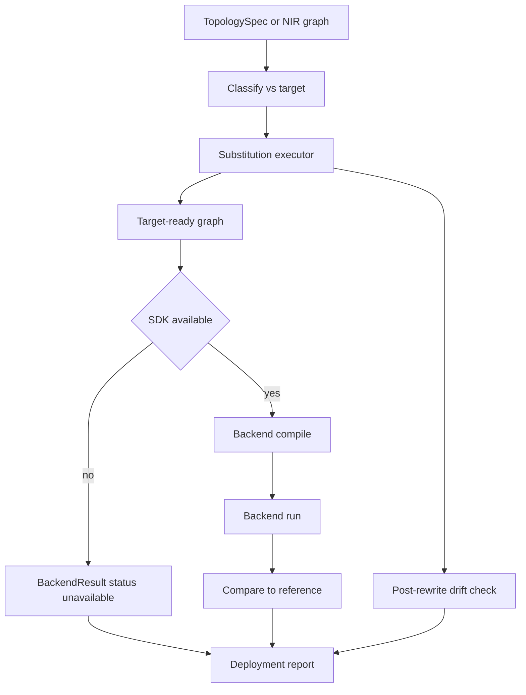

# Spikeforge — WS-B: Hardware and Simulator Backend Execution

> Focused design for workstream **B** of the
> [`professional_roadmap.md`](plans/professional_roadmap.md). Read the roadmap
> first for the vision, cross-workstream interfaces, and packaging rules.

Design/spec only. Every claim about the current code is grounded in a file/line
reference so a Code-mode agent can execute this file-by-file.

**Objective.** Turn the declared deployment story into an **executable** one:
wire at least one real, pip-installable, cross-platform backend so `deploy`
actually compiles and runs a graph and returns comparable trajectories; execute
the capability-matrix substitutions with a report and a post-rewrite drift
check; keep the in-process `reference` target always available; and degrade
honestly when an SDK is absent.

---

## 1. Recommendations and trade-offs

### 1.1 First real backend — Norse

| Option | Install | Cross-platform | Effort | Fit |
|---|---|---|---|---|
| **Norse** | `pip install norse`, pure PyTorch | yes | low | **recommended first** |
| Lava / Loihi 2 | `pip install lava-nc`, heavier | partial | high | first hardware path |
| SpiNNaker2 | SDK + toolchain | partial | high | later |
| Speck (`sinabs`) / Xylo (`rockpool`) | vendor SDKs | partial | high | later |

Norse is recommended first because it is pip-installable, pure PyTorch, and
shares the torch stack, so it exercises the whole compile-run-drift pipeline
with minimal new machinery. It also needs exactly one substitution
(`IF` → `beta=0` `LIF`) that is **already declared**
([`catalog.py`](spikeforge_targets/catalog.py:141)), making it the natural
first *executed* substitution.

### 1.2 First hardware path — Lava / Loihi 2

Lava is chosen as the first hardware path because its declared substitution
(`AvgPool2d` → `SumPool2d`, [`catalog.py`](spikeforge_targets/catalog.py:87))
is a clean, well-understood rewrite, and the SDK is pip-installable (if not
trivially so). It ships executable-when-present and reports unavailable
otherwise.

---

## 2. Current state and gap analysis

| Capability | Current reality | Anchor |
|---|---|---|
| Target registry | Six entries, one available | [`registry.py`](spikeforge_targets/registry.py:14), [`catalog.py`](spikeforge_targets/catalog.py:145) |
| Availability probe | Isolated module import | [`probe.py`](spikeforge_targets/probe.py:23) |
| Capability matrix | Classifies supported/substituted/unsupported | [`capability_matrix.py`](spikeforge_targets/capability_matrix.py:13) |
| Substitution record | Declared `primitive -> substitute` | [`substitution.py`](spikeforge_targets/substitution.py:6), [`target_spec.py`](spikeforge_targets/target_spec.py:35) |
| Deployment report | `deployable` is a capability flag | [`report.py`](spikeforge_targets/report.py:56) |
| NIR serialization | save/load graph | [`serialization.py`](spikeforge/nir_bridge/serialization.py) |
| Reference interpreter | Runs emitted primitives independently | [`interpreter.py`](spikeforge/nir_bridge/interpreter.py:50) |
| Compile/run a backend | None | n/a |
| Substitution execution | None | n/a |
| Backend trajectory compare | Only snnTorch vs NIR | [`validator.py`](spikeforge/nir_bridge/validator.py) |

### 2.1 Invariants that must not break

- `reference` stays available unconditionally
  ([`catalog.py`](spikeforge_targets/catalog.py:61)); its report shape is
  unchanged ([`report.py`](spikeforge_targets/report.py:76)).
- Existing `deployment_report` payload keys and the `deployment_report` /
  `target_list` messages stay additive
  ([`server_message.py`](server/schemas/server_message.py:11),
  [`target_handlers.py`](server/target_handlers.py:76)).
- The declared `substitutions` mapping remains the source of truth for *which*
  rewrites apply; execution only consumes it.
- No backend import escapes its isolated module; a missing SDK is reported,
  never raised at import.
- `ruff`, the 435-test suite, and the client build stay green.

---

## 3. Substitution executor

The executor applies a target's **declared** substitutions
([`TargetSpec.substitutions`](spikeforge_targets/target_spec.py:35)) to
produce a target-ready graph, reports what changed, and re-validates drift.

### 3.1 Module layout

```
spikeforge_targets/
  substitute_ops.py     one rewrite function per (primitive -> substitute) pair
  rewrite.py            rewrite(graph_or_spec, target) -> RewriteResult
  rewrite_report.py     JSON-able deltas: applied, skipped, unfixable
  rewrite_result.py     RewriteResult dataclass: graph, report
```

### 3.2 Rewrite rules (seed set)

| From | To | Rewrite | Target |
|---|---|---|---|
| `IF` | `LIF` | single `nir.LIF` with `beta = 0` (identity integrator) | `norse` |
| `AvgPool2d` | `SumPool2d` | `SumPool2d` followed by a `Scale` of `1/k` where `k` is the pooled window product | `lava_loihi2` |

Each rule is a small pure function `(node, meta) -> (nodes, edges)` so a rule
that expands one node into several (AvgPool) and a rule that is one-for-one
(IF) share one interface. A primitive with **no** substitution stays
`unsupported` and is surfaced as `unfixable`, never dropped
([`capability_matrix.py`](spikeforge_targets/capability_matrix.py:29)).

### 3.3 Rewrite report and drift

`RewriteResult` carries the rewritten graph plus a report:

```json
{
  "target": "norse",
  "applied": [{"node": "lif1", "from": "IF", "to": "LIF", "detail": "beta=0"}],
  "skipped": [],
  "unfixable": [{"node": "pool1", "primitive": "AvgPool2d", "reason": "no substitution declared"}],
  "rewritten": true
}
```

After rewriting, the executor runs a **drift check**: the rewritten graph is
executed by the reference interpreter
([`NirInterpreter`](spikeforge/nir_bridge/interpreter.py:50)) on the same
fixture and compared to the pre-rewrite execution using the existing drift
machinery ([`drift.py`](spikeforge/nir_bridge/drift.py)). The report
includes the drift and whether it is within tolerance, so a lossy substitution
(e.g. the AvgPool window edge case) is quantified rather than hidden.

---

## 4. Backend execution

### 4.1 Module layout

```
spikeforge_targets/backends/
  __init__.py        public compile_run + backend registry
  api.py             isolated per-SDK probes and import helpers (the only importer)
  result.py          BackendResult dataclass: readout, spikes, status, notes
  base.py            Backend protocol: available(), compile(graph, spec), run(spikes)
  reference_backend.py  wraps NirInterpreter (always available)
  norse_backend.py   Norse simulator backend
  lava_backend.py    Lava/Loihi 2 hardware path (executable when SDK present)
  compare.py         compare a BackendResult to the reference trajectory
```

`api.py` is the single module that imports a backend SDK, mirroring
[`probe.py`](spikeforge_targets/probe.py:1) and
[`nir_bridge/api.py`](spikeforge/nir_bridge/api.py:1). It exposes
`module_available(name)` and version strings; nothing else imports a backend.

### 4.2 Backend protocol

```python
class Backend(Protocol):
    def available(self) -> bool: ...
    def compile(self, graph: Any, spec: TopologySpec) -> Any: ...
    def run(self, compiled: Any, spikes: torch.Tensor) -> BackendResult: ...
```

`BackendResult` carries `readout`, per-stage `spikes`/`membranes` in the same
shape as [`InterpreterResult`](spikeforge/nir_bridge/interpreter_result.py),
a `status` in `{ok, unavailable, error}` with an honest `notes` list, and the
`rewritten` report when a substitution preceded compilation.

### 4.3 Flow



### 4.4 Norse backend

Compiles the target-ready NIR graph into a Norse module set (`norse.LIF`,
`norse.LI`, linear/conv equivalents), runs it over the `[T, ...]` spike train,
and returns a `BackendResult`. The `IF`→`beta=0` rewrite makes `norse.LIF`
numerically reproduce `nir.IF`, so the comparison to the reference interpreter
should be within tolerance. Unsupported-by-Norse nodes (`CubaLIF`, `Delay` per
[`catalog.py`](spikeforge_targets/catalog.py:139)) are reported
`unfixable`, and `run` is refused for a graph containing them.

### 4.5 Lava backend

Ships the same protocol. When `lava-nc` is absent it reports
`status="unavailable"` with `notes=["install the lava extra"]`. When present it
compiles the rewritten graph to a Lava process and runs it, returning a
`BackendResult`; a hardware timing model or a CPU Loihi emulator
(`lava`'s `Loihi2SimCfg`) is used when no physical device is attached, and the
report states which path ran (honesty rule).

---

## 5. Surfaces

### 5.1 WebSocket

| Action | Request | Reply | Payload |
|---|---|---|---|
| `deploy_run` | `{train, name: target}` | `backend_run` | `BackendResult` + rewritten + drift + compare |

The existing `deployment_report` still returns the capability view; `deploy_run`
adds the *executed* view. Routed via
[`protocol_handlers.py`](server/protocol_handlers.py:19) to a new
`server/backend_handlers.py` and `server/backend_payloads.py`, following
[`target_handlers.py`](server/target_handlers.py:1).

### 5.2 CLI

Extended in [`target_cli.py`](spikeforge/cli/target_cli.py:166):

```
spikeforge-targets rewrite --topology conv_net --target norse      # rewrite report + drift
spikeforge-targets run     --topology conv_net --target norse      # compile + run + compare
```

Both print JSON; `run` exits non-zero unless `status == "ok"` and the compare
is within tolerance, so it is a CI gate (same convention as
[`deploy_exit`](spikeforge/cli/target_cli.py:86)).

### 5.3 Client

[`BackendRunPanel.tsx`](client/src/components/BackendRunPanel.tsx) renders the
backend status, the rewrite report (applied/skipped/unfixable), the drift, and
the reference comparison, reusing
[`DeploymentReportView.tsx`](client/src/components/DeploymentReportView.tsx)
styling and [`DeploymentBuckets.tsx`](client/src/components/DeploymentBuckets.tsx).

---

## 6. Phases, deliverables, acceptance

### B1 — Substitution executor

- **Deliverables:** `targets/substitute_ops.py`, `targets/rewrite.py`,
  `targets/rewrite_report.py`, `targets/rewrite_result.py`; `spikeforge-targets
  rewrite`.
- **Acceptance:** rewriting `conv_net` for `norse` converts the declared `IF` to
  a `beta=0` `LIF` (when present) and reports it; rewriting for `lava_loihi2`
  expands `AvgPool2d` into `SumPool2d` + `Scale`; an unfixable primitive is
  listed, not dropped; the post-rewrite drift is reported.

### B2 — Norse simulator backend

- **Deliverables:** `targets/backends/{__init__,api,base,result,compare,
  reference_backend,norse_backend}.py`; `spikeforge-targets run`.
- **Acceptance:** with `norse` installed, `conv_net` compiles and runs and its
  readout matches the reference within tolerance; the `IF`→`beta=0` rewrite
  reproduces `nir.IF`; without `norse`, `status=="unavailable"` and a note, never
  an exception.

### B3 — Lava hardware path

- **Deliverables:** `targets/backends/lava_backend.py`.
- **Acceptance:** without `lava-nc`, `status=="unavailable"`; with it, the
  rewritten graph compiles and runs (device or Loihi emulator) and the report
  names which path ran.

### B4 — Wiring and surfaces

- **Deliverables:** `server/backend_handlers.py`, `server/backend_payloads.py`,
  schema additions, `BackendRunPanel.tsx`.
- **Acceptance:** `deploy_run` round-trips over a live connection; the client
  builds and renders; existing `deployment_report` and `target_list` payloads
  are unchanged.

---

## 7. Risks and deferred items

- **SDK API drift:** isolated in `backends/api.py`; each backend's `compile`
  begins with a probe, mirroring [`api.py`](spikeforge/nir_bridge/api.py:1).
- **Lava build weight:** `lava-nc` is heavy and platform-sensitive — it stays an
  optional extra and the reference/Norse paths remain the always-available
  fallback.
- **Substitution fidelity:** the AvgPool→SumPool+Scale rewrite is exact only for
  non-overlapping windows with no padding; the drift check quantifies any
  residual and the report flags it rather than claiming exactness.
- **Deferred:** SpiNNaker2, Speck, and Xylo execution (declared only until their
  extras land); on-device *measured* timing (see WS-D energy honesty).
