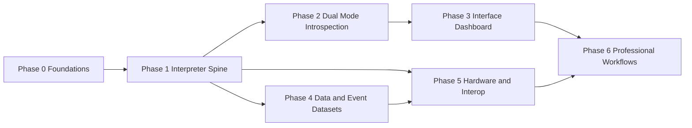

# SNN Interpreter — Ecosystem Roadmap

Master plan. Design/spec only; no production code is changed by this document.
Phase 1 is detailed in [`interpreter_spine_plan.md`](interpreter_spine_plan.md);
this document covers every phase, their dependencies, and the acceptance bar
that turns the project from a tutorial playground into a professional tool.

---

## 1. Vision and pillars

The ecosystem exists so that people working with neuromorphic hardware can
move models and data between libraries without hand-porting. Four pillars:

1. **Interpreter** — translate snnTorch models to standard graph primitives
   (NIR), execute them in two modes, and prove numerical fidelity.
2. **Interface** — one dashboard that *teaches* the tutorials and *serves* a
   professional doing real training, inference, and deployment.
3. **Interop** — a common graph spine that bridges snnTorch, NIR, and other
   frameworks and simulators.
4. **Targets** — a path from a trained model to edge/neuromorphic execution,
   with honest capability reporting.

## 2. Two audiences, one tool

| Audience | Needs | Mode |
|---|---|---|
| Learner | See `U[t]`, `S[t]`, `I[t]`; compare encodings and neurons; guided steps | Educational |
| Professional | Fast training/inference, graph export, drift validation, hardware compile | Production |

These are not two products. They are one engine with an `ExecutionMode` flag
that decides whether full trajectories are captured; every phase must honour
both.

## 3. Current assets to build on

| Asset | Location | Role in roadmap |
|---|---|---|
| Spike encoding math | [`SpikeEncoder`](snn_interpreter/encoding/spike_encoder.py:9) | Phase 2 decoding + Phase 4 bridge |
| Dataset registry | [`datasets.py`](snn_interpreter/data/datasets.py:15) | Phase 4 extends to event modality |
| Sample source | [`SampleSource`](snn_interpreter/data/sample_source.py:10) | Phases 2, 3 reuse as-is |
| FC LIF model | [`SpikingNet`](snn_interpreter/network/spiking_net.py:10) | Phase 1 wraps as `fc_legacy` preset |
| Training loop | [`TrainingEngine`](snn_interpreter/training/training_engine.py:24) | Phases 1, 2, 6 extend |
| Inference payload | [`infer_spikes`](snn_interpreter/network/inference.py:8) | Phase 2 adds membrane trajectories |
| WS protocol | [`server/schemas`](server/schemas/server_message.py:8) | Phases 1, 3, 5 add message types |
| Dashboard | [`client/src/App.tsx`](client/src/App.tsx:17) | Phase 3 expands panels |
| Device/runtime | [`device.py`](snn_interpreter/runtime/device.py:126) | Phases 2, 6 extend for perf |

## 4. Phase overview

| Phase | Name | Primary tutorials | Pillars | Depends on |
|---|---|---|---|---|
| 0 | Foundations | — | all | — |
| 1 | Interpreter Spine | 5, 6, 7 | 1, 3, 4 | 0 |
| 2 | Dual-Mode Introspection Engine | 3, 4 | 1, 2 | 1 |
| 3 | Educational + Professional Interface | all | 2 | 1, 2 |
| 4 | Data Breadth and Event Datasets | 2 | 1, 4 | 1 |
| 5 | Hardware Targets and Cross-Library Interop | 7 | 3, 4 | 1, 4 |
| 6 | Professional Workflows and Hardening | 4, 5, 6 | all | 3, 5 |

Phases 3, 4, and 5 are independent of each other once Phase 2 lands, so they
can be parallelized if more than one implementer is available.

---

## 5. Phase details

### Phase 0 — Foundations

**Objective:** make the repo safe to change at scale, with no behavior change.

**Deliverables**
- A `tests/` suite skeleton wired to `pytest` and `pytest-cov`, plus a
  `scripts/dev.sh test` command.
- CI gate running `ruff`, `pytest`, and the client `npm run build`.
- `nir` and `nirtorch` added to dependencies behind a `nir` extra that is on
  by default in Docker.
- `nir_bridge/api.py` capability probe that reports the installed `nir` and
  `nirtorch` API surface, isolating upstream churn to one module.
- An `ExecutionMode` enum scaffold (`EDUCATIONAL`, `PRODUCTION`) with no
  consumers yet.

**Acceptance:** `ruff`, `pytest`, and the client build pass; the capability
probe prints the available NIR primitives; existing CLI entry points behave
identically.

**Risks:** NIR API version drift — mitigated by the probe and by the
declarative-first export in Phase 1.

---

### Phase 1 — Interpreter Spine

> **Status — delivered (verified in Phase 1g).** All four presets
> (`fc_legacy`, `fc_small`, `conv_net`, `recurrent_net`) export to NIR and
> validate `within_tolerance=True` with bit-exact spikes and zero readout
> drift; the Python suite (143 tests, up from 139) and `ruff` are green; the
> `verify` CLI (`export`/`validate`) and the `nir_export`/`nir_validate`
> WebSocket actions run live; `fc_legacy` checkpoints stay compatible.

**Objective:** lift snnTorch models to NIR, interpret NIR independently, and
prove near-zero numerical drift.

**Tutorials:** the mechanics of 5, 6, and 7.

**Deliverables** (fully specified in [`interpreter_spine_plan.md`](interpreter_spine_plan.md))
- `topology/` — `Stage`, `TopologySpec` graph, `build_module`, presets
  `fc_legacy`, `fc_small`, `conv_net`, `recurrent_net`, with skip and
  multi-branch edges.
- `neurons/` — registry and snnTorch→NIR parameter conversions for Leaky,
  Lapicque, Synaptic, and recurrent LIF.
- `simulator/` — generic stateless-stage temporal runner, state containers,
  and `Trajectory` capture of `U[t]`, `S[t]`, `I[t]`.
- `nir_bridge/` — mapper, exporter, reference NIR interpreter, drift metrics,
  and validator.
- `cli/verify.py` — `export` and `validate` commands.
- Engine, checkpoint, and server wiring for topology selection plus
  `nir_export` and `nir_validate` actions.
- `SpikingNet` preserved as a wrapper over `fc_legacy`.

**Acceptance:** FC, convolutional, recurrent, and skip topologies each
round-trip to a `NIRGraph` and validate `within_tolerance=True`; perturbing a
mapped parameter flips validation to `False` and names the layer; legacy
checkpoints load and produce identical outputs; `main.py` and
`main_encodings.py` still run.

**Risks:** neuron reset/threshold semantics differ between snnTorch and NIR —
the validator is the safety net and conversion constants are pinned by tests.

---

### Phase 2 — Dual-Mode Introspection Engine

**Objective:** deliver the educational/professional execution split and full
neuron-state introspection promised by the goal.

**Tutorials:** 3 and 4.

**Deliverables**
- **Educational mode:** capture per-layer input current `I[t]`, membrane
  `U[t]`, spike output `S[t]`, and (for second-order neurons) synaptic `I[t]`,
  for every shipped topology; expose firing-rate histograms, inter-spike
  intervals, and sparsity metrics.
- **Production mode:** a fused execution path with no per-step logging,
  optional `torch.compile`, and throughput/memory benchmarks; the same code
  path selected by `ExecutionMode`, not a fork.
- **Neuron comparison lab:** run the same input through Leaky, Lapicque,
  Synaptic, and Alpha and diff their trajectories.
- **Encoding introspection and decoding:** reuse [`SpikeEncoder`](snn_interpreter/encoding/spike_encoder.py:9)
  to add rate/latency/delta reconstruction and sparsity reporting alongside
  the existing raster view.
- **Surrogate-gradient introspection:** selectable surrogate functions with
  the derivative visualised, so training behaviour is inspectable rather than
  opaque.
- Extend [`infer_spikes`](snn_interpreter/network/inference.py:8) to carry
  membrane trajectories without changing existing payload keys.

**Acceptance:** every preset produces a full `U[t]`, `S[t]`, `I[t]`
trajectory in educational mode; production mode runs the same model with
trajectory capture disabled and measurably lower per-step overhead; existing
inference payload keys are unchanged.

**Risks:** memory growth when capturing full trajectories at high `num_steps`
and batch size — cap capture to single samples or small batches and document
the trade-off.

---

### Phase 3 — Educational + Professional Interface

**Objective:** make the dashboard the goto surface for both audiences.

**Tutorials:** all.

**Deliverables**
- **Mode toggle** (Educational / Production) in the top bar, wired to
  `ExecutionMode`.
- **LEFT column:** topology picker, neuron-model picker, dataset picker,
  coding controls, model-zoo browser, hardware-target picker.
- **CENTER column:** the existing sample/spike/hidden/output panels plus a
  neuron-state trajectory viewer (`U[t]`, `I[t]`), a graph/topology viewer
  rendered from `graph_summary`, and a validation/drift panel.
- **RIGHT column:** training, prediction, NIR export, hardware compile, and a
  benchmark readout.
- **Guided walkthroughs:** one short, in-app lesson per snnTorch tutorial,
  each highlighting the relevant controls and panel.
- Expanded help text covering topology, neuron model, mode, and targets.

**Acceptance:** changing mode, topology, neuron model, or target updates the
relevant panels without a page reload; the graph view and drift panel render
from live server payloads; each tutorial walkthrough completes end to end in
the browser.

**Risks:** the current grid is fixed; a mode toggle plus additional panels may
need a layout/section refactor — plan a `styles/sections.css` and component
split early in the phase.

---

### Phase 4 — Data Breadth and Event Datasets

**Objective:** ingest neuromorphic/event data through the same pipeline as
static images.

**Tutorials:** 2.

**Deliverables**
- Optional `tonic` extra with a registry of event datasets (for example
  N-MNIST, DVS128 Gesture, CIFAR10-DVS, and a spiking speech dataset).
- An event-tensor representation alongside the image representation, plus an
  event→spike encoding bridge that produces the same `[T,B,F]` contract the
  simulator already consumes.
- Event visualisation: rasters and playback frames through the existing
  raster/video exporters and dashboard panels.
- Dataset registry extended with modality metadata so the UI only offers valid
  encoding options per dataset.

**Acceptance:** at least two event datasets flow sample → encoding →
simulator → NIR validation; the dashboard renders their event rasters; static
and event modalities share one code path after encoding.

**Risks:** `tonic` and eventdataset downloads add build weight and flaky
network dependencies — gate behind the optional extra and reuse the existing
isolated-download worker with its progress UI.

---

### Phase 5 — Hardware Targets and Cross-Library Interop

**Objective:** turn the NIR graph into deployments and consume graphs from
other frameworks.

**Tutorials:** 7.

**Deliverables**
- A target registry with a **capability matrix**: which NIR primitives each
  target supports, and what it does with the rest.
- Adaptors for at least one simulator backend and one hardware path (for
  example a Lava/Loihi path and a SpiNNaker path), plus a generic
  framework-independent backend from Phase 1 as the reference.
- **Cross-library import:** ingest NIR graphs produced by other projects and
  run them through the Phase 1 interpreter and validator.
- A **deployment report** per target: supported nodes, substituted or dropped
  nodes, quantization and timestep constraints, and a drift check.
- Round-trip tests: snnTorch → NIR → other framework → compare trajectories.

**Acceptance:** a shipped preset compiles to at least one target and produces
a deployment report; imported external graphs run and validate; unsupported
nodes are reported, never silently dropped.

**Risks:** hardware SDKs are heavy and often platform-specific — isolate every
backend behind an optional extra and keep the reference interpreter as the
always-available fallback.

---

### Phase 6 — Professional Workflows and Hardening

**Objective:** close the gap between "works" and "trustworthy in production".

**Tutorials:** 4, 5, 6 at scale.

**Deliverables**
- Experiment tracking: config versioning, a reproducibility manifest, and a
  searchable model/checkpoint registry with metadata diffing.
- Training scale-ups: convolutional and recurrent training, truncated BPTT,
  mixed precision, gradient checkpointing, and multi-device execution.
- Performance suite: encode/forward/backward throughput and memory benches
  across topologies, recorded over time.
- Packaging and release: dependency extras, Docker profiles (CPU/GPU/targets),
  API stability notes, and a docs site generated from these plans.
- Observability: structured logs and metrics for training and validation runs.

**Acceptance:** a run is reproducible from its manifest alone; a searchable
registry finds checkpoints by dataset, topology, coding, and accuracy; the
performance suite runs in CI on a fixed fixture; a documented release process
exists.

**Risks:** scope creep into full MLOps — keep tracking local and file-based,
consistent with the current `MODEL_DIR` design, and treat external trackers as
an optional integration.

---

## 6. Cross-cutting concerns

- **Testing:** every phase adds tests in its own area; Phase 0 establishes the
  harness and CI so later phases have somewhere to put them.
- **Style contract:** all code obeys [`rules.md`](rules.md) — one class per
  file, files under 250 lines, functions under 20 lines, 79-column Python and
  80-column TypeScript, no `noqa`, no `any`, no shims.
- **Back-compat:** legacy checkpoints, `main.py`, and `main_encodings.py`
  remain working through every phase; behavior changes are additive and
  surfaced in metadata.
- **Honesty:** unsupported nodes, mismatched configs, and validation failures
  are always reported explicitly, never silently absorbed.

## 7. Suggested first vertical slice

To de-risk the whole roadmap, Phase 1 should be proven end to end on a single
convolutional preset before broad topology breadth is added: build the preset,
export it to NIR, interpret the NIR graph, and show a zero-drift validation
report. Every later phase reuses that same pipeline.

## 8. Success metrics

| Metric | Target |
|---|---|
| NIR primitive coverage for shipped presets | 100 percent of emitted nodes mapped and validated |
| Translation drift on presets | Within tolerance, with failures naming the layer |
| Supported neuron models | Leaky, Lapicque, Synaptic, Alpha, recurrent LIF |
| Supported topologies | FC, convolutional, recurrent, skip and multi-branch |
| Supported data modalities | Static image plus at least two event datasets |
| Supported targets | Reference interpreter plus at least one hardware path |
| Mode overhead | Production mode measurably faster than educational at equal accuracy |
| Onboarding | A new user completes a tutorial walkthrough without leaving the dashboard |

## 9. Tutorial to phase map

| Tutorial | Phase |
|---|---|
| 1 Spike Encoding | done; refined in Phase 2 |
| 2 Neuromorphic Datasets | Phase 4 |
| 3 Spiking Neural Networks | Phase 2 |
| 4 Training SNNs | Phases 2 and 6 |
| 5 Spiking CNNs | Phase 1 |
| 6 Recurrent SNNs | Phase 1 |
| 7 Neuromorphic Intermediate Representation | Phases 1 and 5 |
