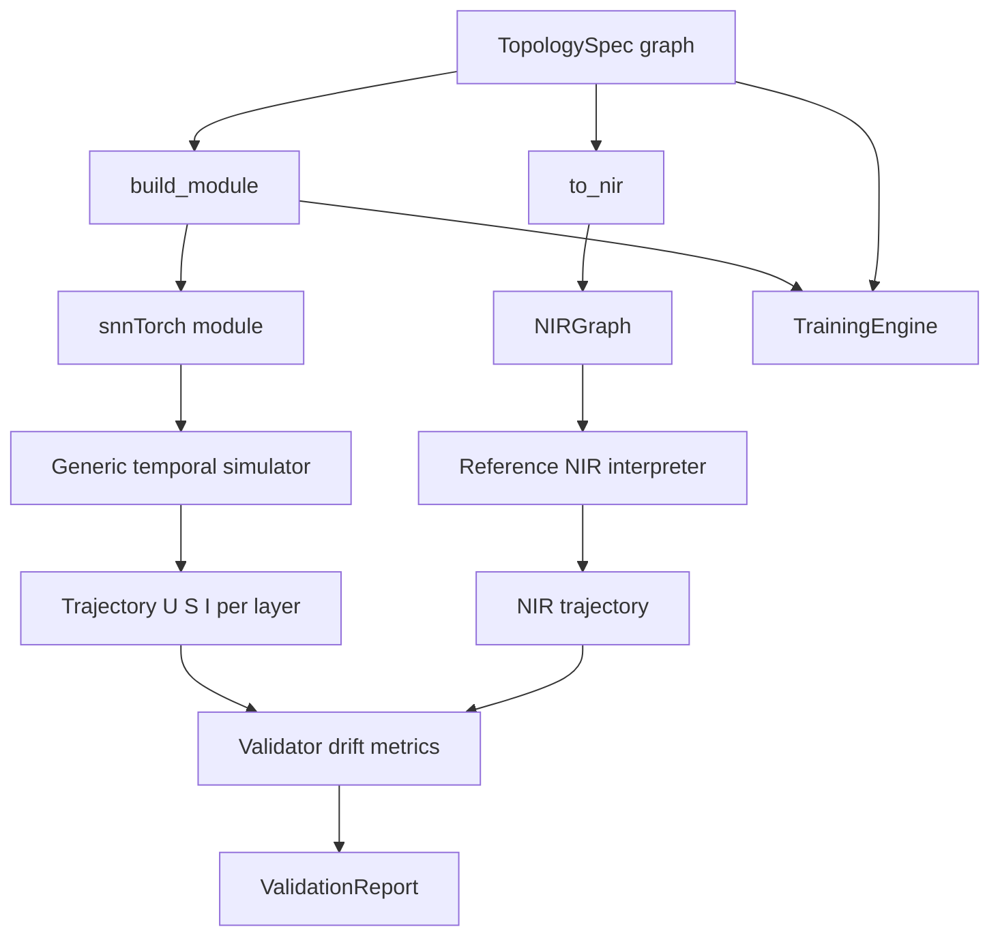

# Spikeforge — Phase 1: The Interpreter Spine

> This is the detailed design for **Phase 1** of the
> [`ecosystem_roadmap.md`](ecosystem_roadmap.md). Read the roadmap first for
> phase dependencies and the full-picture context.

Design/spec only. No production code is changed by this document. Every claim
about the current code is grounded in a file/line reference so a Code-mode
agent can execute this file-by-file.

Scope of this phase: **interpreter spine first** — a configurable topology
builder (FC/conv/recurrent), adoption of the official `nir` + `nirtorch`
packages, NIR export, and snnTorch-vs-NIR numerical validation. Broad UI work
is deferred to Phase 3 of the roadmap.

---

## 1. Goals recap and what this plan delivers

The end goal is an ecosystem where neuromorphic programmers bridge libraries
through a common interpreter. The interpreter's three primary functions are:

1. **Universal graph translation** — ingest snnTorch models, map to standard
   graph primitives, handle skip/recurrent/multi-branch edges.
2. **Dual-mode introspection + execution** — educational per-timestep state
   (`U[t]`, `S[t]`, `I[t]`) vs. fast production execution.
3. **Validation and numerical accuracy** — compare snnTorch trajectories
   against the translated NIR graph and prove near-zero drift.

Of these, functions 1 and 3 are **completely absent** today; function 2 exists
only for spike outputs. This plan builds all three around a single spine:
**one declarative model graph that emits both the snnTorch module and the NIR
graph**, plus an independent reference NIR executor used to validate the
translation.

---

## 2. Tutorial relevance filter

Only the parts of the snnTorch series that feed the interpreter are in scope.

| # | Tutorial | Verdict | Take | Skip |
|---|---|---|---|---|
| 1 | Spike Encoding | Done | Existing rate/latency/delta/random | n/a |
| 2 | Neuromorphic Datasets | Defer | Event-tensor ingestion (future) | Tonic/DVS pipelines now |
| 3 | Spiking Neural Networks | Partial | LIF + Synaptic + Lapicque neuron params and state semantics, reset mechanisms | Neuron cross-section derivations |
| 4 | Training SNNs | Partial | Surrogate-gradient config, regression/spike-count readouts | Dataset-specific tuning tables |
| 5 | Spiking CNNs | Core | `Conv2d`, pooling, flatten stages and their NIR mapping | Data-augmentation specifics |
| 6 | Recurrent SNNs | Core | Recurrent LIF (`RLeaky`), explicit delayed feedback edges | Long BPTT training recipes |
| 7 | NIR | Core | Graph extraction, node mapping, reference simulation, drift validation | Hardware deployment runtimes now |

Tutorial 2 (event datasets) is the only tutorial deliberately deferred: it adds
a data-ingestion axis, not a translation/validation axis, and can land after
the spine is proven.

---

## 3. Current state and gap analysis

| Capability the goal requires | Current reality | Anchor |
|---|---|---|
| Configurable topology | One hardcoded 2-layer FC LIF, hand-written loop | [`SpikingNet`](spikeforge/network/spiking_net.py:10), [`forward_spikes()`](spikeforge/network/spiking_net.py:37) |
| Conv / recurrent support | None | n/a |
| Neuron model library | Only `snn.Leaky` with `beta` | [`SpikingNet.__init__()`](spikeforge/network/spiking_net.py:26) |
| Graph representation / tracing | None; no fx, no IR | n/a |
| NIR dependency | Not present | [`requirements.txt`](requirements.txt:1), [`setup.py`](setup.py:38) |
| NIR export | None | n/a |
| NIR execution / cross-check | None | n/a |
| Numerical validation | None | n/a |
| State introspection | Spikes only, no `U[t]`/`I[t]` | [`infer_spikes()`](spikeforge/network/inference.py:8) |
| Educational vs production mode | Implicit via `track` flag only | [`_pack()`](spikeforge/network/spiking_net.py:62) |
| Topology in checkpoints | `meta` stores dataset/hidden/beta only | [`save()`](spikeforge/training/checkpoint_mixin.py:19) |
| Tests | No `tests/` directory exists | repo root listing |

### Back-compat surface that must not break

- `SpikingNet.forward(x, num_steps)` and `SpikingNet.forward_spikes(spikes, track)`
  return contracts are consumed by [`TrainingEngine._train_batch()`](spikeforge/training/training_engine.py:130),
  [`predict()`](spikeforge/training/training_engine.py:143),
  [`inference.infer_spikes()`](spikeforge/network/inference.py:12), and
  [`device.warmup()`](spikeforge/runtime/device.py:115).
- `SpikingNet` parameter names `_fc1`, `_lif1`, `_fc2`, `_lif2` are baked into
  saved `state_dict`s; existing checkpoints in `MODEL_DIR` must keep loading.
- Properties `hidden`, `beta`, `num_classes`, `input_size` are read by
  [`model_loaded_payload()`](server/payloads.py:26) and the device bench.
- `main.py` / `main_encodings.py` exporters must keep running unchanged.

---

## 4. Target architecture

The spine has three movements: **lift** a snnTorch model to NIR, **interpret**
the NIR graph independently, and **validate** the two against each other.



Core idea: **the `TopologySpec` is the single source of truth.** The snnTorch
module and the NIR graph are two renderings of the same spec, so their
structure cannot silently diverge. The independent NIR interpreter is what
makes the drift check meaningful rather than tautological.

---

## 5. Design decisions and invariants

1. **One spec, two renderings.** `TopologySpec` emits both `build_module()`
   (snnTorch) and `to_nir()` (NIR). No hand-maintained duplication.
2. **Spec is a graph, not a list.** Stages plus explicit edges, so residual
   skips, multi-branch inputs, and delayed recurrent feedback are first-class.
3. **Per-step, stateless stages.** Each stage is a pure function of
   `(input, state)` returning `(output, state)`. The temporal loop lives in
   one generic simulator, never in a model's `forward`. This keeps the graph
   fx-traceable and NIR-mappable.
4. **Independent interpreter.** The NIR executor re-implements the emitted
   primitives from NIR parameters; it never calls back into the snnTorch
   stages. This is the only way drift detection is honest.
5. **API isolation.** All `nir`/`nirtorch` imports live behind
   `nir_bridge/api.py`, so upstream API churn is contained to one module.
6. **Declarative-first export.** Export builds NIR nodes directly from the
   spec. `nirtorch.extract_nir_graph` is the secondary path for ingesting
   arbitrary user modules, with unsupported nodes surfaced as errors.
7. **Legacy first, always.** `SpikingNet` becomes a thin wrapper over the
   `fc_legacy` preset and keeps its parameter names, method contracts, and
   properties so old checkpoints and callers are unaffected.
8. **Modes are a flag, not a fork.** `ExecutionMode` selects trajectory
   capture; the code path is shared.
9. **Small modules.** One class per file, files under 250 lines, functions
   under 20 lines, 79-column lines, full type hints — per `rules.md`.

---

## 6. Module layout

New packages (each new class in its own file, keeping files small):

```
spikeforge/topology/
  __init__.py
  stage.py           Stage: name, kind, params
  spec.py            TopologySpec: stages + edges; chain/residual/recurrent helpers
  builder.py         build_module(spec) -> torch.nn.Module
  presets.py         fc_legacy, fc_small, conv_net, recurrent_net
spikeforge/neurons/
  __init__.py
  registry.py        NEURONS: name -> factory; build(name, **params)
  leaky.py           snn.Leaky factory + NIR parameter conversion
  lapicque.py        snn.Lapicque factory + conversion
  synaptic.py        snn.Synaptic factory + conversion
  recurrent.py       snn.RLeaky factory + conversion
spikeforge/simulator/
  __init__.py
  state.py           NeuronState / StateMap containers
  runner.py          run(stages, edges, spikes, track) -> outputs or trajectories
  trajectory.py      Trajectory: per-layer S[t], U[t], I[t]
spikeforge/nir_bridge/
  __init__.py
  api.py             isolated nir/nirtorch imports + capability check
  mapper.py          Stage kind <-> NIR node conversion table
  exporter.py        to_nir(spec) -> NIRGraph; graph_summary() -> JSON-able dict
  interpreter.py     execute(NIRGraph, spikes) -> Trajectory
  drift.py           error metrics between two trajectories
  validator.py       validate(model, spec, sample) -> ValidationReport
  targets.py         hardware target registry (metadata only)
```

Modified files:

| File | Change |
|---|---|
| [`spiking_net.py`](spikeforge/network/spiking_net.py:10) | Re-implement as a wrapper over the `fc_legacy` preset; keep `_fc1/_lif1/_fc2/_lif2`, `forward`, `forward_spikes`, properties |
| [`inference.py`](spikeforge/network/inference.py:8) | Consume the simulator; add optional membrane trajectory without changing existing payload keys |
| [`training_engine.py`](spikeforge/training/training_engine.py:24) | Build the configured topology; expose the spec |
| [`checkpoint_mixin.py`](spikeforge/training/checkpoint_mixin.py:19) | Persist the `TopologySpec` in `meta` |
| [`encoding_mixin.py`](spikeforge/training/encoding_mixin.py:9) | Unchanged (encoder contract is stable) |
| [`train_config.py`](server/schemas/train_config.py:10) | Add `topology: str` and `topology_params: dict` |
| [`handlers.py`](server/handlers.py:222) | Add `nir_export` / `nir_validate` dispatch and handlers |
| [`server_message.py`](server/schemas/server_message.py:8) | Add `nir_graph` / `nir_validation` types |
| [`requirements.txt`](requirements.txt:1), [`setup.py`](setup.py:38) | Add `nir` + `nirtorch` (an optional `nir` extra, on by default in Docker) |

New CLI module `spikeforge/cli/verify.py` exposes
`python -m spikeforge.cli.verify export --topology conv_net` and
`... validate --topology conv_net --dataset mnist` for headless use.

---

## 7. snnTorch to NIR mapping

The mapper is the heart of translation. Exact `nir` constructor signatures are
isolated in `api.py`; the conversion contract is documented here and enforced
by tests.

| Stage kind | snnTorch source | NIR node | Conversion contract |
|---|---|---|---|
| `linear` | `nn.Linear` | `nir.Affine` | weight/bias copied directly |
| `conv2d` | `nn.Conv2d` | `nir.Conv2d` | weight/bias/stride/padding/dilation/groups copied |
| `flatten` | `nn.Flatten` | `nir.Flatten` | start/end dims copied |
| `pool` | `nn.AvgPool2d` / `nn.SumPool2d` | `nir.AvgPool2d` / `nir.SumPool2d` | kernel/stride/padding copied |
| `lif` (subtract) | `snn.Leaky` | `nir.LI` + `nir.Threshold` + `nir.Delay` + `nir.Scale` | `tau_mem = -dt/ln(beta)`; `R = 1/(1-beta)`; the `Threshold` fires at `v_threshold`; the delayed spike is scaled by `-threshold` and summed back into the `LI`, reproducing snnTorch's one-step-delayed subtract reset exactly |
| `lif` (zero) | `snn.Leaky` | `nir.LIF` | hard reset to `v_reset = 0` with the same `tau`/`R` relation; exact because a zero reset *is* a hard reset |
| `li` | `snn.Lapicque` | `nir.LI` + `nir.Threshold` (+ reset chain) | same `tau`/`R` relation; snnTorch's `Lapicque` uses a first-order Euler update, not zero-order hold, so this carries a small quantified residual |
| `synaptic` | `snn.Synaptic` | `nir.CubaLIF` | second-order decay chain; `alpha/beta -> tau_syn/tau_mem`; `w_in = 1/(1-alpha)`, `R = 1/(1-beta)`; the subtract reset carries a residual |
| `recurrent` | `snn.RLeaky` | `nir.LIF` + `nir.Delay` | feedback edge with a one-step delay |
| `skip` | residual add | graph edge with weight 1 into a merge node | explicit edges in the spec |

The `dt` used for the `beta <-> tau_mem` relation is **one timestep per step**
(`dt = 1`). The reference interpreter solves the continuous NIR neuron with
the exact zero-order-hold (exponential) form, whose input gain is
`R * (1 - beta)`; the contract therefore sets `R = 1 / (1 - beta)` so that
gain is exactly one and the discrete recurrences coincide. A naive `R = 1`
would introduce a `(1 - beta)` mismatch.

**Correction (Phase 1d, empirical).** The installed `snntorch` 1.0.0 defaults
`Leaky(reset_delay=True)`: the reset at step `t` is triggered by the *previous*
step's spike, so `mem[t] = beta*mem[t-1] + I[t] - threshold*spk[t-1]`. A NIR
`LIF` hard reset stores a constant `v_reset` and cannot retain that residual,
so `subtract` is modelled faithfully as the `LI`/`Threshold`/`Delay`/`Scale`
loop above instead of a `LIF`. `zero` and `none` resets remain single-node
(`nir.LIF` and `nir.LI` + `nir.Threshold`). The validator confirms exact spike
trains and readouts, with only float32 membrane rounding (~1e-6) for the four
presets.

---

## 8. Validation design

`nir_bridge/validator.py` runs the same input spikes through both the
snnTorch module and the reference NIR interpreter and compares trajectories.

- **Inputs compared per layer:** spike train `S[t]`, membrane `U[t]`, and the
  final readout (accumulated output spikes and logits).
- **Metrics per layer and quantity:** max absolute error, mean absolute error,
  relative error, and spike-event agreement fraction.
- **Tolerances** are per-quantity constants (spikes exact-match expected;
  membrane and readout within a small epsilon).
- **Report:** `ValidationReport` with per-layer results, an overall
  `within_tolerance` boolean, and a human-readable summary of the worst
  offender — this is the artifact a professional gates hardware deployment on.

Validation is deliberately forward-only (no gradients), because surrogate
gradients are training artifacts and are validated separately by the training
tutorial's parity checks.

---

## 9. Milestones and acceptance criteria

### M1 — Topology spec, builder, neurons
Add `topology/` and `neurons/`; define `Stage`, `TopologySpec`, `build_module`,
and presets `fc_legacy/fc_small/conv_net/recurrent_net`.
**Acceptance:** each preset builds a module; `fc_legacy` reproduces the current
`SpikingNet` parameter names and a forward pass matches the current net
numerically on the same weights.

### M2 — Generic simulator and legacy wrapper
Add `simulator/`; make `SpikingNet` a wrapper over `fc_legacy`; route training,
inference, and device warmup through the simulator.
**Acceptance:** `main.py` and `main_encodings.py` still run; existing
checkpoints load and produce identical outputs; `inference.infer_spikes`
payload keys are unchanged.

### M3 — NIR api, mapper, exporter
Add `nir`/`nirtorch`; implement `api.py`, `mapper.py`, `exporter.py`.
**Acceptance:** `to_nir` emits a `NIRGraph` for FC, conv, recurrent, and
skip topologies with the expected node kinds and edges; `graph_summary`
returns a JSON-able node/edge listing.

### M4 — Reference NIR interpreter
Implement `interpreter.py` for the emitted primitives only.
**Acceptance:** a hand-built single LIF step matches an analytic step; an
identity `Affine` + `LIF` graph matches the snnTorch module to within 1e-6.

### M5 — Drift and validator
Add `drift.py` and `validator.py`.
**Acceptance:** `validate` reports `within_tolerance=True` for the shipped
presets on a fixed seed; deliberately perturbing a mapped parameter flips it
to `False` and names the offending layer.

### M6 — Engine, checkpoint, and server wiring
Thread topology through `TrainConfig`, `TrainingEngine`, and checkpoint meta;
add `nir_export` / `nir_validate` WS actions and payload schemas.
**Acceptance:** a topology-trained checkpoint records its spec in `meta` and
reloads into the matching build; the two WS actions return graph and report
payloads over a live connection.

### M7 — Verification
Add a `tests/` suite; run `ruff` and `pytest`.
**Acceptance:** tests cover mapping, export, interpreter, drift, and legacy
checkpoint compatibility; `ruff` clean; all Python files under 250 lines and
functions under 20 lines.

---

## 10. Risks and deferred items

- **NIR API churn:** `nir`/`nirtorch` signatures may differ from the contract
  above; `api.py` isolates this and M3 begins with a capability probe.
- **Neuron semantics:** `snn.Leaky` reset/threshold conventions vs. NIR LIF
  must be pinned down empirically; the validator is the safety net.
- **fx tracing of loops:** avoided by design — per-step stages plus a generic
  loop mean no model `forward` contains a `for` loop.
- **Deferred:** event-dataset ingestion (Tutorial 2), hardware target
  compilation beyond metadata, broad UI panels for graph/validation views,
  and long-sequence BPTT optimizations.

---

## 11. Deferred UI note

Because broad UI is deferred, the spine ships as a Python API plus a CLI and
two server actions. The follow-up milestone (not in this plan) adds a graph
view, a membrane-voltage trajectory panel, and a validation/drift panel to the
React dashboard, reusing the existing `raster`/`inference` wiring.
