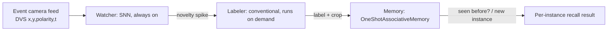

# Spikeforge — Memory-system research track (issues #22-#26)

> Research track, not a PC-0 production use case: these issues test what a
> genuinely spiking, one-shot, non-forgetting memory can and cannot do,
> rather than shipping a scoped product feature. Every claim about current
> code is grounded in a file/line reference; sections marked **design
> only** describe work that has not been built yet.

## 1. Why this track exists

Spikeforge's existing topologies (`fc_small`, `conv_net`, ...) are trained
once, end to end, against a fixed set of classes
([`presets.py`](spikeforge/topology/presets.py:1)). That is the right shape
for a static classifier and the wrong shape for a question this track
asks instead: **can a spiking system learn something new, on the spot,
from a single example, without a retraining cycle and without disturbing
what it already knew?** "No forgetting" is easy to fake with a classical
bolt-on (a nearest-neighbour cache, an embedding database); the point of
this track is to answer it with mechanisms that are actually spiking —
local synaptic plasticity and LIF dynamics, not a lookup table.

## 2. Issue #22 — held-out-digit POC (shipped)

**What it demonstrates.** `fc_small` is trained on MNIST digits 0-8 only,
then frozen (`net.requires_grad_(False)` in
[`frozen_classifier.py`](spikeforge/memory/frozen_classifier.py:34)). A
separate module,
[`OneShotAssociativeMemory`](spikeforge/memory/one_shot_associative_memory.py:18),
is taught digit 9 from a **single** example: one outer-product Hebbian
write ([`HebbianSynapse.write`](spikeforge/memory/hebbian_synapse.py:38))
into a dedicated LIF neuron's incoming weights — no gradient, no
optimizer step. Recall is ordinary `snn.Leaky` dynamics over that
synapse's current.

**Result (one real run, not cherry-picked; see
[`11_held_out_digit_memory.py`](examples/11_held_out_digit_memory.py:1)):**
retained accuracy on digits 0-8 held at **~91%** and recall accuracy on
the held-out 9 landed at **~23-26%** across a gain/threshold sweep (2x-16x
teach gain, 0.5/1.0 threshold) — well above the 10% ten-class chance
floor, short of reliable recognition. The retained number staying flat
across every sweep point is the structural guarantee working exactly as
designed: nothing in `teach()` can touch the frozen base net's weights.
The recall number is an honest research finding, not a tuned headline —
plausible explanation: the frozen net's hidden layer was never
incentivized to represent a class it never saw, so one exemplar's spike
pattern doesn't reliably generalize to other instances of that digit.
Follow-up ideas (not yet attempted): teaching from more than one
exemplar, or letting the base net's hidden layer train with a
class-agnostic (metric-learning) objective — the latter is exactly what
issue #24 explores, deliberately as a separate, harder claim.

**Reused by:** #23 and #24 both reuse
[`OneShotAssociativeMemory`](spikeforge/memory/one_shot_associative_memory.py:18)
unchanged as their memory readout.

## 3. Issue #23 — camera-fed room memory pipeline (design only)

Extension of #22 to a room-scale, always-on setting: a system that
watches a live feed, notices when something changed, identifies what
changed, and remembers whether it has seen *that specific instance*
before. Three stages, deliberately not one monolithic model:

### 3.1 Watcher (stage 1)

Application #3 from the original scoping issue (#22's issue body): an
always-on module that spikes on motion/change rather than running full
perception continuously. **Reuse, do not rebuild:** this is exactly
UC-3's reference architecture —
[`use_case_event_camera_vision.md`](plans/use_case_event_camera_vision.md:1)
— event-camera ingestion through
[`spikeforge/events/`](spikeforge/events/event_bridge.py:1) into a
compact spiking net, already scoped down to `dvs128_gesture`-style
topologies. The watcher's "class" here is binary (`novelty` /
`no-novelty`) rather than gesture identity, which only changes the head,
not the ingestion or runtime story UC-3 already designed.

### 3.2 Labeler (stage 2)

A fixed, pretrained, non-spiking object-detection/scene-understanding
model, run only when the watcher flags novelty — mirrors the
face-embedding backbone pattern already discussed for application #1 in
#22's scoping issue. Not built from scratch; not part of this repo's
SNN-native surface, by design (per the project's SNN-native-for-the-
learning-mechanism stance — the labeler is perception, not memory).

### 3.3 Memory (stage 3)

The **unchanged** #22 module,
[`OneShotAssociativeMemory`](spikeforge/memory/one_shot_associative_memory.py:18).
The open integration question is the input contract: #22 feeds it
`fc_small`'s hidden-layer spikes
([`hidden_trace`](spikeforge/memory/lockstep_runner.py:15)); stage 3 here
needs the labeler's crop turned into a spike pattern of the same shape
(`[T, H]`) before `teach()`/`step()` can be called unchanged. The
simplest bridge — rate-code a fixed-size embedding of the crop through
the existing [`SpikeEncoder`](spikeforge/encoding/spike_encoder.py:8) —
needs no new code, only a decision on which embedding to rate-code.

### 3.4 Open questions (unresolved, tracked here rather than guessed at)

- Real DVS hardware vs. recorded/converted RGB for the watcher — depends
  on available hardware, same caveat UC-3 already carries.
- Which off-the-shelf labeler, and what embedding size becomes the
  memory module's `in_features`.
- Novelty judgment: motion-only vs. "doesn't match anything already
  tracked" (the latter would call the memory module itself during the
  watcher stage, not just after the labeler — an open design fork, not
  decided here).

### 3.5 Explicitly out of scope

Internet scraping for images of similar items — considered and dropped
in the original scoping (ToS/legal exposure, doesn't help the core claim
of recognizing *the same instance again*). Revisit only if the goal
shifts toward describing objects for a person rather than the system
remembering them itself.

**Status:** design only. Implementation is queued behind #24/#25 in the
issue tracker; this section is the durable record of the pipeline shape
so implementation does not re-derive it from scratch.

## 4. Issue #24 — few-shot generalization to an untrained script (shipped)

**Different claim from #22.** #22 recalls a class it was explicitly
taught; #24 asks whether a spiking embedder's *notion of similarity*
transfers to characters it never saw any example of, in any class.
That requires changing the training objective from a fixed N-way
classifier to episodic metric learning
([`prototypical_loss`](spikeforge/memory/prototypical.py:26), Snell et
al.'s Prototypical Networks, adapted to spiking readouts): `fc_small`'s
final layer is repurposed as an embedding
([`episodic_trainer.py`](spikeforge/memory/episodic_trainer.py:17)),
trained so same-class rate-coded spike patterns land close together and
different classes land apart, over randomly sampled N-way K-shot
episodes
([`episode_sampler.py`](spikeforge/memory/episode_sampler.py:1)). The
frozen embedder's output spikes then feed #22's unchanged
`OneShotAssociativeMemory` via
[`embedding_readout.py`](spikeforge/memory/embedding_readout.py:1) —
one memory neuron per class in a held-out evaluation episode, taught
from a single example.

**Setup:** trained on EMNIST letters (English script, 26 classes,
`hidden=64`, `embed_dim=32`, 300 episodes of 5-way 5-shot); evaluated
one-shot 5-way accuracy on two held-out sets never included in a
training episode — (a) six EMNIST letters classes held out of training
(same script) and (b) KMNIST (Japanese Kuzushiji, a script the embedder
never saw in any form).

**Result (real runs, not cherry-picked):**

| Evaluation | One-shot 5-way accuracy | Chance |
|---|---|---|
| Training-episode accuracy (seen classes, 5-shot) | 60-96%, climbing over training | — |
| Held-out EMNIST letters (same script, unseen classes, 300 vs. 1000 episodes) | 23.6% / 21.4% | 20% |
| KMNIST (unseen script) | 21.0% | 20% |

The training curve confirms the mechanism itself works — the network
readily learns to discriminate the *trained* classes' spike patterns
within episodes. But that success does not transfer: one-shot
discrimination of classes excluded from every training episode is
statistically indistinguishable from chance, whether those classes
are same-script letters or a different script entirely. More training
(1000 vs. 300 episodes) did not close the gap and if anything made it
slightly worse, which argues against "just undertrained" as the
explanation.

**Honest reading, per the falsification-first stance this track takes
(no motivated reasoning toward a positive result):** at this scale
(`hidden=64`, `embed_dim=32`, rate coding, 15 timesteps), the embedder
appears to be learning features specific to the 20 trained letter
shapes rather than a transferable notion of character similarity — the
overfitting failure mode common to small-budget few-shot learning, not
evidence that spiking metric learning cannot generalize in principle.
Per the original scoping note, a positive result here would count as
evidence *against* the Consciousness Gradient paper's A3 axiom (issue
#26), not for it — this negative result does not bear on that question
either way.

**Ablations (real runs): neither of the two cheapest confounds explains
it.** Two candidate explanations were floated and both ruled out:

| Configuration | One-shot 5-way accuracy | Chance |
|---|---|---|
| Baseline (`hidden=64`, `embed_dim=32`, train 5-shot, eval 1-shot) | 21.0% | 20% |
| Shot-matched (train 1-shot, eval 1-shot) | 20.4% | 20% |
| Bigger capacity (`hidden=128`, `embed_dim=64`, train 5-shot) | 21.0% | 20% |
| Shot-matched + bigger capacity | 20.1% | 20% |

Every configuration lands within noise of chance — matching the
training/eval shot count and doubling both `hidden` and `embed_dim` each
had, individually and combined, no effect. This is a *cleaner* negative
result than the baseline alone: it rules out the two most likely
"just a hyperparameter mismatch" explanations, so the honest reading
shifts from "didn't work at this specific budget" toward "didn't work
for a more structural reason" — most plausibly that 300-1000 rate-coded
episodes on `fc_small`'s prototypical-loss objective isn't enough signal
to learn a genuinely transferable spike-pattern metric, independent of
capacity or shot count. Not yet tried: a fundamentally different
training signal (e.g. more episodes per unit of eval diversity rather
than raw episode count, or a convolutional rather than fully-connected
embedder given these are 2D character images).

**Reproduce:** [`examples/12_few_shot_character_generalization.py`](examples/12_few_shot_character_generalization.py:1)
for the baseline; the ablation table's other three rows pass
`train_k_shot=1` and/or `hidden=128, embed_dim=64` to
`run_few_shot_generalization_poc`.

## 5. Issue #26

Tracked separately — a falsification test of an unrelated philosophical
claim (the Consciousness Gradient paper's A3 axiom), not a memory-system
feature. Depends on #24's architecture; see the issue for current status.
