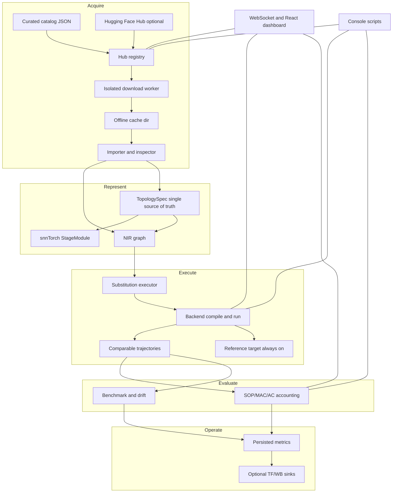
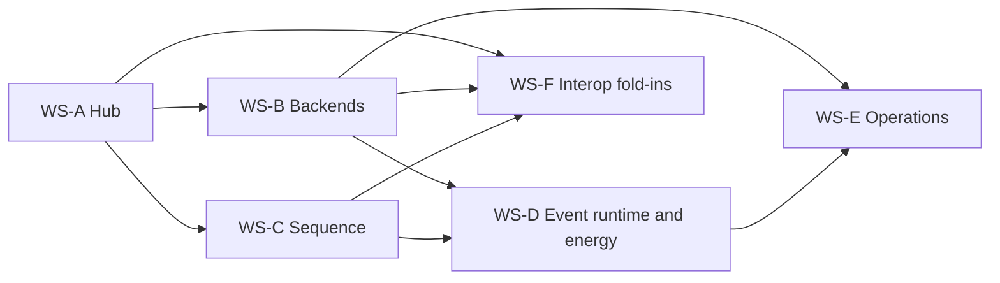

# Spikeforge — Professionalization Roadmap

Master design/spec for the professionalization program. **It shipped:** every
workstream and phase below is implemented in the `0.2.0` tree, so this
document is retained as the authoritative design record rather than a to-do
list. It follows the house style of
[`ecosystem_roadmap.md`](plans/ecosystem_roadmap.md) and
[`interpreter_spine_plan.md`](plans/interpreter_spine_plan.md): status blocks,
grounded file references, Mermaid diagrams, and an explicit acceptance bar.

> **Status — delivered (implemented).** All six workstreams (WS-A…WS-F) and
> every phase A1–F5 shipped; the repo is at `0.2.0` with
> `Development Status :: 4 - Beta` ([`setup.py`](setup.py)) and 739 passing
> tests (1 skipped), `ruff` clean, and a building client. Beta rather than a
> final release because the planned capabilities are delivered while hardware
> and energy results remain unmeasured (reported as estimates). See
> [`plans/index.md`](index.md) for the same status from the docs side and the
> README's "Model hub", "Backend execution", "Sequence primitives", "Event
> runtime and energy", "Operational maturity", and "Interop fold-ins" sections
> for what is delivered and where the honest boundaries are.

---

## 1. Vision and theme

Make `spikeforge` the **lynchpin tooling layer for the neuromorphic model
landscape**: a place where a model authored in snnTorch, NIR, SpikingJelly,
Norse, Lava, or a Hugging Face repo can be **found, downloaded, inspected,
imported, executed on a real backend, translated to sequence/attention
topologies, and evaluated for energy and latency** — with the honesty rule
enforced at every step. Today the tool translates, validates, and reports
capability. This program makes it **acquire, run, and measure**.

Five pillars stay from the ecosystem roadmap (interpreter, interface, interop,
targets) and gain a fifth and sixth movement:

1. **Hub** — discover and obtain models, in-app, with honest availability.
2. **Execute** — actually compile and run on a real backend, not just declare.
3. **Sequence** — a vocabulary broad enough for spiking transformers/sequences.
4. **Energy** — event-driven accounting that reports SOP/MAC/AC counts honestly.
5. **Operate** — persisted metrics, optional external tracking, reproducible
   releases, and generated docs.

---

## 2. Executive summary

Six workstreams, each split into independently verifiable phases:

| WS | Theme | Highest-risk decision | Focused design |
|---|---|---|---|
| A | Model Hub and Import | curated catalog vs. live HF search | [`model_hub_plan.md`](plans/model_hub_plan.md) |
| B | Backend Execution | first real backend + substitution execution | [`backend_execution_plan.md`](plans/backend_execution_plan.md) |
| C | Sequence Primitives and Per-Stage Neurons | NIR contract for new kinds | [`sequence_primitives_plan.md`](plans/sequence_primitives_plan.md) |
| D | Event-Driven Runtime and Energy Accounting | honesty of an energy *estimate* | [`event_runtime_plan.md`](plans/event_runtime_plan.md) |
| E | Operational Maturity | persistence without breaking the default | [`operations_plan.md`](plans/operations_plan.md) |
| F | Interop Fold-Ins | ONNX/nirtorch/event-training scope | [`interop_foldins_plan.md`](plans/interop_foldins_plan.md) |

**Recommended first backend:** `norse` (`pip install norse`, pure PyTorch, same
ecosystem as snnTorch). **Recommended hub approach:** a bundled, curated
catalog browser that works fully offline, plus opt-in live Hugging Face Hub
search/download behind a `hub` extra. Rationale and trade-offs are in
sections 11 and each focused document.

**The through-line invariant:** every workstream preserves the
`TopologySpec` single source of truth ([`spec.py`](spikeforge/topology/spec.py:16)),
the legacy checkpoint keys `_fc1/_lif1/_fc2/_lif2`, `main.py`,
`main_encodings.py`, existing WebSocket payload keys, and the `alpha`
unexportable precedent ([`neuron_nodes.py`](spikeforge/nir_bridge/neuron_nodes.py:51)).

---

## 3. Current-state gap table

Every row is grounded in the current source. "Gap" is what this program closes.

| # | Capability the program requires | Current reality | Anchor | WS |
|---|---|---|---|---|
| 1 | Model browser / downloader | None. No download path for models, only datasets | [`datasets.py`](spikeforge/data/datasets.py:106), [`download_cli.py`](spikeforge/data/download_cli.py:15) | A |
| 2 | External model import | NIR only, via file path; no weight-only import | [`ingest.py`](spikeforge/nir_bridge/ingest.py:21) | A |
| 3 | Hugging Face Hub integration | Absent; no `huggingface_hub` anywhere | [`setup.py`](setup.py:46) | A |
| 4 | Download progress + cancel | Exists for datasets only; not reusable yet | [`downloads.py`](server/downloads.py:41) | A |
| 5 | Backend actually runs a graph | Declared only; `deployable` is a capability flag | [`report.py`](spikeforge_targets/report.py:56) | B |
| 6 | Substitution *execution* | Declared, never applied | [`substitution.py`](spikeforge_targets/substitution.py:6), [`catalog.py`](spikeforge_targets/catalog.py:87) | B |
| 7 | Layer vocabulary | Fixed to 5 module kinds + `add` | [`kinds.py`](spikeforge/topology/kinds.py:8) | C |
| 8 | Per-stage heterogeneous neurons | One neuron kind for all stages | [`presets.py`](spikeforge/topology/presets.py:50) | C |
| 9 | Sequence / attention primitives | None | [`stage_modules.py`](spikeforge/topology/stage_modules.py:59) | C |
| 10 | Sparse / event-driven runtime | Dense unroll only | [`execution.py`](spikeforge/simulator/execution.py:122) | D |
| 11 | Energy / latency accounting | None | [`harness.py`](spikeforge/benchmark/harness.py:1) | D |
| 12 | Metrics persistence | In-memory registry only | [`metrics.py`](spikeforge/observability/metrics.py:14) | E |
| 13 | External tracking | Local files only, by design | [`manifest.py`](spikeforge/tracking/manifest.py:35) | E |
| 14 | Docs site | Markdown in `plans/` only | [`ecosystem_roadmap.md`](plans/ecosystem_roadmap.md:1) | E |
| 15 | Event-dataset **training** | `build_dataset` refuses event specs | [`datasets.py`](spikeforge/data/datasets.py:111) | F |
| 16 | ONNX bridge | None | [`nir_bridge/__init__.py`](spikeforge/nir_bridge/__init__.py:18) | F |
| 17 | Third-party `nirtorch` extraction | Deferred, absent | [`api.py`](spikeforge/nir_bridge/api.py:63) | F |
| 18 | Quantization applied | Declared in constraints only | [`target_spec.py`](spikeforge_targets/target_spec.py:28) | F |
| 19 | Non-square sensor geometry | Hardcoded 28x28 / square conv math | [`presets.py`](spikeforge/topology/presets.py:128) | F |
| 20 | Per-step hidden animation | Raster snapshots only | [`INTEGRATION_PLAN.md`](INTEGRATION_PLAN.md:21) | F |

### 3.1 Invariants that must not break (all workstreams)

- Legacy checkpoints keep loading: state-dict keys `_fc1`, `_lif1`, `_fc2`,
  `_lif2` ([`spiking_net.py`](spikeforge/network/spiking_net.py:10),
  [`registry.py`](spikeforge/topology/registry.py:61)).
- `main.py` and `main_encodings.py` keep running unchanged.
- Existing WebSocket payload keys stay additive-only
  ([`client_message.py`](server/schemas/client_message.py:12),
  [`server_message.py`](server/schemas/server_message.py:8)).
- `TopologySpec` remains the single source of truth for module + NIR renderings
  ([`spec.py`](spikeforge/topology/spec.py:16)).
- The `alpha` unexportable precedent: an unmappable stage raises the typed
  `UnsupportedStageError`, never silently degrades
  ([`neuron_nodes.py`](spikeforge/nir_bridge/neuron_nodes.py:162)).
- Honesty rule: unsupported/unknown things are reported explicitly.

---

## 4. Target architecture



Core idea carried over from the spine: **one declarative graph rendered twice**
([`interpreter_spine_plan.md`](plans/interpreter_spine_plan.md:112)). New
subsystems attach to that spine as **renderers and consumers**, never as a
second source of truth. The hub produces a `TopologySpec` *or* a NIR graph plus
a declared compatibility verdict; the backend consumes the NIR graph; the
energy model consumes the executed trajectory's op counts.

### 4.1 Workstream dependency graph



A and B are the critical path; C can run parallel to B; D depends on B and C;
E and F close out.

---

## 5. Workstream overview

### 5.1 WS-A — Model Hub and Import  → [`model_hub_plan.md`](plans/model_hub_plan.md)

Phases A1–A4: bundled catalog + availability probe; isolated downloader with
progress/cancel/checksum; import/inspect (NIR ingest plus preset weight-mapping);
and the surfaces (WS actions, `spikeforge-hub` CLI, `HubPanel`).

### 5.2 WS-B — Hardware/Simulator Backend Execution → [`backend_execution_plan.md`](plans/backend_execution_plan.md)

Phases B1–B4: a **substitution executor** that rewrites a graph to a target-ready
graph and re-validates drift; the **Norse simulator backend** (first real
backend); a **Lava/Loihi 2 hardware path** executable when the SDK is present;
and wiring so `deploy`/`deploy_run` compile and run.

### 5.3 WS-C — Sequence Primitives and Per-Stage Neurons → [`sequence_primitives_plan.md`](plans/sequence_primitives_plan.md)

Phases C1–C4: per-stage heterogeneous neuron configuration; new module kinds
(`embedding`, `conv1d`, `layer_norm`, `batch_norm`, `dropout`, `attention`,
`maxpool1d/2d`, `positional_encoding`) each with a module factory and a NIR
contract or an explicit unexportable outcome; the sequence/token data path; and
a `sequence_net` demo preset.

### 5.4 WS-D — Event-Driven Sparse Runtime and Energy → [`event_runtime_plan.md`](plans/event_runtime_plan.md)

Phases D1–D3: a sparse/event-driven execution path alongside the dense unroll
with a dense-parity acceptance test; an energy/latency accounting model
(SOPs/MACs/ACs/timesteps mapped to a declared per-target cost table); and its
surfaces (benchmark, report, CLI, dashboard).

### 5.5 WS-E — Operational Maturity → [`operations_plan.md`](plans/operations_plan.md)

Phases E1–E3: persist the in-memory metrics registry to files; optional
TensorBoard/W&B sinks behind extras; the reproducibility/bit-exactness path and
a docs site generated from `plans/`.

### 5.6 WS-F — Interop Fold-Ins → [`interop_foldins_plan.md`](plans/interop_foldins_plan.md)

Phases F1–F5: event-dataset training; ONNX export/import bridge; third-party
PyTorch extraction via `nirtorch`; target quantization application; and the
small gaps (non-square geometry, per-step hidden-layer animation).

---

## 6. New interfaces (summary)

### 6.1 WebSocket actions

Added to the `Literal` union in
[`client_message.py`](server/schemas/client_message.py:15) and routed through
[`protocol_handlers.py`](server/protocol_handlers.py:19); replies added to
[`server_message.py`](server/schemas/server_message.py:11).

| Action | Reply type(s) | Domain | Precondition |
|---|---|---|---|
| `hub_list` | `hub_list` | A | — |
| `hub_search` | `hub_search` | A | live search needs `hub` extra |
| `hub_download` | `hub_download_state` | A | catalog or repo id |
| `hub_cancel` | `hub_download_state` | A | a download in flight |
| `hub_inspect` | `hub_inspect` | A | a downloaded artifact |
| `hub_import` | `hub_import` | A | a compatible artifact |
| `deploy_run` | `backend_run` | B | a target + spec |
| `energy_report` | `energy_report` | D | an executed run or a spec |

All read-only or additive; precondition failures emit the existing `error`
message, matching [`target_handlers.py`](server/target_handlers.py:85).

### 6.2 CLI console scripts

Added to [`setup.py`](setup.py:66):

| Script | Module | Purpose |
|---|---|---|
| `spikeforge-hub` | [`hub/cli.py`](spikeforge_hub/cli.py) | `list`, `search`, `download`, `inspect`, `import` |
| `spikeforge-energy` | [`energy/cli.py`](spikeforge_targets/energy/cli.py) | `account`, `report` |

Extended (not new): `spikeforge-verify` gains `backend run`; `spikeforge-targets` gains
`rewrite` and `run` (see [`target_cli.py`](spikeforge/cli/target_cli.py:166)).

### 6.3 Python API entry points

- `spikeforge_hub`: `catalog()`, `search()`, `download()`, `inspect()`,
  `import_model()`.
- `spikeforge_targets.rewrite`: `rewrite(spec_or_graph, target) -> RewriteResult`.
- `spikeforge_targets.backends`: `compile_run(target, graph, spikes) -> BackendResult`.
- `spikeforge_targets.event_runtime`: `sparse_run(module, spikes, ...) -> Trajectory`.
- `spikeforge_targets.energy`: `account(trajectory_or_spec, target) -> EnergyReport`.

### 6.4 Client panels/components

New under `client/src/components/` (one component per file, 80-column TS, no
`any`): `HubPanel.tsx`, `HubEntryCard.tsx`, `HubDownloadProgress.tsx`,
`HubCompatBadge.tsx`, `BackendRunPanel.tsx`, `EnergyPanel.tsx`, plus
`client/src/hubTypes.ts`, `client/src/energyTypes.ts`, and hooks
`useHub.ts`, `useEnergy.ts`. Wired into [`App.tsx`](client/src/App.tsx) and
[`useWebSocket.ts`](client/src/useWebSocket.ts).

---

## 7. Packaging extras and availability rules

Extras extend [`setup.py`](setup.py:46) (existing: `dev`, `web`, `nir`,
`events`):

| Extra | Packages | Enables | Absent behavior |
|---|---|---|---|
| `hub` | `huggingface_hub` | live HF search/download | catalog browser still works offline; live search reports unavailable |
| `norse` | `norse` | Norse simulator backend | target reports `available: false` |
| `lava` | `lava-nc` | Lava/Loihi 2 execution path | target reports `available: false` |
| `onnx` | `onnx`, `onnxruntime` | ONNX export/import | bridge raises typed unavailable error |
| `tracking` | `tensorboard` | TensorBoard sink | local file manifest remains default |
| `tracking-wandb` | `wandb` | W&B sink | local file manifest remains default |

Availability follows the **existing isolated-probe pattern**: a single module
per subsystem owns the import ([`probe.py`](spikeforge_targets/probe.py:14),
[`api.py`](spikeforge/nir_bridge/api.py:63)). New probes:
`hub/probe.py`, `energy/probe.py`, `nir_bridge/onnx_api.py`. Degradation is
always explicit — an unavailable capability is reported, never faked.

---

## 8. Ordered implementation plan

Each phase is sized to one focused Code-mode task and is independently
verifiable. Order is priority-first (hub) but B/C can be parallelized.

### Milestone 1 — Model Hub (WS-A, highest priority)

| Phase | Task | Key files | New tests | Acceptance command |
|---|---|---|---|---|
| A1 | Catalog + probe + cache | [`hub/catalog.py`](spikeforge_hub/catalog.py), [`hub/entry.py`](spikeforge_hub/entry.py), [`hub/probe.py`](spikeforge_hub/probe.py), [`hub/cache.py`](spikeforge_hub/cache.py), [`hub/models.json`](spikeforge_hub/models.json) | `test_hub_catalog.py`, `test_hub_cache.py` | `python -m spikeforge_hub.cli list` |
| A2 | Downloader worker | [`hub/download_cli.py`](spikeforge_hub/download_cli.py), [`hub/downloads.py`](spikeforge_hub/downloads.py), [`hub/verify.py`](spikeforge_hub/verify.py) | `test_hub_download_routing.py`, `test_hub_verify.py` | `python -m spikeforge_hub.cli download <id>` |
| A3 | Import + inspect | [`hub/inspect.py`](spikeforge_hub/inspect.py), [`hub/import_model.py`](spikeforge_hub/import_model.py), [`hub/weight_map.py`](spikeforge_hub/weight_map.py), [`hub/compat.py`](spikeforge_hub/compat.py) | `test_hub_inspect.py`, `test_hub_import.py`, `test_hub_compat.py` | `python -m spikeforge_hub.cli inspect <id>` |
| A4 | Surfaces | [`hub/cli.py`](spikeforge_hub/cli.py), [`server/hub_handlers.py`](server/hub_handlers.py), [`server/hub_payloads.py`](server/hub_payloads.py), [`client/src/components/HubPanel.tsx`](client/src/components/HubPanel.tsx) | `test_server_hub_actions.py`, `test_cli_hub.py` | `pytest tests/test_server_hub_actions.py` |

### Milestone 2 — Backend Execution (WS-B)

| Phase | Task | Key files | New tests | Acceptance command |
|---|---|---|---|---|
| B1 | Substitution executor | [`targets/rewrite.py`](spikeforge_targets/rewrite.py), [`targets/rewrite_report.py`](spikeforge_targets/rewrite_report.py), [`targets/substitute_ops.py`](spikeforge_targets/substitute_ops.py) | `test_substitution_rewrite.py`, `test_rewrite_report.py` | `python -m spikeforge.cli.verify rewrite --topology conv_net --target norse` |
| B2 | Norse simulator backend | [`targets/backends/norse_backend.py`](spikeforge_targets/backends/norse_backend.py), [`targets/backends/api.py`](spikeforge_targets/backends/api.py), [`targets/backends/result.py`](spikeforge_targets/backends/result.py) | `test_norse_backend.py`, `test_backend_drift.py` | `python -m spikeforge.cli.verify backend run --topology conv_net --target norse` |
| B3 | Lava hardware path | [`targets/backends/lava_backend.py`](spikeforge_targets/backends/lava_backend.py) | `test_lava_backend.py` | `python -m spikeforge.cli.verify backend run --target lava_loihi2` |
| B4 | Deploy wiring + surfaces | [`server/backend_handlers.py`](server/backend_handlers.py), [`client/src/components/BackendRunPanel.tsx`](client/src/components/BackendRunPanel.tsx) | `test_server_backend_actions.py` | `pytest tests/test_server_backend_actions.py` |

### Milestone 3 — Sequence Primitives (WS-C, parallel to B)

| Phase | Task | Key files | New tests | Acceptance command |
|---|---|---|---|---|
| C1 | Per-stage heterogeneous neurons | [`topology/presets.py`](spikeforge/topology/presets.py), [`topology/registry.py`](spikeforge/topology/registry.py), [`server/schemas/train_config.py`](server/schemas/train_config.py) | `test_per_stage_neurons.py`, `test_train_config_stage_overrides.py` | `python -m spikeforge.cli.verify validate --topology fc_small` |
| C2 | New module kinds + NIR contracts | [`topology/kinds.py`](spikeforge/topology/kinds.py), [`topology/stage_modules.py`](spikeforge/topology/stage_modules.py), [`nir_bridge/node_builders.py`](spikeforge/nir_bridge/node_builders.py), [`nir_bridge/mapper.py`](spikeforge/nir_bridge/mapper.py) | `test_stage_kinds_new.py`, `test_nir_unexportable_stages.py` | `python -m spikeforge.cli.verify export --topology sequence_net` |
| C3 | Sequence/token data path | [`simulator/input_shape.py`](spikeforge/simulator/input_shape.py), [`data/sequence_source.py`](spikeforge/data/sequence_source.py) | `test_sequence_input.py` | `pytest tests/test_sequence_input.py` |
| C4 | `sequence_net` preset + stage editor | [`topology/presets.py`](spikeforge/topology/presets.py), [`client/src/components/StageEditor.tsx`](client/src/components/StageEditor.tsx) | `test_sequence_preset.py` | `python -m spikeforge.cli.verify validate --topology sequence_net` |

### Milestone 4 — Event Runtime and Energy (WS-D)

| Phase | Task | Key files | New tests | Acceptance command |
|---|---|---|---|---|
| D1 | Sparse/event-driven runner | [`event_runtime/sparse_runner.py`](spikeforge_targets/event_runtime/sparse_runner.py), [`event_runtime/spike_view.py`](spikeforge_targets/event_runtime/spike_view.py), [`event_runtime/ops.py`](spikeforge_targets/event_runtime/ops.py) | `test_sparse_runtime.py`, `test_sparse_dense_parity.py` | `pytest tests/test_sparse_dense_parity.py` |
| D2 | Energy/latency accounting | [`energy/accounting.py`](spikeforge_targets/energy/accounting.py), [`energy/cost_table.py`](spikeforge_targets/energy/cost_table.py), [`energy/target_costs.py`](spikeforge_targets/energy/target_costs.py) | `test_energy_accounting.py`, `test_cost_table.py` | `python -m spikeforge_targets.energy.cli account --topology conv_net --target reference` |
| D3 | Surfaces | [`energy/report.py`](spikeforge_targets/energy/report.py), [`energy/cli.py`](spikeforge_targets/energy/cli.py), [`server/energy_handlers.py`](server/energy_handlers.py), [`client/src/components/EnergyPanel.tsx`](client/src/components/EnergyPanel.tsx) | `test_energy_report.py`, `test_server_energy_action.py` | `pytest tests/test_server_energy_action.py` |

### Milestone 5 — Operations (WS-E)

| Phase | Task | Key files | New tests | Acceptance command |
|---|---|---|---|---|
| E1 | Persist metrics | [`observability/store.py`](spikeforge/observability/store.py), [`observability/persistence.py`](spikeforge/observability/persistence.py) | `test_metrics_persistence.py` | `pytest tests/test_metrics_persistence.py` |
| E2 | External tracking sinks | [`tracking/sinks.py`](spikeforge/tracking/sinks.py), [`tracking/tensorboard_sink.py`](spikeforge/tracking/tensorboard_sink.py), [`tracking/wandb_sink.py`](spikeforge/tracking/wandb_sink.py) | `test_tracking_sinks.py` | `pytest tests/test_tracking_sinks.py` |
| E3 | Determinism + docs site | [`tracking/determinism.py`](spikeforge/tracking/determinism.py), [`mkdocs.yml`](mkdocs.yml), [`scripts/build_docs.sh`](scripts/build_docs.sh) | `test_determinism.py` | `bash scripts/build_docs.sh --check` |

### Milestone 6 — Interop Fold-Ins (WS-F)

| Phase | Task | Key files | New tests | Acceptance command |
|---|---|---|---|---|
| F1 | Event-dataset training | [`training/event_engine.py`](spikeforge/training/event_engine.py), [`data/datasets.py`](spikeforge/data/datasets.py) | `test_event_training.py` | `pytest tests/test_event_training.py` |
| F2 | ONNX bridge | [`onnx_bridge/api.py`](spikeforge/onnx_bridge/api.py), [`onnx_bridge/export.py`](spikeforge/onnx_bridge/export.py), [`onnx_bridge/import_onnx.py`](spikeforge/onnx_bridge/import_onnx.py) | `test_onnx_bridge.py` | `pytest tests/test_onnx_bridge.py` |
| F3 | `nirtorch` extraction | [`nir_bridge/extract.py`](spikeforge/nir_bridge/extract.py) | `test_nir_extract.py` | `pytest tests/test_nir_extract.py` |
| F4 | Quantization application | [`targets/quantize.py`](spikeforge_targets/quantize.py) | `test_quantize.py` | `pytest tests/test_quantize.py` |
| F5 | Geometry + client animation | [`simulator/input_shape.py`](spikeforge/simulator/input_shape.py), [`client/src/components/NetworkActivity.tsx`](client/src/components/NetworkActivity.tsx) | `test_geometry.py` | `pytest tests/test_geometry.py` |

---

## 9. Test plan

### 9.1 New pytest files (enumerated)

- Hub: `test_hub_catalog.py`, `test_hub_cache.py`, `test_hub_download_routing.py`,
  `test_hub_verify.py`, `test_hub_inspect.py`, `test_hub_import.py`,
  `test_hub_compat.py`, `test_server_hub_actions.py`, `test_cli_hub.py`.
- Backends: `test_substitution_rewrite.py`, `test_rewrite_report.py`,
  `test_norse_backend.py`, `test_lava_backend.py`, `test_backend_drift.py`,
  `test_server_backend_actions.py`, `test_cli_backend.py`.
- Sequence: `test_stage_kinds_new.py`, `test_stage_modules_new.py`,
  `test_per_stage_neurons.py`, `test_train_config_stage_overrides.py`,
  `test_sequence_input.py`, `test_sequence_preset.py`,
  `test_nir_unexportable_stages.py`.
- Event runtime: `test_sparse_runtime.py`, `test_sparse_dense_parity.py`,
  `test_energy_accounting.py`, `test_cost_table.py`, `test_energy_report.py`,
  `test_server_energy_action.py`, `test_cli_energy.py`.
- Operations: `test_metrics_persistence.py`, `test_tracking_sinks.py`,
  `test_determinism.py`.
- Fold-ins: `test_event_training.py`, `test_onnx_bridge.py`,
  `test_nir_extract.py`, `test_quantize.py`, `test_geometry.py`,
  `test_client_animation_payload.py`.
- Extend (`test_packaging_profiles.py`): assert every new extra and console
  script is declared.

### 9.2 Smoke checks (CI gates)

```bash
ruff check .
pytest -q
python -m spikeforge.cli.verify validate --topology conv_net
python -m spikeforge.cli.verify validate --topology sequence_net
python -m spikeforge_hub.cli list
python -m spikeforge_targets.energy.cli account --topology conv_net
python main.py --help && python main_encodings.py --help
cd client && npm run build
```

Back-compat guard: load a legacy `_fc1/_lif1/_fc2/_lif2` checkpoint and assert
identical outputs, exactly as
[`interpreter_spine_plan.md`](plans/interpreter_spine_plan.md:148) specifies.

---

## 10. Cross-cutting concerns

- **Style contract:** every new module obeys [`rules.md`](rules.md) — one class
  per file, files under 250 lines, functions under 20 lines, 79-column Python,
  80-column TS, full type hints, no `noqa`, no `any`, no shims.
- **Back-compat:** changes are additive; new fields surface in `meta`
  ([`checkpoint_mixin.py`](spikeforge/training/checkpoint_mixin.py:37)).
- **Honesty:** estimated energy is labelled an estimate; declared substitutions
  become executed substitutions *with* a rewrite report and a drift check.
- **Out of scope:** multi-user sessions and auth are explicitly deferred (see
  [`interpreter_spine_plan.md`](plans/interpreter_spine_plan.md:1) precedent and
  [`INTEGRATION_PLAN.md`](INTEGRATION_PLAN.md:23)).

---

## 11. Recommendations and trade-off analysis

### 11.1 Hub approach — curated catalog + optional live HF search

| Option | Pros | Cons | Verdict |
|---|---|---|---|
| Live HF search only | broadest coverage | network-dependent, uncurated, no offline | reject as primary |
| Curated catalog only | offline, tested, deterministic | limited to shipped entries | **primary** |
| Curated + optional live HF | offline default, open-ended reach | needs `hub` extra and honest gating | **recommended** |

**Recommendation:** ship a bundled catalog (`hub/models.json`) covering
snnTorch, NIR, SpikingJelly, Norse, Lava, and a small allow-list of HF repos;
add live HF Hub search/download behind `hub`. This matches the project's
existing "bake the browser in, download from wherever behind an extra"
instinct and the `events`-extra precedent
([`datasets.py`](spikeforge/data/datasets.py:51)).

### 11.2 First backend — Norse

| Option | Install | Cross-platform | Effort | Verdict |
|---|---|---|---|---|
| Norse | pip, pure PyTorch | yes | low | **recommended first** |
| Lava / Loihi 2 | heavier, hardware | partial | high | second, hardware path |
| SpiNNaker2 | SDK + toolchain | partial | high | later |
| Speck / Xylo | vendor SDKs | partial | high | later |

**Recommendation:** `norse` first because it is pip-installable, pure PyTorch,
and shares the torch stack, so it validates the compile-run-drift pipeline with
minimal new machinery; the substitution it needs (`IF`→`beta=0` `LIF`) is
already declared ([`catalog.py`](spikeforge_targets/catalog.py:141)) and
becomes the first executed substitution. Lava follows as the first real
hardware path, executable when `lava-nc` is present.

---

## 12. Decisions (resolved)

Every decision below is now recorded and implemented; the two that were still
open in the first draft are closed with the stated default.

1. **Hub catalog contents and licensing — resolved: metadata-only, verified
   only.** The catalog ships metadata only and never redistributes third-party
   weights (bundled entries are this project's own NIR preset graphs); remote
   weights are fetched on demand into a local cache. The four invented
   `"see upstream"` seed entries were removed, so the catalog now ships only
   entries with a real source and a concrete license; an unverified candidate
   must be marked `unverified-candidate` and reports `available: false`. See
   the repository's `NOTICE.md` and `spikeforge_hub/CURATION.md`.
2. **Live HF scope — resolved: allow-list first.** The catalog/allow-list path
   is the default; live full-text search is opt-in behind the `hub` extra and
   gated honestly when absent. General search stays a later, additive step.
3. **First backend — resolved.** `norse` shipped first (pure-PyTorch,
   pip-installable), with `lava_loihi2` as the first hardware path gated on its
   SDK.
4. **Sequence scope boundary — resolved.** Sequence/attention support is for
   *experimentation* and is explicitly not a production LLM-training claim.
5. **Energy cost tables — resolved.** Per-target values are declared in-repo
   estimates (`"measured": false` with a `source`), not measured.
6. **Metrics persistence root — resolved.** Persisted under `SPIKEFORGE_METRICS_DIR`
   (default `<DATA_DIR>/metrics`) with opt-in `SPIKEFORGE_METRICS_PERSIST`.
7. **Docs stack — resolved: MkDocs Material.** Generated from `plans/` and the
   README by [`scripts/build_docs.sh`](scripts/build_docs.sh).

---

## 13. Deferred and out of scope

- Multi-user sessions, authentication, and remote users — deferred.
- Production LLM training — out of scope; sequence support is experimental.
- Measured (rather than estimated) energy — deferred until a device is present.
- Vendor SDKs Speck/Xylo/SpikingJelly model *execution* — declared only until
  their extras land.

---

## 14. Success metrics

| Metric | Target |
|---|---|
| Hub entries browsable offline | ≥ 10 across ≥ 5 frameworks |
| Backends that actually compile and run | ≥ 1 simulator + ≥ 1 hardware path gated on SDK |
| Substitutions executed (not just declared) | 100 percent of a target's declared substitutions applied with a rewrite report |
| New stage kinds with a module factory | 100 percent; each NIR-mapped or explicitly unexportable |
| Sparse-vs-dense parity | same readout within tolerance, lower op count on sparse input |
| Per-stage neuron control | every neuron stage independently configurable |
| Metrics durability | survives process restart, default stays local |
| Back-compat | 739 existing tests stay green; legacy checkpoints load |
