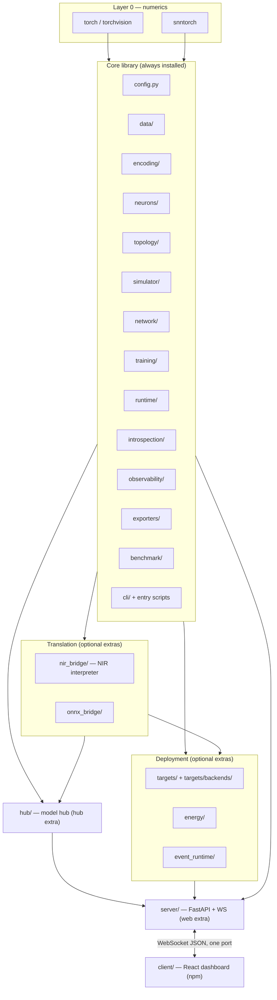

# Repo topology: component inventory and split analysis

This document answers three questions about the current codebase:

1. **What components does it actually contain?** (a complete inventory, not just
   the four obvious ones)
2. **Can it be split into more than one repository?** (where are the seams?)
3. **Should it be split, and if so, when and how?** (a staged recommendation)

The short answer: the seams are already good enough to split cleanly, but the
right first step is *multiple distributions in one repo*, not multiple repos.
Go multi-repo only where release cadence actually diverges. Details below.

> Status — **proposed.** No code has moved. This is a decision document, and
> the recommendation is deliberately staged.

## 1. Component inventory

The repository is one Python distribution (`snn-interpreter`, see
[`setup.py`](../setup.py)), one FastAPI app (`server/`), one React app
(`client/`), plus tests, scripts, plans, and Docker. The Python distribution is
the interesting part: it is monolithic, but its subpackages already cluster
into layers with distinct dependencies and audiences.

### 1.1 What the four "obvious" components actually are

You named four; here is what each maps to in the tree.

- **Web app** — split across two components, not one:
  - `server/` — FastAPI + WebSocket adapter, Pydantic protocol schemas,
    per-session lifecycle, static mount of the built client.
  - `client/` — React 18 + Vite 6 + TypeScript dashboard that speaks the
    WebSocket protocol. Already a separate npm package
    ([`client/package.json`](../client/package.json)) that is `private: true`
    and has no Python coupling.
- **Training code** — `snn_interpreter/training/` (trainer + mixins, AMP,
  multi-device, event engine) plus `snn_interpreter/encoding/` (rate/latency/
  delta/random spike encoders).
- **Inference code** — `snn_interpreter/simulator/` (one temporal loop,
  runners, compiled step), `snn_interpreter/network/` (inference, model
  store/search/diff), and `snn_interpreter/runtime/` (device, execution mode).
- **Model hub downloader** — `snn_interpreter/hub/` (catalog, Hugging Face API,
  cache, download progress, compatibility, inspect, import).

### 1.2 What else is in here

These are the components that the four-item framing misses, and they are the
ones that most affect a split.

| Component | Path | Responsibility | Key third-party deps | Optional? |
|---|---|---|---|---|
| Topology spine | `snn_interpreter/topology/` | `TopologySpec` single source of truth; stage kinds, presets, sequence/attention stages | torch | core |
| Neuron models | `snn_interpreter/neurons/` | Leaky/Lapicque/Alpha/synaptic/recurrent neurons, registry, surrogate grads | torch, snntorch | core |
| Simulator | `snn_interpreter/simulator/` | Temporal loop, frames, runners, compiled/parallel step, trajectory | torch | core |
| Training | `snn_interpreter/training/` | Trainer + mixins, AMP, multi-device, checkpoints, eval, event batches | torch | core |
| Encoding | `snn_interpreter/encoding/` | Rate/latency/delta trainers, random spike generator | torch, snntorch | core |
| Data | `snn_interpreter/data/` | Dataset registry/loaders, event geometry, sequence source, sample access | torch, torchvision, tonic (lazy) | core (events extra) |
| Runtime | `snn_interpreter/runtime/` | Device selection/priming, execution mode, system stats | torch, psutil | core |
| Config | `snn_interpreter/config.py` | `SNN_*` env-driven paths (data, models, hub, metrics, tracking) | stdlib | core |
| NIR interpreter | `snn_interpreter/nir_bridge/` | `TopologySpec` ⇄ `nir.NIRGraph`, independent interpreter, drift, validation | nir, nirtorch, torch (lazy) | `nir` extra |
| ONNX bridge | `snn_interpreter/onnx_bridge/` | ONNX export/import/roundtrip, step module, metadata | onnx (lazy) | `onnx` extra |
| Deploy targets | `snn_interpreter/targets/` | Capability matrix, rewrite/substitute/quantize, reports, node views | nir, torch | core + `nir` |
| Deploy backends | `snn_interpreter/targets/backends/` | Reference, Norse, Lava backends; lowering, compare | norse, lava-nc (lazy) | `norse` / `lava` extras |
| Energy accounting | `snn_interpreter/energy/` | SOP/MAC/AC estimates, cost tables (JSON per platform), probe, report | torch, stdlib | core |
| Event runtime | `snn_interpreter/event_runtime/` | Sparse execution, dense compare, spike views, counters | torch | core (events) |
| Model hub | `snn_interpreter/hub/` | Catalog, HF API, cache, downloads, compat/probe, import, verify | huggingface_hub (lazy), nir | `hub` extra |
| Introspection | `snn_interpreter/introspection/` | Firing rate, ISI, sparsity, histograms, surrogate, encoding decode | torch, snntorch | core |
| Observability | `snn_interpreter/observability/` | Structured logging, metrics registry, persistence, snapshots | stdlib | core |
| Tracking | `snn_interpreter/tracking/` | Checkpoint manifest, determinism, seeds, sinks | tensorboard/wandb (lazy) | `tracking` extras |
| Exporters | `snn_interpreter/exporters/` | Matplotlib/GIF/MP4 tutorial artifacts, reconstruction | matplotlib, Pillow, snntorch | core |
| Benchmark | `snn_interpreter/benchmark/` | Suite, harness, config, energy, CLI | torch | core |
| CLI | `snn_interpreter/cli/` + per-package `cli.py` | `snn-verify`, `snn-records`, `snn-targets`, `snn-hub`, `snn-energy`, `snn-benchmark` | — | core |
| Entry scripts | `main.py`, `main_encodings.py` | Tutorial rate pipeline and extra encodings | matplotlib, snntorch | core |
| Server | `server/` | FastAPI app, WS protocol, sessions, handlers, schemas, static mount | fastapi, pydantic, uvicorn | `web` extra (separate dist today) |
| Client | `client/` | React dashboard, hand-written protocol types, tours | react, vite (npm) | separate npm package |
| Tooling | `scripts/`, `.github/workflows/`, `Dockerfile`, `docker-compose.yml` | Dev runner, docs build, CI (lint/test/extras/blocked-deps/docs/client), images | — | repo-level |
| Docs | `plans/`, `README.md`, `COOKBOOK.md`, `mkdocs.yml` | Authoritative design docs, generated site | mkdocs-material | `docs` extra |

### 1.3 Component chart

### 1.4 Dependency layers (from the actual imports)

Verified by scanning imports across `snn_interpreter/` and `server/`:

- **Layer 0 (numerics):** `torch`, `torchvision`, `snntorch`, `numpy`, `psutil`.
- **Layer 1 (core):** `config`, `data`, `encoding`, `neurons`, `topology`,
  `simulator`, `network`, `training`, `runtime`, `introspection`,
  `observability`, `exporters`, `benchmark`, `cli`.
- **Layer 2 (translation):** `nir_bridge` (24 `nir` references, 6 `nirtorch`,
  12 `torch`), `onnx_bridge` (7 `onnx` references, all lazy).
- **Layer 3 (deployment):** `targets` (12 `nir`, 5 `norse`, 5 `lava`, 3
  `torch`), `energy`, `event_runtime`.
- **Layer 4 (hub):** `hub` (9 `nir`, 5 `huggingface_hub`, probes `norse`/`lava`).
- **Layer 5 (serving):** `server` (18 `fastapi`, 6 `pydantic`, 9 `torch`,
  9 `nir`, rest via the library).
- **Layer 6 (UI):** `client` (React/Vite; no Python).

### 1.5 Seams that already exist

The codebase is closer to splittable than its single distribution suggests:

- **Optional extras are declared** in [`setup.py`](../setup.py:49):
  `web`, `nir`, `events`, `onnx`, `hub`, `tracking`, `tracking-wandb`, `norse`,
  `lava`, `docs`.
- **Optional imports are lazy** behind `api.py` shims:
  [`nir_bridge/api.py`](../snn_interpreter/nir_bridge/api.py),
  [`onnx_bridge/api.py`](../snn_interpreter/onnx_bridge/api.py),
  [`targets/backends/api.py`](../snn_interpreter/targets/backends/api.py),
  [`events/tonic_api.py`](../snn_interpreter/events/tonic_api.py),
  [`hub/probe.py`](../snn_interpreter/hub/probe.py),
  [`targets/probe.py`](../snn_interpreter/targets/probe.py).
- **The client is already isolated** — its own npm package and build; it talks
  to the server over one WebSocket protocol on a single port (Vite proxies
  `/ws` and `/health` to `:8877`).
- **CI already runs "blocked deps"** — the suite passes with every optional
  extra made unimportable, which is the exact test of a clean core boundary.
- **`snn_interpreter/__init__.py` exposes a tiny public surface** (six training
  symbols), so the import contract is small.

## 2. Coupling assessment

| Boundary | How it is coupled | Can it split today? |
|---|---|---|
| client ↔ server | Hand-mirrored JSON over one WS port; TS types in `client/src/protocolTypes.ts` / `types.ts` / `nirTypes.ts` mirror `server/schemas/*`; parity guarded by [`tests/test_client_animation_payload.py`](../tests/test_client_animation_payload.py). No schema codegen, no protocol version field. | Yes, but the protocol needs a versioned home first. |
| server ↔ library | `server/` imports **18** library subpackages; it is an adapter plus the protocol owner. | Yes, as a separate distribution that pins the library. |
| core ↔ translation/deploy/hub | Optional-extras gated and lazily imported. | Yes, low churn. |
| tests | 105 files; **208** reference `snn_interpreter`, **17** reference `server`, 1 cross-contract. | Tests must move with their subject. |
| docs | One docs site generated from `plans/` + README. | Would need a home if repos split. |

The one real coupling that a split forces us to solve is the **client/server
protocol**: today it is hand-mirrored, unversioned, and validated by a single
Python test. That must become an explicit, versioned contract regardless of
whether we split — so it is a prerequisite, not a consequence.

## 3. Options

### Option 0 — One repo, multiple distributions (recommended first step)

Keep the monorepo, but make the boundaries real:

- Split the Python distribution into installable pieces:
  - `snn-interpreter` — core (Layer 1 + translation CLI + observability).
  - `snn-interpreter[targets]` / `[nir]` / `[hub]` / `[tracking]` — optional
    capabilities, exactly the extras already declared.
  - `snn-interpreter-server` — the FastAPI adapter (today `server/`, shipped as
    its own distribution so "install the library without the server" is real).
- Add a `protocol/` contract: a JSON Schema (or generated TS) for the WS
  messages with a `protocol_version` field, replacing the hand-mirrored types.

**Why first:** it delivers the user-visible win ("install the interpreter
layer without the server/client") at near-zero coordination cost, and it is
reversible.

### Option 1 — Three repos: core | targets | dashboard

- `snn-core` — Layers 0–2 + hub as an extra.
- `snn-targets` — Layer 3 (targets/backends, energy, event runtime); carries
  the `norse`/`lava` extras and their fast-moving SDK churn.
- `snn-dashboard` — `server/` + `client/` together (protocol stays internal to
  one repo).

### Option 2 — Four repos: core | targets | hub | dashboard

Splits the hub out too, because it does network I/O and curated-catalog
versioning on its own cadence.

### Option 3 — Five-plus repos: core | targets | hub | server | client

Maximum independence, maximum coordination cost.

### Comparison

| Criterion | Option 0 | Option 1 | Option 2 | Option 3 |
|---|---|---|---|---|
| "Library without server/client" | Yes | Yes | Yes | Yes |
| Independent release cadence | Partial | Good | Good | Best |
| Version-drift risk | Lowest | Medium | Medium-high | High |
| CI/release overhead | ~1× | ~3× | ~4× | ~5× |
| Atomic cross-cutting changes | Easy | Hard | Hard | Very hard |
| Protocol ownership | One repo | One repo | One repo | Split risk |
| Fits a 0.2.0 beta w/ small team | Best | Later | Later | Much later |

## 4. Recommendation

**Can we split? Yes.** The extras, lazy `api.py` shims, one-port protocol, and
already-isolated client mean the seams are real.

**Should we split now? No — do Option 0 first, then split by cadence.** Concretely:

### Phase 1 — now (monorepo, multiple distributions)

1. Publish/define `snn-interpreter` core that excludes `server/`, `hub/`,
   `targets/`, `onnx_bridge/`, `tracking/` sinks — the "interpreter layer" that
   installs and runs headless.
2. Make `server/` a separate distribution (`snn-interpreter-server`) with the
   `web` extra as its base deps.
3. Introduce a **versioned protocol contract** (`protocol_version` in every WS
   message; JSON Schema source of truth) and generate/validate the TS types so
   `client/` stops hand-mirroring.
4. Keep the client in-repo for now; CI already builds it.

### Phase 2 — extract `client/` (dashboard repo)

Once the protocol is versioned, the client can live in its own repo and deploy
independently. The server serves a pinned prebuilt bundle (or the client is
served statically). This is the safest standalone extraction because the npm
package is already isolated.

### Phase 3 — extract `snn-targets` (interpreter/deploy library)

Move `targets/`, `targets/backends/`, `energy/`, and `event_runtime/` into a
`snn-targets` repo that depends on `snn-core`. Justify it with the volatile
backend SDKs (`norse`, `lava-nc`) and their own release cadence.

### Phase 4 — optional

Extract `snn-hub` (network I/O + curation) and, only if it must release
separately, `snn-server`. Do not split the hub out before it has a stable
catalog format.

### Naming/namespace note

If repos split, each distribution should own its **own top-level import root**
(e.g., `snn_interpreter` core, `snn_targets`, `snn_hub`, `snn_server`). Do not
ship two distributions into the same `snn_interpreter.*` namespace unless using
a deliberate PEP 420 namespace package. Also decide the project's punchy name
**before** creating repos, so the import roots and distribution names are
chosen once.

## 5. Costs and risks of splitting

- **Version drift.** `snn-core`, `snn-targets`, and the dashboard must pin
  compatible versions; a protocol change can break client/server across repos.
- **CI and release overhead.** Today's five jobs become per-repo pipelines;
  cross-repo changes need coordinated PRs and tags.
- **Test fixtures.** `tests/` leans on `snn_interpreter` heavily (208 files);
  the 17 server tests, the 1 protocol-parity test, and shared fixtures must be
  relocated to the owning repo.
- **Docs fragmentation.** `plans/` is a single authoritative site; splitting
  repos means either a docs repo or per-repo docs plus a hub site.
- **Duplicated governance.** LICENSE, NOTICE, SECURITY, CODE_OF_CONDUCT, CI
  scaffolding, and Docker files multiply.
- **Contributor friction.** For a pre-1.0 project, a monorepo with clean
  distributions is friendlier than four repos.

## 6. Immediate actions (no repo move required)

1. Formalize the core boundary: a `snn-interpreter` install that pulls in
   **no** `fastapi`, `pydantic`, `huggingface_hub`, `nir`, `onnx`, `norse`, or
   `lava`, and prove it with the existing blocked-deps CI job.
2. Ship `snn-interpreter-server` as its own distribution.
3. Add `protocol_version` + a schema source of truth for WS messages and retire
   the hand-mirrored TS types.
4. Re-run the component inventory after each change so this document stays the
   single source of truth for the split decision.
