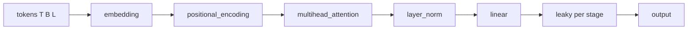

# Spikeforge — WS-C: Sequence Primitives and Per-Stage Heterogeneous Neurons

> Focused design for workstream **C** of the
> [`professional_roadmap.md`](plans/professional_roadmap.md). Read the roadmap
> first for the vision, cross-workstream interfaces, and packaging rules.

Design/spec only. Every claim about the current code is grounded in a file/line
reference so a Code-mode agent can execute this file-by-file.

**Objective.** Widen the layer vocabulary so sequence and attention topologies
are expressible, and let **every neuron stage choose its own kind, parameters,
and surrogate**. Each new module kind gets a snnTorch/PyTorch factory and an
explicit NIR contract — either a real mapping or a typed `UnsupportedStageError`,
mirroring the `alpha` precedent. Ship a demonstration sequence preset so the new
vocabulary is exercisable and NIR-validatable.

**Scope boundary (explicit).** This enables sequence/token *experimentation*, a
small spiking transformer/sequence topology. It does **not** claim production
LLM training. Long-context, KV caching, and large-vocabulary training are out of
scope and noted as deferred.

---

## 1. Current state and gap analysis

| Capability | Current reality | Anchor |
|---|---|---|
| Module kinds | `flatten, linear, conv2d, avgpool2d, sumpool2d` + `add` | [`kinds.py`](spikeforge/topology/kinds.py:8) |
| Stage model | `Stage(name, kind, params)` already per-stage | [`stage.py`](spikeforge/topology/stage.py:7) |
| Neuron selection | One kind for all stages in a preset | [`presets.py`](spikeforge/topology/presets.py:50), [`registry.py`](spikeforge/topology/registry.py:122) |
| Module factories | Fixed builder table | [`stage_modules.py`](spikeforge/topology/stage_modules.py:59) |
| NIR builders | Fixed builder table | [`mapper.py`](spikeforge/nir_bridge/mapper.py:20), [`node_builders.py`](spikeforge/nir_bridge/node_builders.py) |
| Unexportable precedent | `alpha` -> typed error | [`neuron_nodes.py`](spikeforge/nir_bridge/neuron_nodes.py:51), [`mapper.py`](spikeforge/nir_bridge/mapper.py:58) |
| Emitted primitives | Fixed set | [`primitives.py`](spikeforge_targets/primitives.py:12) |
| Input shape | Feature vs. spatial only | [`input_shape.py`](spikeforge/simulator/input_shape.py), [`frames.py`](spikeforge/simulator/frames.py) |
| Sequence / attention | None | n/a |

### 1.1 Invariants that must not break

- The default `neuron` selection still applies to every neuron stage when no
  per-stage override is given; a preset built with defaults is byte-identical to
  today ([`presets.py`](spikeforge/topology/presets.py:18)).
- `fc_legacy` keeps `_fc1/_lif1/_fc2/_lif2` and the legacy wrapper
  ([`registry.py`](spikeforge/topology/registry.py:115)).
- `TopologySpec.to_dict`/`from_dict` round-trips heterogeneous stages with no
  schema change — per-stage kind+params are already captured
  ([`spec.py`](spikeforge/topology/spec.py:50)).
- `alpha` continues to raise `UnsupportedStageError`
  ([`neuron_nodes.py`](spikeforge/nir_bridge/neuron_nodes.py:162)).
- Existing `topology_params` keys and `TrainConfig` fields stay valid and
  additive ([`train_config.py`](server/schemas/train_config.py:28)).
- Existing WebSocket payload keys are unchanged.

---

## 2. Per-stage heterogeneous neurons

### 2.1 Design

`Stage` already stores `(kind, params)` per stage, and `build_neuron` already
resolves any registered kind ([`registry.py`](spikeforge/neurons/registry.py:36)).
The only thing forcing homogeneity is the presets: `_neuron_stage` applies one
`neuron`/`surrogate` to every neuron stage
([`presets.py`](spikeforge/topology/presets.py:50)). The change is to let a
preset resolve a neuron kind **per stage name**, with the single-`neuron`
argument remaining the default.

New preset parameters (additive, forwarded by the registry):

| Param | Type | Meaning |
|---|---|---|
| `neuron` | str | default kind for every neuron stage (unchanged) |
| `surrogate` | str? | default surrogate for every neuron stage (unchanged) |
| `neurons` | map? | per-stage-name kind override |
| `stage_params` | map? | per-stage-name params merged over the default |

`_neuron_stage` becomes `_resolve_neuron_stage(name, neuron, neurons, ...)`,
returning `neurons[name]` when present, else the default, and merging
`stage_params[name]` over the computed params. Because `resolved_params` only
forwards keys already in a preset's defaults
([`registry.py`](spikeforge/topology/registry.py:99)), `neurons` and
`stage_params` are added to each preset's default mapping in
[`registry.py`](spikeforge/topology/registry.py:25).

### 2.2 Schema and persistence

- `TrainConfig` gains two additive optional fields (or nesting inside
  `topology_params`, which already exists): `stage_neurons: Dict[str, str]` and
  `stage_params: Dict[str, Dict[str, Any]]`
  ([`train_config.py`](server/schemas/train_config.py:29)). Existing clients are
  unaffected.
- Checkpoint `meta` already stores the resolved `spec`, which carries per-stage
  kind+params ([`checkpoint_mixin.py`](spikeforge/training/checkpoint_mixin.py:52)).
  Add a readable `stage_neurons` summary to `meta` (additive), so a checkpoint's
  heterogeneity is visible without decoding the spec.
- Reproducibility: the manifest already includes the spec
  ([`manifest.py`](spikeforge/tracking/manifest.py:35)); no change needed.

### 2.3 NIR export per stage

The mapper already dispatches per `stage.kind`
([`mapper.py`](spikeforge/nir_bridge/mapper.py:41)) and neurons map
per-kind ([`neuron_nodes.py`](spikeforge/nir_bridge/neuron_nodes.py:154)).
So heterogeneous neurons export correctly with **no mapper change**: a `leaky`
stage emits `LI`+`Threshold`, a `synaptic` stage emits `CubaLIF`, and so on,
side by side. This is a key reason the spine's per-stage design pays off.

---

## 3. New module kinds and their NIR contracts

### 3.1 Vocabulary

Added to [`kinds.py`](spikeforge/topology/kinds.py:8):

`embedding`, `conv1d`, `maxpool1d`, `maxpool2d`, `layer_norm`, `batch_norm`,
`dropout`, `positional_encoding`, `attention`, `multihead_attention`.

Each kind declares a **NIR contract** with exactly one of three outcomes:

| Outcome | Meaning | Precedent |
|---|---|---|
| `mapped` | a builder emits NIR node(s) | [`node_builders.py`](spikeforge/nir_bridge/node_builders.py) |
| `passthrough` | inference-equivalent to identity; emits no node | new, documented |
| `unexportable` | no faithful NIR primitive; raises typed error | `alpha` ([`neuron_nodes.py`](spikeforge/nir_bridge/neuron_nodes.py:51)) |

Proposed contracts (each verified against the installed `nir` at build time via
[`api.py`](spikeforge/nir_bridge/api.py:76), so a future `nir` that adds a
primitive flips the contract honestly):

| Kind | Factory | NIR contract |
|---|---|---|
| `embedding` | `nn.Embedding` | `unexportable` — no embedding primitive; simulation-only |
| `conv1d` | `nn.Conv1d` | `mapped` if `nir.Conv1d` exists, else `unexportable` |
| `maxpool1d` / `maxpool2d` | `nn.MaxPool*d` | `unexportable` — `nir` pooling is avg/sum only |
| `layer_norm` / `batch_norm` | `nn.LayerNorm` / `nn.BatchNorm*d` | `unexportable` — no norm primitive in `nir` |
| `dropout` | `nn.Dropout` | `passthrough` — identity at inference |
| `positional_encoding` | deterministic add | `unexportable` — no constant node; simulation-only |
| `attention` | custom single-head | `unexportable` — no attention primitive |
| `multihead_attention` | custom multi-head | `unexportable` — no attention primitive |

The `unexportable` set is collected in a new
`nir_bridge/stages_unmappable.py` table (one reason string per kind) and
consulted by the mapper exactly where `alpha` is consulted today, so export
raises a typed error naming the stage instead of silently dropping it.

### 3.2 Module layout

```
spikeforge/topology/
  kinds.py                 extend MODULE_KINDS with the new kinds
  stage_modules.py         register factories in _BUILDERS
  sequence_stages.py       embedding, positional_encoding, attention, norms factories
spikeforge/nir_bridge/
  stage_builders.py        conv1d/pool/norm/attention builder table
  stages_unmappable.py     kind -> reason, for unexportable kinds
  mapper.py                consult stage_builders then stages_unmappable
  node_builders.py         add any genuinely mapped builders
```

Files stay under 250 lines by splitting the builder tables (the codebase
already does this with `ops_linear.py`/`ops_neuron.py`).

### 3.3 Target coverage

New emitted primitives (e.g. `Conv1d`) are added to
[`EMITTED_PRIMITIVES`](spikeforge_targets/primitives.py:12) only when a
mapper can actually emit them, so the capability matrix and the mapper agree on
one vocabulary.

---

## 4. Sequence / token data path

### 4.1 Input contract

`input_shape` ([`input_shape.py`](spikeforge/simulator/input_shape.py))
gains a sequence layout `[T, B, L, D]` (steps, batch, sequence length, feature
dim), selected when the spec's input stage is a sequence kind (`embedding`,
`attention`, `conv1d`). `normalise_frame`
([`frames.py`](spikeforge/simulator/frames.py)) must pass sequence frames
through unflattened, exactly as it already does for spatial kinds
([`interpreter.py`](spikeforge/nir_bridge/interpreter.py:106) shows the
analogous spatial special-case).

### 4.2 Token source

New [`data/sequence_source.py`](spikeforge/data/sequence_source.py) serves
`(tokens, label)` pairs for a synthetic/registered sequence task; the dataset
registry ([`dataset_spec.py`](spikeforge/data/dataset_spec.py)) gains a
`sequence` modality. This is deliberately small — a toy token task that
exercises the vocabulary, not a corpus pipeline.

---

## 5. Demonstration sequence presets

Two presets, for two honest purposes:

1. **`sequence_mlp`** — built **only** from NIR-mappable kinds (`linear`,
   `flatten`, `leaky`) applied to a `[T, B, L, D]` sequence. This is the preset
   that **NIR-validates end to end** and proves the sequence data path. It is
   added to [`presets.py`](spikeforge/topology/presets.py) and
   [`registry.py`](spikeforge/topology/registry.py:78).
2. **`sequence_attn`** — the demonstration spiking-transformer-shaped preset
   (`embedding` -> `positional_encoding` -> `multihead_attention` ->
   `layer_norm` -> `linear` -> neuron, stacked). It is **simulation-only**;
   export raises the typed `UnsupportedStageError` naming the first unexportable
   stage, mirroring `alpha`. This is the honest way to ship attention without
   faking NIR.

Both accept the per-stage neuron overrides from section 2, so `sequence_attn`
can mix `leaky`/`synaptic`/`recurrent` neurons per stage as a demonstration.



---

## 6. Surfaces

### 6.1 WebSocket

No new actions; the existing `train`/`nir_export`/`deployment_report` actions
carry the heterogeneous configuration through `TrainConfig.topology_params`.
`nir_export` returns the graph summary; for `sequence_attn` it returns the
typed unexportable error on the existing `error` channel with the stage named.

### 6.2 Client

- [`StageEditor.tsx`](client/src/components/StageEditor.tsx): per-stage kind,
  neuron kind, params, and surrogate; renders the spec from `graph_summary`.
- [`TopologyStageList.tsx`](client/src/components/TopologyStageList.tsx): the
  flat list of stages with their heterogeneity.
- The neuron picker ([`Controls.tsx`](client/src/components/Controls.tsx))
  keeps its global default and gains a "per-stage" expansion.
- An unexportable badge per stage, mirroring the
  [`TargetsPanel.tsx`](client/src/components/TargetsPanel.tsx) honesty styling.

### 6.3 CLI

`python -m spikeforge.cli.verify validate --topology sequence_mlp` must
report `within_tolerance=True`; `export --topology sequence_attn` must exit
non-zero with the unexportable stage named.

---

## 7. Phases, deliverables, acceptance

### C1 — Per-stage heterogeneous neurons

- **Deliverables:** `presets.py` per-stage resolution, `registry.py` defaults,
  `TrainConfig` fields, `checkpoint_mixin.py` `stage_neurons` meta,
  `StageEditor.tsx`.
- **Acceptance:** a preset with `neurons={"lif1": "synaptic"}` builds a spec
  whose `lif1` kind is `synaptic` and others stay `leaky`; a default build is
  unchanged; the spec round-trips through checkpoint save/load; existing
  `nir_validate` still passes.

### C2 — New module kinds and NIR contracts

- **Deliverables:** `kinds.py`, `stage_modules.py`, `sequence_stages.py`,
  `stages_unmappable.py`, `stage_builders.py`, `mapper.py`, `node_builders.py`.
- **Acceptance:** every new kind builds a module; `conv1d` maps or reports
  unexportable per the live probe; `attention`/`embedding`/norms raise the typed
  error naming the stage; `dropout` exports as a documented passthrough.

### C3 — Sequence data path

- **Deliverables:** `input_shape.py`, `frames.py`, `data/sequence_source.py`,
  `dataset_spec.py` modality.
- **Acceptance:** a `[T, B, L, D]` tensor flows through the simulator unchanged
  in shape; `sequence_mlp` runs on sequence tokens.

### C4 — Demonstration presets

- **Deliverables:** `sequence_mlp`, `sequence_attn` presets and registry
  entries; client stage list; docs.
- **Acceptance:** `validate --topology sequence_mlp` is within tolerance;
  `export --topology sequence_attn` raises the typed unexportable error; the
  client renders both.

---

## 8. Risks and deferred items

- **NIR primitive absence:** several kinds are genuinely unexportable; the
  design leans on the `alpha` precedent rather than inventing lossy mappings.
  If upstream `nir` adds a primitive, the probe flips the contract honestly.
- **Simulator statefulness:** attention is stateless per step in the generic
  loop; any recurrent attention state would need a state container change (out of
  scope here).
- **Sequence scope:** small token experiments only; long-context, KV cache, and
  large vocabularies are deferred.
- **Deferred:** spiking-specific attention kernels, learned positional
  encodings, and mixed-precision sequence training.
