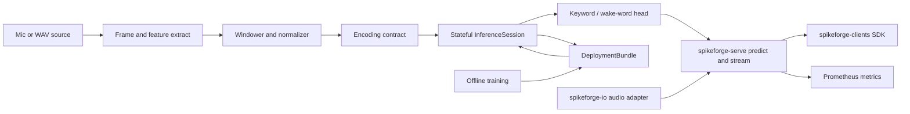

# Spikeforge — UC-2: Always-On Audio / Keyword Spotting / Wake-Word

> The second fully scoped production use case. Extends the reference slice in
> [`use_case_streaming_timeseries.md`](plans/use_case_streaming_timeseries.md);
> consumes the shared enablers from
> [`production_toolkit_plan.md`](plans/production_toolkit_plan.md); listed in the
> umbrella [`production_use_cases.md`](plans/production_use_cases.md).

**One-line summary.** Classify a continuous microphone stream window-by-window —
wake word, keyword, or audio event — on CPU/edge with **no neuromorphic chip**.

**What it demonstrates.** The SNN as an always-on, event-sparse temporal front
end: audio is framed into features, encoded with temporal coding, and scored
incrementally through a stateful [`InferenceSession`](spikeforge/serving/session.py:1),
with per-window latency and a false-accept budget on conventional hardware.

Design/spec only. Every claim about current code is grounded in a file/line
reference so a Code-mode agent can execute this file-by-file. **No
implementation starts in this document.**

---

## 1. Problem and users

**What.** Given a continuous audio stream (16 kHz microphone or WAV replay),
detect (a) a wake word, (b) one of a small closed keyword set, or (c) a general
audio event, per feature window, with a bounded decision latency and a bounded
false-accept rate, running on CPU (edge GPU optional) with no neuromorphic
hardware.

**Users.** Embedded/edge engineers building voice UI; ML engineers adding an
on-device trigger beside an existing assistant; researchers who want a runnable
streaming SNN audio baseline.

**Why SNN here.** The audio front end is inherently streaming and sparse; the
temporal state lives in membrane potentials rather than a buffered frame stack,
so updates are event-driven and the per-step loop maps to a mic capture callback.
This is one of the few niches where an SNN is *deployed in production today*.

**Success criteria (SLAs).**
- Latency: p99 per-window decision under a configured budget (target: ≤ 20 ms
  per 10 ms audio frame on CPU for `fc_small`).
- Quality: on Google Speech Commands v2 (12 keywords, 1 s clips) top-1 accuracy
  ≥ 0.90 and macro-F1 ≥ 0.88; wake-word operating point with false-accept rate
  ≤ 0.5 per hour on the negative corpus at ≥ 0.95 recall.
- Throughput: N concurrent mic streams per process without exceeding the budget.
- Zero hardware: everything runs on a laptop, a small CPU container, or an edge
  CPU; energy stays `estimate: true`.

---

## 2. Reference architecture

Legend: the **offline** half is largely existing; the **online** half reuses the
released W1/W2/W3 machinery and adds only the audio front end.

---

## 3. Offline: data, encoding, model, training

### 3.1 Data
- **Sources:** Google Speech Commands v2 (public, 12-keyword subset, 1 s clips)
  for the real adapter; a deterministic synthetic generator of class-labelled
  chirps/tones/noise for CI, paralleling
  [`sequence_source.py`](spikeforge/data/sequence_source.py:1).
- **Front end:** 16 kHz mono → 25 ms frame / 10 ms hop → 40-bin log-mel (or MFCC)
  → window of `L=49` frames (≈ 0.5 s), stride 1 for streaming, per-feature
  z-score fitted on train only.
- **Contract:** the frozen `preprocessing.json` (sample rate, hop, mel
  filterbank hash, window `L`, stride, feature order, normalization stats) is
  stored in the bundle (W2), preventing train/serve skew.
- **Repo fit:** windowing/normalization belongs to `spikeforge-io`
  ([`windowing.py`](spikeforge_io/windowing.py:1)); an audio source adapter lands
  beside the existing adapters ([`adapters.py`](spikeforge_io/adapters.py:64)).

### 3.2 Encoding
- **Primary coding:** `latency` (time-to-first-spike carries feature salience,
  preserving intra-window temporal order), with `delta` over the window as the
  streaming-change alternative and `rate` as the baseline.
- **Input shape:** `[T, B, L, D]` feature windows, matching the sequence presets
  ([`sequence_presets.py`](spikeforge/topology/sequence_presets.py:1)).
- **Deliverable:** the one `spikeforge.serving.preprocess.encode(sample, spec)`
  call site backed by a frozen
  [`EncodeSpec`](spikeforge/serving/encode_spec.py:1) (`CODINGS` includes
  `latency`, `delta`, `rate`).

### 3.3 Model
- **Topology:** `fc_small` over the flattened window as the CPU-latency baseline;
  `sequence_mlp` over `[T, B, L, D]` as the primary for temporal fidelity.
  Declared once as a [`TopologySpec`](spikeforge/topology/spec.py:1).
- **Head:** softmax classifier over the closed keyword set; a **wake-word**
  variant is a binary head over `{wake, not-wake}` reusing the same trunk.
- **Reuse:** [`TrainingEngine`](spikeforge/training/training_engine.py:1),
  surrogate gradients, checkpointing
  ([`checkpoint_mixin.py`](spikeforge/training/checkpoint_mixin.py:75)).

### 3.4 Evaluation
- Accuracy / macro-F1 / per-keyword recall; confusion matrix.
- Wake-word: ROC/PR and **false-accepts per hour** at the chosen threshold; the
  threshold is picked on the **validation** split, never refit on test.
- Validation: NIR drift (`within_tolerance`) and determinism
  ([`determinism.py`](spikeforge/tracking/determinism.py:82)); a reproducibility
  manifest is written per run ([`manifest.py`](spikeforge/tracking/manifest.py:35)).

---

## 4. Online: bundle, runtime, service

### 4.1 Deployment bundle
- `model.spkf` with `manifest.json` (spec, versions, expected metrics, label
  map), `weights.pt`, `encode_config.json`, `preprocessing.json` (mel spec +
  stats), `graph.nir.json`, checksums/signature. Built from a checkpoint plus the
  frozen encode/preprocessing specs.
- Anchors: [`bundle.py`](spikeforge/serving/bundle.py:1),
  [`bundle_manifest.py`](spikeforge/serving/bundle_manifest.py:1).

### 4.2 Stateful runtime
- `InferenceSession.load(bundle)`, `.reset()`, `.step(frame) -> Prediction`,
  `.run_stream(frames)`; carried state via a
  [`StateTree`](spikeforge/serving/state_tree.py:1).
- Shares the per-step body with the closed loop, so streaming and batch cannot
  diverge ([`step.py`](spikeforge/serving/step.py:1)).

### 4.3 Service
- `spikeforge-serve` endpoints: `POST /v1/predict`, `POST /v1/reset`,
  `GET|WS /v1/stream`, `GET /health`, `GET /metrics`, `GET /v1/bundle`
  ([`app.py`](spikeforge_serve/app.py:1), [`service.py`](spikeforge_serve/service.py:1)).
- Per-mic session ids; bounded batching; concurrency cap; auth token; stream
  backpressure. One keyword model per process by default.

### 4.4 Clients and I/O
- `spikeforge-clients` Python/TS/CLI SDKs call `predict`/`stream`
  ([`client.py`](spikeforge_clients/client.py:1)).
- A `spikeforge-io` audio adapter replays recorded WAV into `/v1/stream`
  ([`adapters.py`](spikeforge_io/adapters.py:64), [`replay.py`](spikeforge_io/replay.py:1)).

### 4.5 Observability
- Prometheus over the metrics registry
  ([`registry.py`](spikeforge/observability/registry.py:1)): request latency
  histogram, throughput, queue depth, spike rate/sparsity per stage,
  wake-word score distribution, false-accept counter.
- Serving benchmark: p50/p99, throughput at concurrency N, cold start, peak
  memory, wired into the regression gate
  ([`compare.py`](spikeforge/benchmark/compare.py:123)).

### 4.6 Compression option
- Optional unstructured pruning to ~50% sparsity via
  [`pruning.py`](spikeforge/compression/pruning.py:1) plus weight-only
  quantization ([`quantize.py`](spikeforge_targets/quantize.py:103)); the
  [`PruningReport`](spikeforge/compression/pruning.py:48) drift is recorded in the
  bundle. Weight-only stays the default when the edge profile is not requested.

### 4.7 Test-deploy matrix row
- One linear topology test-deployed on `reference`, `norse`, and `lava_loihi2`
  (CPU emulator) with a parity report from
  [`test_deploy.py`](spikeforge_targets/test_deploy.py:1); all runs stay
  `estimate: true` and a missing SDK reports `available: false` with a reason.

---

## 5. Phased delivery

| Phase | Deliverable | Depends on | Acceptance |
|---|---|---|---|
| P0 | Audio source adapter + synthetic generator + frozen mel/window spec | — | windowing reproducible; mel filterbank and stats frozen |
| P1 | `fc_small`/`sequence_mlp` trained; metrics + manifest | P0 | accuracy ≥ 0.90 / macro-F1 ≥ 0.88; NIR validates |
| P2 | `InferenceSession` streaming audio frames + tests | W1 | streaming readout == closed-loop `run` within tolerance |
| P3 | `DeploymentBundle` export/import + tamper check | W1 | fresh-process rebuild is exact; tamper is refused |
| P4 | `spikeforge-serve` `/predict` + `/stream` + `/reset` + `/health` | W2, W3 | parity with in-process; state persists; reset works |
| P5 | `/metrics`, serving benchmark, FA/hour + latency CI gate | W6 | p99 within budget; FA/hour below floor in CI |
| P6 | Container, promotion/rollback, drift monitor, edge artifact | W7 | prune+quantize artifact ships with recorded drift |

**MVP = P0–P4.** That is the smallest end-to-end slice that demonstrates the
chip-less always-on audio story.

---

## 6. Dependencies and out of scope

**Depends on:** PT-W1/W2 (released: `spikeforge/serving/`, frozen
[`EncodeSpec`](spikeforge/serving/encode_spec.py:1)); PT-W3 `spikeforge-serve`;
PT-W5 compression/quantization; PT-W6 observability + serving benchmarks; PT-W7
I/O adapters. Tracked by umbrella issue #12; reference implementation UC-1
(released in spikeforge 0.3.0).

**Out of scope:** measured power (stays `estimate: true`); always-on MCU firmware
and audio-capture drivers; open-vocabulary ASR / word-level decoding; multi-model
routing; claims of silicon energy.

## 7. Risks

| Risk | Mitigation |
|---|---|
| Mel/feature mismatch train vs serve | W2 forces one `encode` function; bundle pins the filterbank hash |
| Wake-word false accepts too high | tune threshold on validation; report FA/hour; keep classifier as primary |
| CPU latency budget unmet | start at `fc_small`, profile in P5, prune via W5 |
| Audio adapter scope creep | adapter only yields `[N, D]`; windowing/encoding stay in the shared contract |

## 8. GitHub issue payload

- **Title:** `[UC-2] Always-on audio / keyword spotting / wake-word`
- **Labels:** `enhancement`, `architecture`
- **Body:** see `plans/use_case_audio_keyword_spotting.md` — goal, reference
  architecture (encode → `InferenceSession` → head → `spikeforge-serve` →
  clients/io → `/metrics`), encoding (latency primary, delta/rate fallback),
  `fc_small`/`sequence_mlp`, acceptance (accuracy ≥ 0.90, macro-F1 ≥ 0.88,
  FA/hour ≤ 0.5, p99 ≤ 20 ms/frame), MVP phases P0–P4, dependencies PT-W3/W5/W6/W7.
