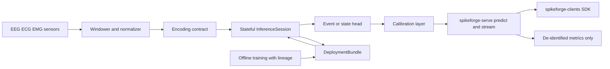

# Spikeforge — UC-6: Bio-Signal & Medical Monitoring

> A fully scoped production use case. Extends the reference slice in
> [`use_case_streaming_timeseries.md`](plans/use_case_streaming_timeseries.md);
> consumes the shared enablers from
> [`production_toolkit_plan.md`](plans/production_toolkit_plan.md); listed in the
> umbrella [`production_use_cases.md`](plans/production_use_cases.md).

**One-line summary.** Monitor EEG/ECG/EMG streams (seizure / arrhythmia / fatigue
detection) on CPU or wearable, with **no neuromorphic chip** and with
regulatory-grade validation and traceability.

**What it demonstrates.** Low-latency, privacy-preserving on-device inference
where **validation and traceability matter as much as accuracy**: deterministic
runs, an auditable manifest/lineage, calibration, and PHI-safe I/O.

Design/spec only. Every claim about current code is grounded in a file/line
reference so a Code-mode agent can execute this file-by-file. **No
implementation starts in this document.**

---

## 1. Problem and users

**What.** Given a continuous multi-channel bio-signal stream (EEG/ECG/EMG),
detect a clinical event (seizure, arrhythmia) or a state (fatigue) per window with
low latency, on CPU/wearable, with no neuromorphic hardware and no PHI leaving the
device in the reference design.

**Users.** Medical-device and digital-health engineers; clinical researchers;
wearable teams needing an on-device detector. **Regulated** (e.g. MDR/FDA), so
evidence and traceability are first-class.

**Why SNN here.** Low-latency temporal detection at the sensor plus
privacy-preserving on-device inference: state is carried in membrane potentials
and the model is compact enough for a wearable CPU.

**Success criteria (SLAs).**
- Quality: event sensitivity ≥ 0.90 and specificity ≥ 0.90 (or AUROC ≥ 0.95) on a
  held-out **subject-independent** split, with a dataset-specific floor defined at
  kickoff; detection latency p99 within the clinical budget (e.g. ≤ 2 s after
  event onset for seizure baselines).
- Calibration: expected calibration error (ECE) ≤ 0.05 on validation, so a
  reported probability means what it says.
- Traceability: every run carries a reproducibility manifest and a dataset →
  model → bundle → deployment lineage record; bit-exactness verified on a fixture
  ([`determinism.py`](spikeforge/tracking/determinism.py:82)).
- Privacy: PHI stays on-device in the reference path; only de-identified metrics
  leave. Zero hardware.

---

## 2. Reference architecture

---

## 3. Offline: data, encoding, model, training

### 3.1 Data
- **Sources:** a public de-identified bio-signal dataset (e.g. CHB-MIT-style EEG
  or a public ECG arrhythmia set) for the real adapter; a deterministic synthetic
  generator with annotated events for CI (paralleling
  [`sequence_source.py`](spikeforge/data/sequence_source.py:1)).
- **Contract:** frozen `preprocessing.json` (montage/channel order, sample rate,
  bandpass/filter specs, window `L`, stride 1, per-channel normalization) in the
  bundle; **splits are subject-disjoint** to avoid leakage.
- **PHI-safe I/O:** the reference adapter reads local files only; no network
  upload; identifiers are dropped at load.

### 3.2 Encoding
- **Primary coding:** `delta` over the window (change in the signal is the event
  signal) with `latency` as the alternative for spike-time-sensitive events and
  `rate` as baseline; frozen
  [`EncodeSpec`](spikeforge/serving/encode_spec.py:1).
- **Input shape:** `[T, B, L, D]` windows, matching
  [`sequence_presets.py`](spikeforge/topology/sequence_presets.py:1).

### 3.3 Model
- **Topology:** `sequence_mlp` (NIR-exportable) as the primary; `fc_small` as the
  wearable baseline. Declared once as a
  [`TopologySpec`](spikeforge/topology/spec.py:1).
- **Head:** per-window event classifier with an additive **calibration** step
  (temperature scaling fitted on validation); a state-regression variant for
  fatigue.
- **Reuse:** [`TrainingEngine`](spikeforge/training/training_engine.py:1),
  surrogate gradients, checkpointing
  ([`checkpoint_mixin.py`](spikeforge/training/checkpoint_mixin.py:75)).

### 3.4 Evaluation
- Subject-independent sensitivity/specificity/AUROC; event-detection latency.
- **Calibration:** reliability diagram + ECE on validation.
- **Traceability:** reproducibility manifest
  ([`manifest.py`](spikeforge/tracking/manifest.py:35)) and a lineage record
  (dataset → model → bundle → deployment) built on the registry governance
  ([`registry.py`](spikeforge_hub/registry.py:1)).
- Validation: NIR drift (`within_tolerance`) and determinism
  ([`determinism.py`](spikeforge/tracking/determinism.py:82)).

---

## 4. Online: bundle, runtime, service

### 4.1 Deployment bundle
- `model.spkf` with `manifest.json` (spec, versions, expected metrics, label
  map, calibration parameters, lineage), `weights.pt`, `encode_config.json`,
  `preprocessing.json`, `graph.nir.json`, checksums/**signature** (approval
  gate).
- Anchors: [`bundle.py`](spikeforge/serving/bundle.py:1),
  [`bundle_manifest.py`](spikeforge/serving/bundle_manifest.py:1).

### 4.2 Stateful runtime
- `InferenceSession.load(bundle)`, `.reset()`, `.step(frame) -> Prediction`,
  `.run_stream(frames)`; state via
  [`StateTree`](spikeforge/serving/state_tree.py:1) — for a wearable, the state is
  compact and serializable between sessions.
- Shares the per-step body with the closed loop
  ([`step.py`](spikeforge/serving/step.py:1)).

### 4.3 Service
- `spikeforge-serve`: `POST /v1/predict`, `POST /v1/reset`, `GET|WS /v1/stream`,
  `GET /health`, `GET /metrics`, `GET /v1/bundle`
  ([`app.py`](spikeforge_serve/app.py:1), [`service.py`](spikeforge_serve/service.py:1)).
- Per-patient/session ids; auth mandatory; request timeouts; **only de-identified
  telemetry** is exported to `/metrics`.

### 4.4 Clients and I/O
- `spikeforge-clients` SDKs drive `predict`/`stream`
  ([`client.py`](spikeforge_clients/client.py:1)); `spikeforge-io` replays a
  recorded de-identified recording ([`replay.py`](spikeforge_io/replay.py:1)).

### 4.5 Observability
- Prometheus over the registry ([`registry.py`](spikeforge/observability/registry.py:1)):
  latency histogram, sensitivity/specificity proxy, alarm count, calibration
  drift — **no PHI**.
- Serving benchmark p50/p99 + throughput, wired into the regression gate
  ([`compare.py`](spikeforge/benchmark/compare.py:123)).

### 4.6 Compression option
- Pruning ([`pruning.py`](spikeforge/compression/pruning.py:1)) to fit a wearable
  budget plus weight-only/activation quantization
  ([`activation_quant.py`](spikeforge_targets/activation_quant.py:1),
  [`quantize.py`](spikeforge_targets/quantize.py:103)); any sensitivity drift is
  recorded and a regression beyond tolerance **fails the release gate**.

### 4.7 Test-deploy matrix row
- Test-deploy the `sequence_mlp` topology on `reference`, `norse`, and
  `lava_loihi2` with a parity report
  ([`test_deploy.py`](spikeforge_targets/test_deploy.py:1)); `estimate: true`,
  `available: false` with a reason when an SDK is absent. No clinical claim is
  attached to any simulator run.

---

## 5. Phased delivery

| Phase | Deliverable | Depends on | Acceptance |
|---|---|---|---|
| P0 | PHI-safe data adapter + synthetic event generator + frozen spec | — | subject-disjoint splits; identifiers dropped |
| P1 | `sequence_mlp` trained + calibration; metrics + manifest | P0 | sensitivity/specificity ≥ 0.90; ECE ≤ 0.05; NIR validates |
| P2 | `InferenceSession` streaming + state round-trip | W1 | streaming readout == closed-loop `run`; state persists |
| P3 | Signed `DeploymentBundle` + lineage + tamper check | W1 | fresh-process rebuild exact; unsigned/tampered refused |
| P4 | `spikeforge-serve` `/predict` + `/stream` + `/reset` | W2, W3 | parity with in-process; de-identified metrics only |
| P5 | `/metrics`, calibration/drift CI gate, serving benchmark | W6 | ECE within bound; p99 within clinical budget |
| P6 | Wearable-size compressed artifact, promotion/rollback, audit trail | W7 | release gate refuses on sensitivity regression |

**MVP = P0–P4.** That is the smallest end-to-end slice that demonstrates the
chip-less bio-signal story with its evidence discipline intact.

---

## 6. Dependencies and out of scope

**Depends on:** PT-W1 (released `spikeforge/serving/` + signed
[`DeploymentBundle`](spikeforge/serving/bundle.py:1)); PT-W2 (frozen
[`EncodeSpec`](spikeforge/serving/encode_spec.py:1)); PT-W3 `spikeforge-serve`;
PT-W5 compression/quantization; PT-W6 observability; PT-W7 registry governance +
I/O. Tracked by umbrella issue #12; reference implementation UC-1 (released in
spikeforge 0.3.0).

**Out of scope:** any clinical or diagnostic claim; regulatory submission
dossiers; hosting/storing PHI; wearable firmware and sensor drivers; implantable
or real-time closed-loop therapy; measured power (`estimate: true`).

## 7. Risks

| Risk | Mitigation |
|---|---|
| Subject leakage inflates metrics | enforce subject-disjoint splits; assert in tests |
| Poor calibration misleads clinicians | temperature scaling + ECE gate in CI |
| PHI leaks through metrics | export de-identified aggregates only; test the metrics payload for identifiers |
| Regulatory scope creep | keep validation/traceability in scope, claims/submissions explicitly out |
| Compression harms sensitivity | release gate refuses any artifact beyond the tolerance |

## 8. GitHub issue payload

- **Title:** `[UC-6] Bio-signal and medical monitoring`
- **Labels:** `enhancement`, `architecture`
- **Body:** see `plans/use_case_biosignal_medical_monitoring.md` — goal, reference
  architecture (encode → `InferenceSession` → calibrated head →
  `spikeforge-serve` → clients/io → de-identified `/metrics`), delta/latency
  coding, `sequence_mlp`, acceptance (sensitivity/specificity ≥ 0.90, ECE ≤ 0.05,
  subject-disjoint, signed bundle + lineage), MVP phases P0–P4, dependencies
  PT-W3/W5/W6/W7.
