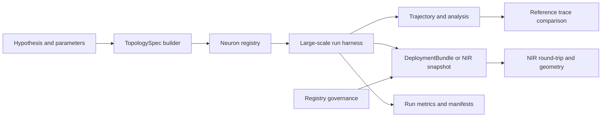

# Spikeforge — UC-10: Computational Neuroscience / Neuromorphic R&D

> A fully scoped production use case. Extends the reference slice in
> [`use_case_streaming_timeseries.md`](plans/use_case_streaming_timeseries.md);
> consumes the shared enablers from
> [`production_toolkit_plan.md`](plans/production_toolkit_plan.md); listed in the
> umbrella [`production_use_cases.md`](plans/production_use_cases.md).

**One-line summary.** Build biophysically parameterized brain-circuit models and
neuromorphic algorithms at scale, with reproducible large runs — on HPC/GPU with
**no neuromorphic chip**.

**What it demonstrates.** The model *is* spiking dynamics: a declarative
`TopologySpec` plus the neuron registry drives large-scale simulation, and the
bundle/session machinery turns an experiment into a **reproducible, shareable
artifact** rather than an ad-hoc script.

Design/spec only. Every claim about current code is grounded in a file/line
reference so a Code-mode agent can execute this file-by-file. **No
implementation starts in this document.**

---

## 1. Problem and users

**What.** Given a biological circuit hypothesis (neuron types, connectivity,
synapses, input drives), simulate it at scale, compare against a reference
neuron model, and record every run so results are reproducible and shareable —
on HPC/GPU with no neuromorphic hardware.

**Users.** Computational neuroscientists; neuromorphic-algorithm researchers;
labs that need reproducible large-scale spiking simulations and cross-tool
interoperability.

**Why SNN here.** The system under study *is* spiking dynamics; the SNN runtime
is the model, not an approximation of one.

**Success criteria (SLAs).**
- Fidelity: single-neuron and small-circuit dynamics match a reference
  closed-form/analytical or published trace within a configured tolerance.
- Scale: a large network runs to a configured duration/scale (e.g. 10^5 neurons ×
  10^4 steps) within a time/memory budget on HPC/GPU.
- Reproducibility: identical `TopologySpec` + seed + parameters reproduce the same
  trajectory (bit-exact on the CPU fixture; deterministic where enforced on GPU);
  every run writes a manifest ([`manifest.py`](spikeforge/tracking/manifest.py:35)).
- Interop: the circuit round-trips through NIR and geometry; no measured power
  claim (`estimate: true`).

---

## 2. Reference architecture

Legend: this use case is **batch/simulation-first**; the bundle is used as a
reproducible snapshot rather than a serving endpoint, though the same
`InferenceSession` can replay a recorded drive.

---

## 3. Offline: model definition, encoding, dynamics

### 3.1 Model definition and data
- **Sources:** declarative circuit definitions (`TopologySpec`) plus recorded or
  synthetic input drives; a deterministic synthetic drive generator for CI
  (paralleling [`sequence_source.py`](spikeforge/data/sequence_source.py:1)).
- **Neurons:** biophysical parameters via the neuron registry
  ([`registry.py`](spikeforge/neurons/registry.py:1),
  [`lapicque.py`](spikeforge/neurons/lapicque.py:1),
  [`leaky.py`](spikeforge/neurons/leaky.py:1),
  [`synaptic.py`](spikeforge/neurons/synaptic.py:1)); a registry entry declares
  its dynamics and its NIR mapping.
- **Contract:** the full parameter set (neuron params, synaptic weights/delays,
  connectivity, drive spec) is frozen into a bundle/manifest so a run is
  self-describing.

### 3.2 Encoding
- **Coding:** the drive is encoded with `rate`/`latency`/`delta` as appropriate
  to the hypothesis; the frozen
  [`EncodeSpec`](spikeforge/serving/encode_spec.py:1) is recorded so a replayed
  drive is identical to the training/simulation drive.
- **Input shape:** `[T, B, …]`, matching the simulator's temporal contract.

### 3.3 Dynamics and training
- **Topology:** composed with
  [`builder.py`](spikeforge/topology/builder.py:1) and declared as a
  [`TopologySpec`](spikeforge/topology/spec.py:1); stage kinds from
  [`kinds.py`](spikeforge/topology/kinds.py:1).
- **Execution:** the closed-loop simulator
  ([`execution.py`](spikeforge/simulator/execution.py:1)) drives the run; the
  shared per-step body ([`step.py`](spikeforge/serving/step.py:1)) lets the same
  circuit be replayed statefully. Where learning is in scope, reuse
  [`TrainingEngine`](spikeforge/training/training_engine.py:1) with surrogate
  gradients; checkpoint via
  [`checkpoint_mixin.py`](spikeforge/training/checkpoint_mixin.py:75).

### 3.4 Evaluation
- **Fidelity:** compare trajectories to a reference trace (analytical or
  published) with a configured tolerance; report per-quantity error.
- **Reproducibility:** `bit_exactness_check` on the CPU fixture; a determinism
  report ([`determinism.py`](spikeforge/tracking/determinism.py:82)) else.
- **Interop:** NIR round-trip and geometry validation
  ([`serialization.py`](spikeforge/nir_bridge/serialization.py:52),
  [`image_size.py`](spikeforge/data/image_size.py:1)).
- Manifest per run ([`manifest.py`](spikeforge/tracking/manifest.py:35)).

---

## 4. Online: bundle, replay, and run reporting

### 4.1 Reproducible snapshot (bundle)
- `model.spkf` with `manifest.json` (spec, versions, **neuron parameters**,
  expected metrics), `weights.pt` (synapses), `encode_config.json`,
  `preprocessing.json` (drive spec), `graph.nir.json`, checksums/signature.
- Anchors: [`bundle.py`](spikeforge/serving/bundle.py:1),
  [`bundle_manifest.py`](spikeforge/serving/bundle_manifest.py:1).

### 4.2 Stateful replay
- `InferenceSession.load(bundle)`, `.reset()`, `.step(frame)`,
  `.run_stream(frames)` replay a recorded drive exactly, with state via
  [`StateTree`](spikeforge/serving/state_tree.py:1) — useful for re-running a
  published experiment from its artifact.

### 4.3 Long-run harness and service
- A **large-scale run harness** (batch, HPC/GPU) drives the closed-loop simulator
  with checkpointing of long runs; progress and cost are recorded.
- Optional: `spikeforge-serve` exposes `/v1/predict` and `/v1/bundle` for
  artifact introspection and drive replay
  ([`app.py`](spikeforge_serve/app.py:1)); this is not the primary surface.

### 4.4 Clients and I/O
- `spikeforge-clients` SDKs introspect the served bundle
  ([`client.py`](spikeforge_clients/client.py:1)); `spikeforge-io` replays
  recorded drives ([`replay.py`](spikeforge_io/replay.py:1)).

### 4.5 Run telemetry
- Prometheus over the registry ([`registry.py`](spikeforge/observability/registry.py:1)):
  steps/s, neurons, spike rate, memory, per-stage sparsity; long-run cost is
  recorded with `estimate: true` for energy.

### 4.6 Compression option
- Optional pruning/sparsity experiments via
  [`pruning.py`](spikeforge/compression/pruning.py:1) to study how structural
  sparsity changes circuit dynamics — reported as a scientific result, not a
  deployment claim.

### 4.7 Test-deploy matrix row
- Test-deploy a small representative circuit on `reference`, `norse`, and
  `lava_loihi2` with a parity report
  ([`test_deploy.py`](spikeforge_targets/test_deploy.py:1)); `estimate: true`,
  `available: false` with a reason when an SDK is absent. This is the
  cross-tool interoperability check, not a device measurement.

---

## 5. Phased delivery

| Phase | Deliverable | Depends on | Acceptance |
|---|---|---|---|
| P0 | Declarative circuit spec + drive generator + frozen parameter set | — | same spec reproduces the same drive |
| P1 | Reference-trace fidelity harness for neuron/circuit dynamics | P0 | dynamics within tolerance |
| P2 | Large-scale run harness with long-run checkpointing | W1 | runs to configured scale within budget |
| P3 | Reproducible bundle/NIR snapshot + tamper check | W1 | fresh-process rebuild exact; NIR round-trips |
| P4 | `InferenceSession` replay of a recorded drive | W1, W2 | replay == original trajectory on the CPU fixture |
| P5 | Run telemetry + reproducibility CI gate | W6 | bit-exact fixture green; metrics recorded |
| P6 | HPC packaging, promotion/rollback of artifacts, drift monitor | W7 | promote/rollback demo; artifact lineage recorded |

**MVP = P0–P4.** That is the smallest end-to-end slice that demonstrates the
reproducible-simulation story.

---

## 6. Dependencies and out of scope

**Depends on:** PT-W1 (released `spikeforge/serving/` stateful runtime + bundle);
PT-W2 (frozen [`EncodeSpec`](spikeforge/serving/encode_spec.py:1)); PT-W6
observability; PT-W7 registry governance/lineage. Tracked by umbrella issue #12;
reference implementation UC-1 (released in spikeforge 0.3.0).

**Out of scope:** measured power and on-device capacity (needs silicon;
`estimate: true`); reproducing vendor/chip numerics; new biophysical neuron models
beyond the registry contract; a GUI/notebook product; clinical or diagnostic
claims.

## 7. Risks

| Risk | Mitigation |
|---|---|
| "R&D" scope is unbounded | anchor every run to a `TopologySpec` + reference trace with a tolerance |
| Large runs are irreproducible | manifest + deterministic seeds + bit-exact CPU fixture |
| Neuron params not expressible in NIR | registry entries declare their NIR mapping; unmappable dynamics refuse with a typed error |
| Results read as hardware evidence | energy stays `estimate: true`; test-deploy runs are named as simulators |

## 8. GitHub issue payload

- **Title:** `[UC-10] Computational neuroscience / neuromorphic R&D`
- **Labels:** `enhancement`, `architecture`
- **Body:** see `plans/use_case_computational_neuroscience.md` — goal, reference
  architecture (TopologySpec + neuron registry → run harness → trajectory/NIR
  snapshot → reproducible bundle → replay; run telemetry via `/metrics`), rate/
  latency/delta coding, biophysical neuron registry, acceptance (dynamics within
  tolerance, 10^5 neurons × 10^4 steps within budget, bit-exact CPU fixture, NIR
  round-trip), MVP phases P0–P4, dependencies PT-W1/W2/W6/W7.
