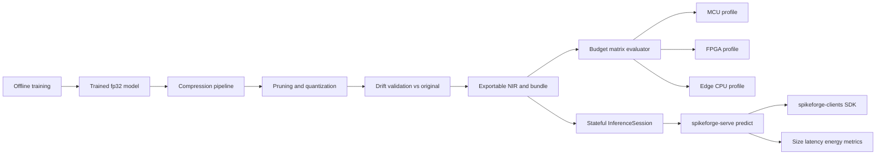

# Spikeforge — UC-9: Edge / Mobile Inference Under Power Budgets

> A fully scoped production use case. Extends the reference slice in
> [`use_case_streaming_timeseries.md`](plans/use_case_streaming_timeseries.md);
> consumes the shared enablers from
> [`production_toolkit_plan.md`](plans/production_toolkit_plan.md); listed in the
> umbrella [`production_use_cases.md`](plans/production_use_cases.md).

**One-line summary.** Deploy compressed SNNs to MCU / FPGA / edge CPU under
explicit size, latency, and (estimated) power budgets — with **no neuromorphic
chip**.

**What it demonstrates.** The full compression-to-edge pipeline: train, prune,
quantize, validate the induced drift, export via NIR, and report a size/latency/
power **budget matrix** with energy honestly marked `estimate: true`.

Design/spec only. Every claim about current code is grounded in a file/line
reference so a Code-mode agent can execute this file-by-file. **No
implementation starts in this document.**

---

## 1. Problem and users

**What.** Given a trained SNN, fit it into a device budget (flash/RAM size,
per-inference latency, estimated energy per inference) for an MCU, FPGA, or edge
CPU, with a documented export path and an acceptance matrix — on hardware with no
neuromorphic chip.

**Users.** Embedded/edge engineers; product teams choosing a deployment target;
researchers comparing sparsity-based efficiency against dense edge inference.

**Why SNN here.** Sparse, event-driven compute can undercut dense MACs at the
edge when spike activity is low; the win is conditional on sparsity, which this
use case measures rather than assumes.

**Success criteria (SLAs).**
- Size: exported artifact within the target budget (e.g. ≤ 64 KB weights for the
  MCU profile) after pruning + quantization.
- Quality: metric retained within a configured tolerance (e.g. ≤ 2% absolute drop
  vs the uncompressed model); a regression beyond tolerance refuses the artifact.
- Latency: per-inference p99 within the device budget (measured on the edge CPU
  profile; `estimate` elsewhere).
- Energy: estimated energy per inference reported with `estimate: true`, plus
  spike-density and op-count that explain it. **No measured-power claim.**
- Zero hardware: all profiles run on a plain edge CPU; no neuromorphic chip.

---

## 2. Reference architecture

---

## 3. Offline: data, encoding, model, training

### 3.1 Data
- **Sources:** reuse a UC-1-style numeric stream or a small vision/keyword set
  for the edge profile; a deterministic synthetic generator for CI
  (paralleling [`sequence_source.py`](spikeforge/data/sequence_source.py:1)).
- **Contract:** frozen `preprocessing.json` (window/normalization) in the bundle;
  the **compression recipe** (pruning strategy/level, quantization scheme,
  calibration set hash) is recorded in the manifest.

### 3.2 Encoding
- **Primary coding:** `rate` (cheapest to compute on edge) with `delta` as the
  streaming alternative; frozen
  [`EncodeSpec`](spikeforge/serving/encode_spec.py:1). The encoder's cost is part
  of the budget, not an afterthought.

### 3.3 Model
- **Topology:** `fc_small`/`sequence_mlp` (NIR-exportable) chosen for the target;
  [`builder.py`](spikeforge/topology/builder.py:1) for a size-tuned variant.
  Declared once as a [`TopologySpec`](spikeforge/topology/spec.py:1).
- **Compression pipeline (the core deliverable):**
  - pruning via [`pruning.py`](spikeforge/compression/pruning.py:1) with the
    achieved-vs-target [`PruningReport`](spikeforge/compression/pruning.py:48);
  - weight-only **and** activation/membrane quantization via
    [`quantize_schemes.py`](spikeforge_targets/quantize_schemes.py:1) and
    [`activation_quant.py`](spikeforge_targets/activation_quant.py:1);
  - export via [`quantize.py`](spikeforge_targets/quantize.py:103) and NIR
    ([`serialization.py`](spikeforge/nir_bridge/serialization.py:52)).
- **Reuse:** [`TrainingEngine`](spikeforge/training/training_engine.py:1),
  surrogate gradients, checkpointing
  ([`checkpoint_mixin.py`](spikeforge/training/checkpoint_mixin.py:75)).

### 3.4 Evaluation
- Accuracy/F1 retained vs the fp32 model; **drift** from
  [`drift.py`](spikeforge/nir_bridge/drift.py:1) is the gate.
- **Budget matrix:** size (KB of weights/activations), per-inference latency
  p50/p99, estimated energy per inference
  ([`accounting.py`](spikeforge_targets/energy/accounting.py:1)), spike density,
  op count — one row per target profile.
- Unapplied quantization schemes are **reported, not ignored**
  ([`quantize_report.py`](spikeforge_targets/quantize_report.py:1)).
- Validation: NIR drift (`within_tolerance`) and determinism
  ([`determinism.py`](spikeforge/tracking/determinism.py:82)); manifest per run
  ([`manifest.py`](spikeforge/tracking/manifest.py:35)).

---

## 4. Online: bundle, runtime, service

### 4.1 Deployment bundle
- `model.spkf` with `manifest.json` (spec, versions, expected metrics, **budget
  matrix**, compression recipe), `weights.pt` (quantized), `encode_config.json`,
  `preprocessing.json`, `graph.nir.json`, checksums/signature.
- Anchors: [`bundle.py`](spikeforge/serving/bundle.py:1),
  [`bundle_manifest.py`](spikeforge/serving/bundle_manifest.py:1).

### 4.2 Stateful runtime
- `InferenceSession.load(bundle)`, `.reset()`, `.step(frame) -> Prediction`,
  `.run_stream(frames)`; state via
  [`StateTree`](spikeforge/serving/state_tree.py:1). The session is the edge
  reference implementation; the budget matrix is measured through it.

### 4.3 Service
- `spikeforge-serve`: `POST /v1/predict`, `POST /v1/reset`, `GET|WS /v1/stream`,
  `GET /health`, `GET /metrics`, `GET /v1/bundle`
  ([`app.py`](spikeforge_serve/app.py:1), [`service.py`](spikeforge_serve/service.py:1));
  on the edge, the in-process session is the primary path.

### 4.4 Clients and I/O
- `spikeforge-clients` SDKs drive `predict`/`stream`
  ([`client.py`](spikeforge_clients/client.py:1)); `spikeforge-io` supplies
  compact windowing/replay for the edge fixture
  ([`windowing.py`](spikeforge_io/windowing.py:1)).

### 4.5 Observability
- Prometheus over the registry ([`registry.py`](spikeforge/observability/registry.py:1)):
  per-inference latency histogram, artifact size, spike density, op count,
  quantized-range coverage — plus the budget matrix readout.
- Serving benchmark p50/p99 + throughput + peak memory, wired into the regression
  gate ([`compare.py`](spikeforge/benchmark/compare.py:123)).

### 4.6 Compression option
- This use case **is** the compression path; the option is fully exercised
  (prune → quantize → validate → export) with the drift gate enforced.

### 4.7 Test-deploy matrix row
- Test-deploy the compressed topology on `reference`, `norse`, and `lava_loihi2`
  (CPU emulator) with a parity report
  ([`test_deploy.py`](spikeforge_targets/test_deploy.py:1)); **`estimate: true`**
  on every cell and no device measurement is implied. `speck`/`xylo`/`spinnaker2`
  report `available: false` with a named reason when their SDKs are absent.

---

## 5. Phased delivery

| Phase | Deliverable | Depends on | Acceptance |
|---|---|---|---|
| P0 | Edge fixture data + budget-matrix spec (size/latency/energy) | — | matrix schema frozen; profiles named |
| P1 | fp32 baseline trained; metrics + manifest | P0 | baseline above floor; NIR validates |
| P2 | Prune + quantize pipeline with drift gate | W5 | retained metric within tolerance; unapplied schemes reported |
| P3 | Signed `DeploymentBundle` with quantized weights + recipe | W1 | fresh-process rebuild exact; tamper refused |
| P4 | `InferenceSession` edge path + `spikeforge-serve` predict | W2, W3 | parity with in-process at reduced precision within tolerance |
| P5 | Budget matrix + `/metrics` + CI size/latency gate | W6 | size ≤ budget; p99 ≤ budget; energy `estimate: true` |
| P6 | NIR export profiling, promotion/rollback, drift monitor | W7 | promote/rollback demo; drift alarm fires |

**MVP = P0–P4.** That is the smallest end-to-end slice that demonstrates the
chip-less edge-budget story.

---

## 6. Dependencies and out of scope

**Depends on:** PT-W5 (compression + quantization — the keystone for this use
case); PT-W1 (released `spikeforge/serving/` + bundle); PT-W2 (frozen
[`EncodeSpec`](spikeforge/serving/encode_spec.py:1)); PT-W3 `spikeforge-serve`;
PT-W6 observability/benchmarks; PT-W7 registry/export. Tracked by umbrella issue
#12; reference implementation UC-1 (released in spikeforge 0.3.0).

**Out of scope:** **measured power and on-device capacity** (needs silicon; remains
`estimate: true`); vendor compilers and MCU/FPGA firmware toolchains;
reproducing vendor numerics; reproducing neuromorphic-chip energy advantages.

## 7. Risks

| Risk | Mitigation |
|---|---|
| Compression destroys accuracy | drift gate refuses artifacts beyond tolerance; report retained metric per profile |
| Budget matrix read as a power claim | every energy row carries `estimate: true` and the note from [`test_deploy.py`](spikeforge_targets/test_deploy.py:44) |
| Quantization scheme silently unsupported | unapplied schemes are reported, never ignored |
| Encoder cost excluded from the budget | encode cost is a measured row in the matrix |

## 8. GitHub issue payload

- **Title:** `[UC-9] Edge / mobile inference under power budgets`
- **Labels:** `enhancement`, `architecture`
- **Body:** see `plans/use_case_edge_power_budgets.md` — goal, reference
  architecture (train → prune/quantize → drift validation → NIR/bundle →
  `InferenceSession` → `spikeforge-serve` → clients → size/latency/energy
  `/metrics`), rate/delta coding, `fc_small`/`sequence_mlp` with
  pruning + activation/membrane quantization, acceptance (size ≤ budget, retained
  metric within 2%, p99 ≤ budget, energy `estimate: true`), MVP phases P0–P4,
  dependencies PT-W5/W1/W2/W3/W6/W7.
