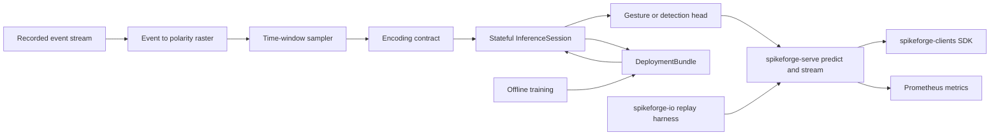

# Spikeforge — UC-3: Event-Camera (DVS) Vision

> A fully scoped production use case. Extends the reference slice in
> [`use_case_streaming_timeseries.md`](plans/use_case_streaming_timeseries.md);
> consumes the shared enablers from
> [`production_toolkit_plan.md`](plans/production_toolkit_plan.md); listed in the
> umbrella [`production_use_cases.md`](plans/production_use_cases.md).

**One-line summary.** Classify asynchronous event-camera streams (gesture,
eye-tracking, automotive) window-by-window on GPU/CPU with **no neuromorphic
chip**.

**What it demonstrates.** The strongest near-term SNN fit: the input *is* spikes,
so no artificial encoding is needed — an event stream is accumulated into
polarity rasters, consumed natively, and served through the stateful runtime.

Design/spec only. Every claim about current code is grounded in a file/line
reference so a Code-mode agent can execute this file-by-file. **No
implementation starts in this document.**

---

## 1. Problem and users

**What.** Given an asynchronous stream of `(x, y, polarity, t)` events, produce a
class label per time window (e.g. which gesture) or a detection, with bounded
latency and a sparse compute profile, on GPU training / CPU-or-GPU inference with
no neuromorphic hardware.

**Users.** Robotics and automotive perception teams; HCI/gesture product teams;
DVS researchers who already have recorded event data and want a served SNN.

**Why SNN here.** Event cameras emit sparse per-pixel changes; a conventional
frame pipeline must first densify them into frames. An SNN consumes sparse
events directly, so compute scales with activity, not sensor resolution.

**Success criteria (SLAs).**
- Quality: on DVS128 Gesture (11 classes) top-1 accuracy ≥ 0.90 and macro-F1
  ≥ 0.88 with a compact SNN; on CIFAR10-DVS, accuracy above a dataset-specific
  floor defined at kickoff.
- Latency: p99 per-window decision under a configured budget (target: ≤ 10 ms on
  CPU for a small topology; GPU for the larger variant).
- Sparsity: reported input spike density and per-stage sparsity recorded per run.
- Zero hardware: recorded-stream replay on CPU/GPU; no DVS camera required.

---

## 2. Reference architecture

---

## 3. Offline: data, encoding, model, training

### 3.1 Data
- **Sources:** DVS128 Gesture and CIFAR10-DVS public event datasets
  ([`event_datasets.md`](documentation/event-datasets.md:1)), plus a deterministic
  synthetic event generator for CI (paralleling
  [`synthetic.py`](spikeforge/events/synthetic.py:1)).
- **Contract:** events `(x, y, p, t)` are accumulated into `[T, 2, H, W]`
  polarity rasters over `T` slice windows with a frozen slice width; train-fitted
  normalization and the raster geometry live in `preprocessing.json` in the
  bundle.
- **Repo fit:** event loading and the polarity raster live in
  `spikeforge/events/` ([`event_sample.py`](spikeforge/events/event_sample.py:1),
  [`event_bridge.py`](spikeforge/events/event_bridge.py:1)); replay belongs to
  `spikeforge-io` ([`replay.py`](spikeforge_io/replay.py:1)).

### 3.2 Encoding
- **Primary coding:** *identity / event-native* — the raster is already binary,
  so the "encoder" is the raster builder; where a coded path is needed, `rate`
  over the slice is the documented fallback. A frozen
  [`EncodeSpec`](spikeforge/serving/encode_spec.py:1) records whichever path is
  used so the bundle stays self-describing.
- **Input shape:** `[T, 2, H, W]`, matching the event raster contract and the
  simulator's `[T, …]` loop.

### 3.3 Model
- **Topology:** `dvs128_gesture` preset for the small path;
  [`builder.py`](spikeforge/topology/builder.py:1) for a compact convolutional
  spiking net; declared once as a [`TopologySpec`](spikeforge/topology/spec.py:1).
- **Head:** softmax classifier over gesture classes; a detection variant swaps
  the head for a per-window score.
- **Reuse:** [`TrainingEngine`](spikeforge/training/training_engine.py:1),
  surrogate gradients, BPTT over event slices
  ([`checkpoint_mixin.py`](spikeforge/training/checkpoint_mixin.py:75)).

### 3.4 Evaluation
- Top-1 accuracy / macro-F1 / per-class recall on the held-out event split.
- **Event-native metrics:** input spike density, per-stage spike sparsity, and
  parity of readout vs spikes through the simulator (default tolerances from
  [`rewrite_drift.py`](spikeforge_targets/rewrite_drift.py:1)).
- Validation: NIR drift (`within_tolerance`) and determinism
  ([`determinism.py`](spikeforge/tracking/determinism.py:82)); manifest per run
  ([`manifest.py`](spikeforge/tracking/manifest.py:35)).

---

## 4. Online: bundle, runtime, service

### 4.1 Deployment bundle
- `model.spkf` with `manifest.json`, `weights.pt`, `encode_config.json`,
  `preprocessing.json` (raster geometry + slice width), `graph.nir.json`,
  checksums/signature.
- Anchors: [`bundle.py`](spikeforge/serving/bundle.py:1),
  [`bundle_manifest.py`](spikeforge/serving/bundle_manifest.py:1).

### 4.2 Stateful runtime
- `InferenceSession.load(bundle)`, `.reset()`, `.step(frame) -> Prediction`,
  `.run_stream(frames)`; carried membrane state via
  [`StateTree`](spikeforge/serving/state_tree.py:1) so a gesture can span windows.
- Shares the per-step body with the closed loop
  ([`step.py`](spikeforge/serving/step.py:1)).

### 4.3 Service
- `spikeforge-serve`: `POST /v1/predict`, `POST /v1/reset`, `GET|WS /v1/stream`,
  `GET /health`, `GET /metrics`, `GET /v1/bundle`
  ([`app.py`](spikeforge_serve/app.py:1), [`service.py`](spikeforge_serve/service.py:1)).
- Session ids per recording/camera; bounded batching; concurrency cap; auth;
  stream backpressure for continuous event feeds.

### 4.4 Clients and I/O
- `spikeforge-clients` SDKs drive `predict`/`stream`
  ([`client.py`](spikeforge_clients/client.py:1)).
- A **recorded-stream replay harness** in `spikeforge-io` feeds a stored event
  file into `/v1/stream` deterministically
  ([`replay.py`](spikeforge_io/replay.py:1), [`adapters.py`](spikeforge_io/adapters.py:64)).
  A live DVS-camera adapter is optional (W7) and out of the MVP.

### 4.5 Observability
- Prometheus over the registry ([`registry.py`](spikeforge/observability/registry.py:1)):
  latency histogram, throughput, queue depth, per-stage spike sparsity, class
  score distribution.
- Serving benchmark p50/p99, throughput at concurrency N, cold start, peak
  memory, wired into the regression gate
  ([`compare.py`](spikeforge/benchmark/compare.py:123)).

### 4.6 Compression option
- Optional structured prune of spiking conv channels via
  [`pruning.py`](spikeforge/compression/pruning.py:1) plus weight-only
  quantization ([`quantize.py`](spikeforge_targets/quantize.py:103)); drift from
  [`PruningReport`](spikeforge/compression/pruning.py:48) recorded in the bundle.

### 4.7 Test-deploy matrix row
- Test-deploy the compact conv spiking net on `reference`, `norse`, and
  `lava_loihi2` (CPU emulator) with a parity report
  ([`test_deploy.py`](spikeforge_targets/test_deploy.py:1)); `estimate: true`
  everywhere and `available: false` with a reason when an SDK is absent.

---

## 5. Phased delivery

| Phase | Deliverable | Depends on | Acceptance |
|---|---|---|---|
| P0 | Event dataset adapter + synthetic generator + frozen raster spec | — | raster reproducible; geometry frozen |
| P1 | `dvs128_gesture`/conv topology trained; metrics + manifest | P0 | accuracy ≥ 0.90 / macro-F1 ≥ 0.88; NIR validates |
| P2 | `InferenceSession` over event slices + tests | W1 | streaming readout == closed-loop `run` within tolerance |
| P3 | `DeploymentBundle` export/import + tamper check | W1 | fresh-process rebuild is exact; tamper is refused |
| P4 | `spikeforge-serve` `/predict` + `/stream` + `/reset` | W2, W3 | parity with in-process; state persists across slices |
| P5 | `/metrics`, serving benchmark, sparsity + latency CI gate | W6 | p99 within budget; sparsity recorded in CI |
| P6 | Replay harness in CI, container, promotion/rollback, drift | W7 | replay reproduces a stored recording exactly |

**MVP = P0–P4.** That is the smallest end-to-end slice that demonstrates the
chip-less DVS story.

---

## 6. Dependencies and out of scope

**Depends on:** PT-W1/W2 (released `spikeforge/serving/` + frozen
[`EncodeSpec`](spikeforge/serving/encode_spec.py:1)); PT-W3 `spikeforge-serve`;
PT-W6 observability + serving benchmarks; PT-W7 I/O adapters (replay; live-camera
adapter optional). Tracked by umbrella issue #12; reference implementation UC-1
(released in spikeforge 0.3.0).

**Out of scope:** live DVS camera drivers and SDKs (optional W7); measured power
(`estimate: true`); full temporal ONNX (NIR is the temporal graph); automotive
safety certification.

## 7. Risks

| Risk | Mitigation |
|---|---|
| Raster geometry mismatch train vs serve | freeze geometry in `preprocessing.json`; raster builder is the single call site |
| Large event datasets overwhelm CI | keep the synthetic generator as the CI fixture; use a subset for the public adapter |
| Sparse conv lowering past linear chains | start with `reference`+`norse`; broaden Lava lowering as W-track work |
| Latency vs accuracy trade-off | two presets (small/large) with per-preset budgets |

## 8. GitHub issue payload

- **Title:** `[UC-3] Event-camera (DVS) vision`
- **Labels:** `enhancement`, `architecture`
- **Body:** see `plans/use_case_event_camera_vision.md` — goal, reference
  architecture (event raster → `InferenceSession` → gesture head →
  `spikeforge-serve` → clients/io → `/metrics`), event-native encoding,
  `dvs128_gesture`/conv topology, acceptance (DVS128 Gesture accuracy ≥ 0.90,
  macro-F1 ≥ 0.88, p99 ≤ 10 ms on CPU), MVP phases P0–P4, dependencies
  PT-W3/W6/W7.
