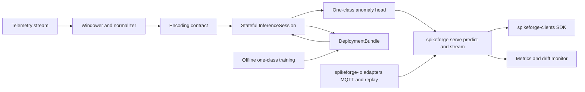

# Spikeforge — UC-5: Anomaly / Intrusion Detection (IoT, Network, Grid)

> A fully scoped production use case. Reuses the UC-1 pipeline
> ([`use_case_streaming_timeseries.md`](plans/use_case_streaming_timeseries.md));
> consumes the shared enablers from
> [`production_toolkit_plan.md`](plans/production_toolkit_plan.md); listed in the
> umbrella [`production_use_cases.md`](plans/production_use_cases.md).

**One-line summary.** Flag unusual patterns in always-on telemetry (IoT, network
flows, grid/sensor channels) **without labels**, on CPU/edge with **no
neuromorphic chip**.

**What it demonstrates.** An unsupervised / one-class SNN monitor: the same
temporal trunk as UC-1 with an anomaly head, driven by the sparse runtime, with an
explicit false-positive budget and a drift alarm.

Design/spec only. Every claim about current code is grounded in a file/line
reference so a Code-mode agent can execute this file-by-file. **No
implementation starts in this document.**

---

## 1. Problem and users

**What.** Given a continuous multivariate stream (network-flow features, IoT
telemetry, grid/sensor channels), score each window as normal/anomalous with a
false-positive budget, adapt to slow drift, and estimate sparse-runtime cost — on
CPU/edge with no neuromorphic hardware.

**Users.** Security/OT teams adding an unsupervised monitor beside existing
signatures; reliability engineers watching grid/IoT fleets; researchers needing a
runnable one-class SNN baseline.

**Why SNN here.** Temporal dynamics plus low-power always-on monitoring: state
lives in membrane potentials, updates are sparse, and the sparse runtime maps to
edge CPUs. Unsupervised operation avoids the label scarcity of intrusion data.

**Success criteria (SLAs).**
- Quality: window AUROC ≥ 0.80 and AUPRC above the dataset-specific positive
  rate floor on a held-out anomaly split (CIC-style network flows); AUROC ≥ 0.70
  on the synthetic CI fixture.
- False positives: ≤ a configured **false-positive rate per day** (e.g. ≤ 20 FP/day
  per stream) at the chosen threshold, picked on validation only.
- Drift: a drift alarm fires when input statistics move beyond a configured
  distance (e.g. KS / PSI), reported, not silently absorbed.
- Zero hardware: CPU/edge; energy stays `estimate: true` via the sparse runtime.

---

## 2. Reference architecture

---

## 3. Offline: data, encoding, model, training

### 3.1 Data
- **Sources:** a public network-intrusion dataset (CIC-IDS-style) for the real
  adapter; a deterministic synthetic generator with injected anomalies for CI,
  paralleling [`stream_source.py`](spikeforge/streaming/stream_source.py:1).
- **Contract:** frozen `preprocessing.json` (window `L`, stride 1, channel order,
  train-fitted z-score) stored in the bundle (W2) — identical discipline to UC-1.
- **Repo fit:** windowing/normalization belongs to `spikeforge-io`
  ([`windowing.py`](spikeforge_io/windowing.py:1)); MQTT/Kafka adapters are W7.

### 3.2 Encoding
- **Primary coding:** `delta` over the window (change is the anomaly signal) with
  `rate` as the baseline; frozen [`EncodeSpec`](spikeforge/serving/encode_spec.py:1).
- **Input shape:** `[T, B, L, D]` windows, matching
  [`sequence_presets.py`](spikeforge/topology/sequence_presets.py:1).

### 3.3 Model
- **Topology:** the UC-1 `sequence_mlp` trunk (NIR-exportable) as the primary;
  `fc_small` as the tabular baseline. Declared once as a
  [`TopologySpec`](spikeforge/topology/spec.py:1).
- **Head:** **one-class** score — `1 - max softmax` (UC-1's additive rule) or an
  energy/negative-log-likelihood score — with the threshold set on the **train**
  score distribution (a rule, not a per-test fit). No separate one-class network
  is required for the MVP.
- **Reuse:** [`TrainingEngine`](spikeforge/training/training_engine.py:1),
  surrogate gradients, checkpointing
  ([`checkpoint_mixin.py`](spikeforge/training/checkpoint_mixin.py:75)).

### 3.4 Evaluation
- Window AUROC / AUPRC with a false-positive budget; score-distribution plots.
- **Sparse-runtime cost:** op counts and `estimate: true` energy from
  [`accounting.py`](spikeforge_targets/energy/accounting.py:1) via the sparse
  runner ([`sparse_runner.py`](spikeforge_targets/event_runtime/sparse_runner.py:1)).
- **Drift:** input-statistic and score-distribution distances; alarm threshold.
- Validation: NIR drift + determinism
  ([`determinism.py`](spikeforge/tracking/determinism.py:82)); manifest per run
  ([`manifest.py`](spikeforge/tracking/manifest.py:35)).

---

## 4. Online: bundle, runtime, service

### 4.1 Deployment bundle
- `model.spkf` with `manifest.json` (spec, versions, expected metrics, anomaly
  threshold), `weights.pt`, `encode_config.json`, `preprocessing.json`,
  `graph.nir.json`, checksums/signature.
- Anchors: [`bundle.py`](spikeforge/serving/bundle.py:1),
  [`bundle_manifest.py`](spikeforge/serving/bundle_manifest.py:1).

### 4.2 Stateful runtime
- `InferenceSession.load(bundle)`, `.reset()`, `.step(frame) -> Prediction`,
  `.run_stream(frames)`; state via
  [`StateTree`](spikeforge/serving/state_tree.py:1); the sparse runtime path is
  reused from the event runtime for cost estimation.
- Shares the per-step body with the closed loop
  ([`step.py`](spikeforge/serving/step.py:1)).

### 4.3 Service
- `spikeforge-serve`: `POST /v1/predict`, `POST /v1/reset`, `GET|WS /v1/stream`,
  `GET /health`, `GET /metrics`, `GET /v1/bundle`
  ([`app.py`](spikeforge_serve/app.py:1), [`service.py`](spikeforge_serve/service.py:1)).
- Long-lived per-stream sessions (always-on); bounded batching; concurrency cap;
  auth; stream backpressure; the anomaly threshold is read from the bundle.

### 4.4 Clients and I/O
- `spikeforge-clients` SDKs call `predict`/`stream`
  ([`client.py`](spikeforge_clients/client.py:1)).
- `spikeforge-io` adapters (MQTT/Kafka/replay) feed the stream
  ([`adapters.py`](spikeforge_io/adapters.py:64), [`replay.py`](spikeforge_io/replay.py:1)).

### 4.5 Observability
- Prometheus over the registry ([`registry.py`](spikeforge/observability/registry.py:1)):
  latency histogram, throughput, spike sparsity, anomaly-score distribution,
  alarm count, FP-rate proxy, drift distance.
- Serving benchmark p50/p99 + throughput, wired into the regression gate
  ([`compare.py`](spikeforge/benchmark/compare.py:123)).

### 4.6 Compression option
- Unstructured pruning to ~50–70% sparsity via
  [`pruning.py`](spikeforge/compression/pruning.py:1) plus weight-only
  quantization ([`quantize.py`](spikeforge_targets/quantize.py:103)); the induced
  AUROC drift from [`PruningReport`](spikeforge/compression/pruning.py:48) is
  recorded, and a regression beyond tolerance refuses the artifact.

### 4.7 Test-deploy matrix row
- Test-deploy the `sequence_mlp` topology on `reference`, `norse`, and
  `lava_loihi2` with a parity report
  ([`test_deploy.py`](spikeforge_targets/test_deploy.py:1)); `estimate: true`,
  `available: false` with a reason when an SDK is absent.

---

## 5. Phased delivery

| Phase | Deliverable | Depends on | Acceptance |
|---|---|---|---|
| P0 | Data adapter + synthetic anomaly generator + frozen windowing spec | — | windowing reproducible; z-score frozen |
| P1 | `sequence_mlp` one-class score trained; AUROC/AUPRC + manifest | P0 | AUROC ≥ 0.80; NIR validates |
| P2 | `InferenceSession` streaming + sparse-runtime cost report | W1 | streaming readout == closed-loop `run`; cost recorded `estimate: true` |
| P3 | `DeploymentBundle` export/import incl. threshold | W1 | fresh-process rebuild exact; tamper refused |
| P4 | `spikeforge-serve` `/predict` + `/stream` + `/reset` | W2, W3 | parity with in-process; reset works |
| P5 | `/metrics`, FP-rate + drift alarm CI gate, serving benchmark | W6 | FP/day ≤ floor; drift alarm fires on shifted input |
| P6 | Container, promotion/rollback, retrain trigger | W7 | promote/rollback demo; retrain trigger fires |

**MVP = P0–P4.** That is the smallest end-to-end slice that demonstrates the
chip-less unsupervised-monitoring story.

---

## 6. Dependencies and out of scope

**Depends on:** PT-W1 (released `spikeforge/serving/` — this is the W1 use case
alongside UC-1); PT-W2 (frozen [`EncodeSpec`](spikeforge/serving/encode_spec.py:1));
PT-W3 `spikeforge-serve`; PT-W5 compression; PT-W6 observability; PT-W7 I/O
adapters. Tracked by umbrella issue #12; reference implementation UC-1 (released
in spikeforge 0.3.0).

**Out of scope:** supervised multi-class attack classification; measured power
(`estimate: true`); automated response/blocking actions; threat-intel enrichment;
modeling attacks on the detector itself.

## 7. Risks

| Risk | Mitigation |
|---|---|
| Unlabelled data makes the story weak | use a public dataset with known anomalies for reporting; keep the synthetic fixture for CI |
| False-positive budget hard to meet | tune threshold on validation; report FP/day; keep classification variant available |
| Drift adapts away real attacks | alarm + human review, never silent auto-adaptation in the MVP |
| Pruning collapses the tail of the score | re-check AUROC after compression; refuse on regression |

## 8. GitHub issue payload

- **Title:** `[UC-5] Anomaly / intrusion detection for IoT, network, grid`
- **Labels:** `enhancement`, `architecture`
- **Body:** see `plans/use_case_intrusion_anomaly_detection.md` — goal, reference
  architecture (encode → `InferenceSession` → one-class head → `spikeforge-serve`
  → clients/io → `/metrics` + drift), delta primary coding, `sequence_mlp`,
  sparse-runtime energy `estimate: true`, acceptance (AUROC ≥ 0.80, FP/day ≤
  floor, drift alarm fires), MVP phases P0–P4, dependencies PT-W1/W2/W3/W5/W6/W7.
