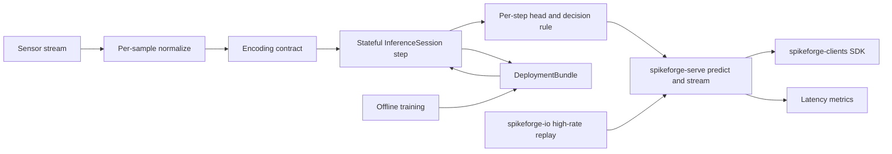

# Spikeforge — UC-4: Ultra-Low-Latency Sensor-Stream Inference

> A fully scoped production use case. Extends the reference slice in
> [`use_case_streaming_timeseries.md`](plans/use_case_streaming_timeseries.md);
> consumes the shared enablers from
> [`production_toolkit_plan.md`](plans/production_toolkit_plan.md); listed in the
> umbrella [`production_use_cases.md`](plans/production_use_cases.md).

**One-line summary.** Per-sample decisions on radar/LiDAR/RF/vibration streams
with hard latency bounds, on CPU with **no neuromorphic chip**.

**What it demonstrates.** The SNN's deterministic per-step latency: decisions are
made incrementally as samples arrive, without buffering a full window, and the
value is measured in p50/p99 scheduling — not power.

Design/spec only. Every claim about current code is grounded in a file/line
reference so a Code-mode agent can execute this file-by-file. **No
implementation starts in this document.**

---

## 1. Problem and users

**What.** Given a high-rate sensor stream (radar/LiDAR/RF/vibration samples
arriving per step), emit a decision or score every K samples with a hard bound on
**p99 end-to-end latency** and jitter, running on CPU (GPU optional) with no
neuromorphic hardware.

**Users.** Real-time signal engineers (radar/RF/SDR, tactile/vibration sensing);
robotics teams that need a bounded control-loop decision; researchers comparing
temporal SNN latency against framed baselines.

**Why SNN here.** A recurrent spiking model carries state across steps, so a
decision needs only the current sample plus carried membrane state — no fixed
frame buffer — and per-step work is bounded and deterministic, which is what
real-time budgets require.

**Success criteria (SLAs).**
- Latency: p99 end-to-end per-decision latency ≤ the configured budget on CPU
  (target: ≤ 5 ms per step for a small topology); **jitter** bounded (max − p50
  ≤ budget/2).
- Quality: task-specific metric (per-sample accuracy / AUROC) above a
  dataset-specific floor defined at kickoff; the floor is asserted in CI on the
  synthetic fixture.
- Determinism: repeated runs reproduce the same decision sequence for the same
  seed and input ([`determinism.py`](spikeforge/tracking/determinism.py:82)).
- Zero hardware: laptop or small CPU container.

---

## 2. Reference architecture

Legend: the pipeline is deliberately one sample (or one micro-batch) at a time;
the latency harness is the new machinery.

---

## 3. Offline: data, encoding, model, training

### 3.1 Data
- **Sources:** a public radar/RF or vibration dataset plus a synthetic
  high-rate generator for CI (paralleling
  [`sequence_source.py`](spikeforge/data/sequence_source.py:1)).
- **Contract:** per-sample normalization stats and channel order are frozen in
  `preprocessing.json` in the bundle; the stream is `[N, D]` at sensor rate,
  streamed sample-by-sample with no lookahead.
- **Repo fit:** high-rate replay belongs to `spikeforge-io`
  ([`adapters.py`](spikeforge_io/adapters.py:64), [`replay.py`](spikeforge_io/replay.py:1)).

### 3.2 Encoding
- **Primary coding:** `delta` (per-sample temporal change is the signal) with
  `latency` as the alternative for spike-time-sensitive tasks and `rate` as the
  baseline. A frozen [`EncodeSpec`](spikeforge/serving/encode_spec.py:1) pins the
  choice in the bundle.
- **Input shape:** `[T, B, D]` with `T=1` per call in the streaming path; batch
  only for offline training, so per-step cost is bounded.

### 3.3 Model
- **Topology:** `fc_small` (per-step MLP) as the minimal-latency baseline;
  `recurrent_net`/`sequence_mlp` for temporal accuracy when budget allows; a
  latency-tuned `TopologySpec` ([`spec.py`](spikeforge/topology/spec.py:1)).
- **Head:** per-step classifier or score with a decision rule (threshold /
  hysteresis) applied to the carried state.
- **Reuse:** [`TrainingEngine`](spikeforge/training/training_engine.py:1),
  surrogate gradients, checkpointing
  ([`checkpoint_mixin.py`](spikeforge/training/checkpoint_mixin.py:75)).

### 3.4 Evaluation
- Task metric (accuracy / AUROC) above the floor; **latency distribution**
  (p50/p99, jitter, throughput) is a first-class result, not an afterthought.
- Validation: NIR drift and determinism ([`determinism.py`](spikeforge/tracking/determinism.py:82));
  manifest per run ([`manifest.py`](spikeforge/tracking/manifest.py:35)).

---

## 4. Online: bundle, runtime, service

### 4.1 Deployment bundle
- `model.spkf` with `manifest.json` (incl. the latency budget), `weights.pt`,
  `encode_config.json`, `preprocessing.json`, `graph.nir.json`,
  checksums/signature.
- Anchors: [`bundle.py`](spikeforge/serving/bundle.py:1),
  [`bundle_manifest.py`](spikeforge/serving/bundle_manifest.py:1).

### 4.2 Stateful runtime
- `InferenceSession.load(bundle)`, `.reset()`, `.step(frame) -> Prediction`,
  `.run_stream(frames)`; per-step state via
  [`StateTree`](spikeforge/serving/state_tree.py:1). The shared per-step body is
  the artifact under latency test ([`step.py`](spikeforge/serving/step.py:1)).

### 4.3 Service
- `spikeforge-serve`: `POST /v1/predict`, `POST /v1/reset`, `GET|WS /v1/stream`,
  `GET /health`, `GET /metrics`, `GET /v1/bundle`
  ([`app.py`](spikeforge_serve/app.py:1), [`service.py`](spikeforge_serve/service.py:1)).
- Streaming is the primary path; bounded queue depth and backpressure reject
  rather than delay; request timeouts honour the latency budget.

### 4.4 Clients and I/O
- `spikeforge-clients` SDKs drive the stream
  ([`client.py`](spikeforge_clients/client.py:1)); `spikeforge-io` replays a
  recorded high-rate stream at real time into `/v1/stream`
  ([`replay.py`](spikeforge_io/replay.py:1)).

### 4.5 Observability
- Prometheus over the registry ([`registry.py`](spikeforge/observability/registry.py:1)):
  per-request latency histogram (p50/p99/p999), jitter, queue depth, drop count,
  throughput, spike rate per step.
- Serving benchmark: p50/p99 latency, throughput at concurrency N, cold start,
  peak memory — wired into the regression gate
  ([`compare.py`](spikeforge/benchmark/compare.py:123)); **the tail-latency gate
  is the whole point of this use case.**

### 4.6 Compression option
- Optional pruning ([`pruning.py`](spikeforge/compression/pruning.py:1)) to shrink
  per-step cost, with weight-only quantization
  ([`quantize.py`](spikeforge_targets/quantize.py:103)) for edge CPU. Drift is
  recorded; the latency budget is re-checked after compression.

### 4.7 Test-deploy matrix row
- Test-deploy the per-step topology on `reference` and `norse` (and
  `lava_loihi2` if the chain lowers) with a parity report
  ([`test_deploy.py`](spikeforge_targets/test_deploy.py:1)); `estimate: true`,
  `available: false` with a reason when an SDK is absent.

---

## 5. Phased delivery

| Phase | Deliverable | Depends on | Acceptance |
|---|---|---|---|
| P0 | High-rate source adapter + synthetic generator + frozen per-sample spec | — | stream reproducible; normalization frozen |
| P1 | Low-latency topology trained; quality + latency report | P0 | quality above floor; per-step cost measured |
| P2 | `InferenceSession` per-step path + tests | W1 | step latency bounded; state persists |
| P3 | `DeploymentBundle` export/import + tamper check | W1 | fresh-process rebuild is exact |
| P4 | `spikeforge-serve` `/stream` + `/predict` + `/reset` | W2, W3 | in-process parity; backpressure rejects, never delays |
| P5 | `/metrics`, serving benchmark, **p99 tail-latency CI gate** | W6 | p99 ≤ budget in CI; jitter bounded |
| P6 | Container, promotion/rollback, drift monitor, compressed artifact | W7 | promote/rollback demo; drift alarm fires |

**MVP = P0–P4.** That is the smallest end-to-end slice that demonstrates the
chip-less latency story.

---

## 6. Dependencies and out of scope

**Depends on:** PT-W1/W2 (released `spikeforge/serving/` + frozen
[`EncodeSpec`](spikeforge/serving/encode_spec.py:1)); PT-W3 `spikeforge-serve`;
PT-W6 observability + serving benchmarks (**the tail-latency gate**); PT-W7 I/O
adapters. Tracked by umbrella issue #12; reference implementation UC-1 (released
in spikeforge 0.3.0).

**Out of scope:** measured power (`estimate: true`); hard real-time OS/kernel
tuning and CPU pinning beyond best-effort reporting; custom hardware timing;
safety certification.

## 7. Risks

| Risk | Mitigation |
|---|---|
| Python/service overhead dominates per-step cost | benchmark in-process `step` vs served latency; document the split honestly |
| Tail latency noisy in CI | assert p99 with a generous margin plus a jitter bound; record the environment |
| Encoding lookahead sneaks in | encode is strictly one sample; windowing is forbidden in this task |
| Compression regresses latency | re-run the latency gate after pruning/quantization |

## 8. GitHub issue payload

- **Title:** `[UC-4] Ultra-low-latency sensor-stream inference`
- **Labels:** `enhancement`, `architecture`
- **Body:** see `plans/use_case_low_latency_sensor_stream.md` — goal, reference
  architecture (per-sample encode → `InferenceSession.step` → per-step head →
  `spikeforge-serve` → clients/io → `/metrics`), delta primary coding,
  `fc_small`/`recurrent_net`, acceptance (p99 ≤ budget, jitter ≤ budget/2,
  quality above floor), MVP phases P0–P4, dependencies PT-W3/W6/W7.
