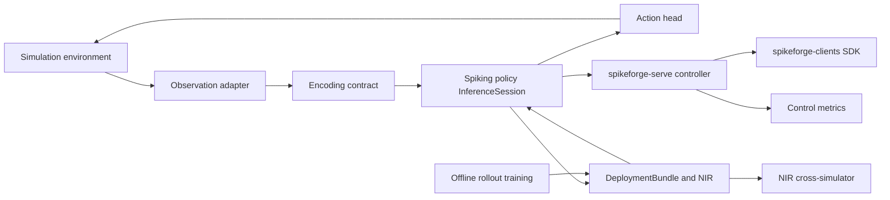

# Spikeforge — UC-7: Reinforcement Learning for Control & Robotics

> A fully scoped production use case. Extends the reference slice in
> [`use_case_streaming_timeseries.md`](plans/use_case_streaming_timeseries.md);
> consumes the shared enablers from
> [`production_toolkit_plan.md`](plans/production_toolkit_plan.md); listed in the
> umbrella [`production_use_cases.md`](plans/production_use_cases.md).

**One-line summary.** Train SNN policies with temporal memory for control in
simulation and deploy the compact, event-driven controller on CPU/embedded — with
**no neuromorphic chip**.

**What it demonstrates.** Recurrent temporal state as a compact controller: a
spiking policy trained in simulation, exported via NIR for cross-simulator
parity, and served as a stateful controller.

Design/spec only. Every claim about current code is grounded in a file/line
reference so a Code-mode agent can execute this file-by-file. **No
implementation starts in this document.**

---

## 1. Problem and users

**What.** Given an environment with observations and a reward, train an SNN
policy whose recurrent state replaces an explicit frame stack, then deploy it as a
stateful controller on CPU/embedded, on hardware with no neuromorphic chip.

**Users.** Robotics/controls engineers; RL researchers exploring neuromorphic
policies; teams that need a compact controller with bounded per-step cost.

**Why SNN here.** A recurrent spiking controller carries temporal state in
membrane potentials, giving memory in a compact, event-driven form and a bounded
per-step compute footprint that suits a control loop.

**Success criteria (SLAs).**
- Return: episode return within a configured fraction (e.g. ≥ 90%) of a dense
  baseline on a standard control task, averaged over ≥ 5 seeds.
- Stability: no seed collapses below a floor return; reported as mean ± spread,
  not a best-of.
- Sample efficiency: episodes-to-threshold within a configured budget; reported
  honestly if worse than the dense baseline.
- Deployability: per-step control latency p99 within the loop budget on CPU;
  NIR export validates and cross-simulator parity holds. Zero hardware.

---

## 2. Reference architecture

Legend: training is a closed interaction loop; deployment reuses the same
per-step body through the stateful runtime.

---

## 3. Offline: data, encoding, model, training

### 3.1 Environment and data
- **Sources:** a standard control environment behind an **env adapter** (a
  Gymnasium-style `reset()/step(action)` duck-typed interface) plus a deterministic
  synthetic environment for CI. The env adapter is the shim between the
  environment's `step` and the spike encode contract (paralleling
  [`sequence_source.py`](spikeforge/data/sequence_source.py:1)).
- **Contract:** the observation normalization and encode choice are frozen in
  `preprocessing.json` in the bundle so a deployed controller encodes identically
  to training (W2).

### 3.2 Encoding
- **Primary coding:** `rate` over a short observation window (robust for control)
  with `delta` as the streaming alternative and `latency` when spike timing
  matters; frozen [`EncodeSpec`](spikeforge/serving/encode_spec.py:1).
- **Input shape:** `[T, B, D]` (or `[T, B, L, D]` when a short history is used),
  matching the sequence/recurrent presets.

### 3.3 Model
- **Topology:** `recurrent_net` for the recurrent policy; the topology
  [`builder.py`](spikeforge/topology/builder.py:1) to compose a compact
  actor/critic trunk. Declared once as a
  [`TopologySpec`](spikeforge/topology/spec.py:1).
- **Heads:** policy/action head (discrete or continuous) plus an optional value
  head; both reuse the same spiking trunk.
- **Training:** a **rollout harness** driving the env adapter with the existing
  per-step simulator body, plus a policy-gradient/surrogate-gradient objective on
  [`TrainingEngine`](spikeforge/training/training_engine.py:1) primitives;
  checkpointing via
  [`checkpoint_mixin.py`](spikeforge/training/checkpoint_mixin.py:75).
- **Cross-sim export:** NIR envelope from
  [`serialization.py`](spikeforge/nir_bridge/serialization.py:52) for
  cross-simulator checks; refusal stays typed (`UnsupportedStageError`).

### 3.4 Evaluation
- Episode return mean ± spread over ≥ 5 seeds vs a dense baseline; samples-to-
  threshold; per-step cost.
- Parity: NIR drift (`within_tolerance`) and determinism
  ([`determinism.py`](spikeforge/tracking/determinism.py:82)); manifest per run
  ([`manifest.py`](spikeforge/tracking/manifest.py:35)).

---

## 4. Online: bundle, runtime, service

### 4.1 Deployment bundle
- `model.spkf` with `manifest.json` (spec, versions, expected return, action
  space), `weights.pt`, `encode_config.json`, `preprocessing.json` (observation
  normalization), `graph.nir.json`, checksums/signature.
- Anchors: [`bundle.py`](spikeforge/serving/bundle.py:1),
  [`bundle_manifest.py`](spikeforge/serving/bundle_manifest.py:1).

### 4.2 Stateful runtime
- `InferenceSession.load(bundle)`, `.reset()` (episode start), `.step(obs) ->
  action`, `.run_stream(observations)`; recurrent state via
  [`StateTree`](spikeforge/serving/state_tree.py:1) — `reset()` maps exactly to an
  environment reset.
- Shares the per-step body with the closed loop so training and deployment cannot
  diverge ([`step.py`](spikeforge/serving/step.py:1)).

### 4.3 Service
- `spikeforge-serve`: `POST /v1/predict` (per-observation action), `POST
  /v1/reset` (episode boundary), `GET|WS /v1/stream`, `GET /health`,
  `GET /metrics`, `GET /v1/bundle`
  ([`app.py`](spikeforge_serve/app.py:1), [`service.py`](spikeforge_serve/service.py:1)).
- Per-episode session ids; bounded batching; concurrency cap; auth; timeouts tied
  to the control-loop budget.

### 4.4 Clients and I/O
- `spikeforge-clients` SDKs drive `predict`/`reset` for a controller
  ([`client.py`](spikeforge_clients/client.py:1)); `spikeforge-io` replays a
  recorded trajectory as a regression fixture
  ([`replay.py`](spikeforge_io/replay.py:1)).

### 4.5 Observability
- Prometheus over the registry ([`registry.py`](spikeforge/observability/registry.py:1)):
  per-step latency histogram, return/episode metrics, spike sparsity, action
  saturation.
- Serving benchmark p50/p99 + throughput, wired into the regression gate
  ([`compare.py`](spikeforge/benchmark/compare.py:123)).

### 4.6 Compression option
- Pruning ([`pruning.py`](spikeforge/compression/pruning.py:1)) plus weight-only
  quantization ([`quantize.py`](spikeforge_targets/quantize.py:103)) to shrink the
  controller; return drift from
  [`PruningReport`](spikeforge/compression/pruning.py:48) is recorded, and a
  regression beyond tolerance refuses the artifact.

### 4.7 Test-deploy matrix row
- Test-deploy the recurrent policy on `reference`, `norse`, and `lava_loihi2`
  with a parity report ([`test_deploy.py`](spikeforge_targets/test_deploy.py:1));
  `estimate: true`, `available: false` with a reason when an SDK is absent.

---

## 5. Phased delivery

| Phase | Deliverable | Depends on | Acceptance |
|---|---|---|---|
| P0 | Env adapter + rollout harness + deterministic CI env | — | rollout reproducible; observation spec frozen |
| P1 | Recurrent spiking policy trained; return/sample-efficiency report | P0 | return ≥ 90% of dense baseline over ≥ 5 seeds |
| P2 | `InferenceSession` controller (`step`/`reset`) + tests | W1 | deployed rollout == training rollout within tolerance |
| P3 | `DeploymentBundle` + NIR export + tamper check | W1 | fresh-process rebuild exact; NIR validates |
| P4 | `spikeforge-serve` `/predict` + `/reset` + `/stream` | W2, W3 | in-process parity; reset at episode boundary |
| P5 | `/metrics`, control-loop latency CI gate, serving benchmark | W6 | p99 within loop budget in CI |
| P6 | Container, promotion/rollback, drift/return monitor | W7 | promote/rollback demo; return-regression alarm fires |

**MVP = P0–P4.** That is the smallest end-to-end slice that demonstrates the
chip-less control story.

---

## 6. Dependencies and out of scope

**Depends on:** PT-W1 (released `spikeforge/serving/` stateful runtime + bundle);
PT-W2 (frozen [`EncodeSpec`](spikeforge/serving/encode_spec.py:1)); PT-W3
`spikeforge-serve`; PT-W6 observability/benchmarks; PT-W7 I/O adapters. Tracked by
umbrella issue #12; reference implementation UC-1 (released in spikeforge 0.3.0).

**Out of scope:** real-robot sim-to-real transfer claims (simulation-trained
only); measured power (`estimate: true`); safety certification; distributed
multi-agent training; online learning on the deployed controller.

## 7. Risks

| Risk | Mitigation |
|---|---|
| RL returns are noisy across seeds | report mean ± spread over ≥ 5 seeds; never best-of |
| Sample inefficiency vs dense baseline | report honestly; scope claims to compactness/latency, not sample efficiency |
| Train/deploy divergence through the env adapter | one frozen encode/preprocessing contract; `reset` maps to episode reset |
| NIR cannot express a stage | keep the topology within NIR-mappable primitives; typed refusal otherwise |

## 8. GitHub issue payload

- **Title:** `[UC-7] Reinforcement learning for control and robotics`
- **Labels:** `enhancement`, `architecture`
- **Body:** see `plans/use_case_rl_control_robotics.md` — goal, reference
  architecture (obs adapter → encode → recurrent `InferenceSession` → action head →
  sim loop; deploy via `spikeforge-serve` → clients → `/metrics`), rate/delta
  coding, `recurrent_net`, acceptance (return ≥ 90% of dense baseline over ≥ 5
  seeds, p99 within loop budget), MVP phases P0–P4, dependencies PT-W3/W6/W7.
