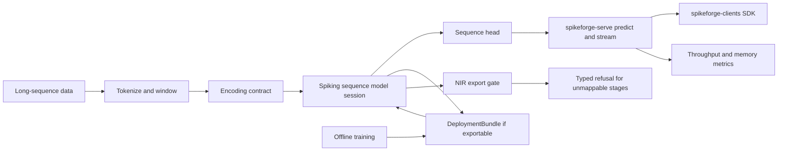

# Spikeforge — UC-8: Efficient Sequence Models / Spiking Transformers

> A fully scoped production use case. Extends the reference slice in
> [`use_case_streaming_timeseries.md`](plans/use_case_streaming_timeseries.md);
> consumes the shared enablers from
> [`production_toolkit_plan.md`](plans/production_toolkit_plan.md); listed in the
> umbrella [`production_use_cases.md`](plans/production_use_cases.md).

**One-line summary.** Model long sequences with spiking attention, benchmark the
efficiency case against a dense baseline on GPU, and define a **contract for an
exportable spiking attention primitive** — with **no neuromorphic chip**.

**What it demonstrates.** The research frontier: spiking attention today is
`sequence_attn` — **simulation-only**, with export refused via a typed
`UnsupportedStageError` ([`stages_unmappable.py`](spikeforge/nir_bridge/stages_unmappable.py:1)).
This use case turns that honest boundary into an explicit, testable contract and a
long-sequence efficiency benchmark.

Design/spec only. Every claim about current code is grounded in a file/line
reference so a Code-mode agent can execute this file-by-file. **No
implementation starts in this document.**

---

## 1. Problem and users

**What.** Train and serve long-sequence spiking models (including
`sequence_attn`) on GPU, measure quality and efficiency against a dense baseline,
and specify the conditions under which an attention stage becomes **NIR-exportable**
(and therefore deployable through the standard bundle path).

**Users.** Sequence-modeling researchers; teams evaluating SNNs for very long
sequences; maintainers who need the export boundary to be explicit rather than
implicit.

**Why SNN here.** Potential efficiency at long sequence lengths from sparse,
event-driven updates; this is a research use case where the honest question is
"where does it win, and where can it not yet be exported?"

**Success criteria (SLAs).**
- Quality: task metric (accuracy/perplexity) within a configured margin (e.g.
  ≤ 5% relative) of a matched dense baseline on the chosen long-sequence task, or
  an honest statement that it does not match.
- Efficiency: throughput and peak memory at long sequence length reported vs the
  dense baseline; a win is claimed only where measured.
- Boundary: every non-exportable stage raises the typed
  `UnsupportedStageError` naming the stage; the **exportable attention contract**
  is specified and enforced by a test.
- Zero hardware: GPU training/serving only; energy stays `estimate: true`.

---

## 2. Reference architecture

---

## 3. Offline: data, encoding, model, training

### 3.1 Data
- **Sources:** a long-sequence benchmark task (e.g. a character/word-level
  sequence corpus or a long time-series set) plus a deterministic synthetic
  long-sequence generator for CI (paralleling
  [`sequence_source.py`](spikeforge/data/sequence_source.py:1)).
- **Contract:** tokenization/windowing and normalization frozen in
  `preprocessing.json` in the bundle; sequence length `T` is a first-class,
  reported parameter.

### 3.2 Encoding
- **Primary coding:** `rate` over the token window as the robust baseline, with
  `delta` as the streaming alternative; frozen
  [`EncodeSpec`](spikeforge/serving/encode_spec.py:1).
- **Input shape:** `[T, B, D]` (or `[T, B, L, D]`), matching the sequence presets
  ([`sequence_presets.py`](spikeforge/topology/sequence_presets.py:1)) and the
  attention stages ([`attention.py`](spikeforge/topology/attention.py:1),
  [`multihead_attention.py`](spikeforge/topology/multihead_attention.py:1)).

### 3.3 Model
- **Topology:** `sequence_attn` (simulation-only) as the primary research model;
  `sequence_mlp` as the exportable control. Declared once as a
  [`TopologySpec`](spikeforge/topology/spec.py:1).
- **Head:** sequence classifier or next-token head.
- **Reuse:** [`TrainingEngine`](spikeforge/training/training_engine.py:1),
  surrogate gradients, AMP/BPTT scale-ups, checkpointing
  ([`checkpoint_mixin.py`](spikeforge/training/checkpoint_mixin.py:75)).
- **Export contract (new deliverable):** define the primitive set an attention
  stage must use to be NIR-mappable, so
  [`stages_unmappable.py`](spikeforge/nir_bridge/stages_unmappable.py:1) refuses
  only what is genuinely unmappable and the contract is documented and tested.

### 3.4 Evaluation
- Quality vs the dense baseline at matched parameter count / compute.
- **Efficiency:** throughput (tokens/s) and peak memory at increasing `T`.
- **Export gate:** the control `sequence_mlp` exports and validates; the
  `sequence_attn` model raises a typed `UnsupportedStageError` naming the stage —
  both asserted by test.
- Validation: NIR drift (`within_tolerance`) where applicable and determinism
  ([`determinism.py`](spikeforge/tracking/determinism.py:82)); manifest per run
  ([`manifest.py`](spikeforge/tracking/manifest.py:35)).

---

## 4. Online: bundle, runtime, service

### 4.1 Deployment bundle
- `model.spkf` with `manifest.json`, `weights.pt`, `encode_config.json`,
  `preprocessing.json`, `graph.nir.json` **only when the model is exportable**,
  checksums/signature. A non-exportable model yields a typed refusal, not a
  broken bundle.
- Anchors: [`bundle.py`](spikeforge/serving/bundle.py:1),
  [`bundle_manifest.py`](spikeforge/serving/bundle_manifest.py:1).

### 4.2 Stateful runtime
- For exportable models: `InferenceSession.load(bundle)`, `.reset()`,
  `.step(frame)`, `.run_stream(frames)`; state via
  [`StateTree`](spikeforge/serving/state_tree.py:1).
- For simulation-only attention models: the closed-loop simulator path remains
  the reference; the session is available but the export gate is explicit.

### 4.3 Service
- `spikeforge-serve`: `POST /v1/predict`, `POST /v1/reset`, `GET|WS /v1/stream`,
  `GET /health`, `GET /metrics`, `GET /v1/bundle` — serving the **exportable**
  control model; the research-only model is served via the in-process simulator
  path ([`app.py`](spikeforge_serve/app.py:1), [`service.py`](spikeforge_serve/service.py:1)).

### 4.4 Clients and I/O
- `spikeforge-clients` SDKs drive the served control model
  ([`client.py`](spikeforge_clients/client.py:1)); `spikeforge-io` supplies
  windowing for long sequences ([`windowing.py`](spikeforge_io/windowing.py:1)).

### 4.5 Observability
- Prometheus over the registry ([`registry.py`](spikeforge/observability/registry.py:1)):
  latency histogram, throughput, peak memory, spike sparsity per stage.
- Serving benchmark p50/p99 + throughput at long `T`, wired into the regression
  gate ([`compare.py`](spikeforge/benchmark/compare.py:123)).

### 4.6 Compression option
- Pruning ([`pruning.py`](spikeforge/compression/pruning.py:1)) plus weight-only
  quantization ([`quantize.py`](spikeforge_targets/quantize.py:103)) to test
  whether the efficiency case survives compression; drift recorded.

### 4.7 Test-deploy matrix row
- Test-deploy the **exportable control** (`sequence_mlp`) on `reference` and
  `norse` (and `lava_loihi2` where it lowers) with a parity report
  ([`test_deploy.py`](spikeforge_targets/test_deploy.py:1)). The attention model
  is **not** a test-deploy row; it reports a typed refusal and the upstream NIR
  primitive gap is named as not-ours.

---

## 5. Phased delivery

| Phase | Deliverable | Depends on | Acceptance |
|---|---|---|---|
| P0 | Long-sequence data adapter + synthetic generator + windowing spec | — | long-`T` windows reproducible |
| P1 | `sequence_attn` + `sequence_mlp` trained at matched size; metrics | P0 | quality vs dense baseline reported honestly |
| P2 | Efficiency harness (throughput/memory vs `T`) | W1 | numbers reproducible on GPU and CPU |
| P3 | **Exportable attention contract** + NIR gate tests | W1 | contract spec'd; typed refusal asserted |
| P4 | `DeploymentBundle` for the exportable control + parity | W1, W2 | fresh-process rebuild exact; tamper refused |
| P5 | `spikeforge-serve` control path + `/metrics` + benchmark | W3, W6 | parity with in-process; p99 within budget |
| P6 | Container, promotion/rollback, benchmark publication | W7 | results published with environment and caveats |

**MVP = P0–P4.** That is the smallest end-to-end slice that demonstrates the
long-sequence research story and makes the export boundary explicit.

---

## 6. Dependencies and out of scope

**Depends on:** PT-W1 (released `spikeforge/serving/`); W2 (frozen
[`EncodeSpec`](spikeforge/serving/encode_spec.py:1)); PT-W6 observability/benchmarks;
PT-W3 for the served control path. Tracked by umbrella issue #12; reference
implementation UC-1 (released in spikeforge 0.3.0).

**Out of scope:** a full temporal SNN in ONNX (ONNX has no temporal spiking
semantics); **NIR primitive gaps that are upstream of this project** (attention
lowering may require upstream changes — named, not promised); measured power
(`estimate: true`); large-scale distributed training.

## 7. Risks

| Risk | Mitigation |
|---|---|
| Efficiency win does not materialize | report honestly; scope claims to where measured; keep `sequence_mlp` as the exportable control |
| Export contract drifts from the NIR gate | one contract spec plus a test asserting the typed refusal and the exportable case |
| Benchmark irreproducibility across GPUs | record environment, seeds, and determinism report with every number |
| Upstream NIR gap blocks deployment | kept explicitly out of scope; the refusal stays typed and named |

## 8. GitHub issue payload

- **Title:** `[UC-8] Efficient sequence models / spiking transformers`
- **Labels:** `enhancement`, `architecture`
- **Body:** see `plans/use_case_spiking_transformers.md` — goal, reference
  architecture (encode → spiking sequence session → head → `spikeforge-serve`
  control → clients → throughput/memory `/metrics`; NIR export gate), rate/delta
  coding, `sequence_attn` (simulation-only) + `sequence_mlp` control, acceptance
  (quality within 5% of dense baseline or honest statement; throughput/memory
  reported; typed `UnsupportedStageError`), MVP phases P0–P4, dependencies
  PT-W1/W2/W3/W6.
