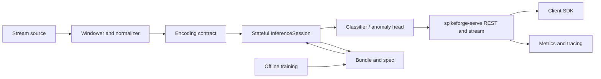

# Spikeforge — UC-1: Streaming Time-Series Classification / Anomaly Detection

> The first fully scoped production use case, and the reference implementation
> for the rest. Consumes the shared enablers from
> [`production_toolkit_plan.md`](plans/production_toolkit_plan.md); listed in the
> umbrella [`production_use_cases.md`](plans/production_use_cases.md).

Design/spec only. Every claim about current code is grounded in a file/line
reference so a Code-mode agent can execute this file-by-file. **No
implementation starts in this document.**

---

## 1. Problem and users

**What.** Given a continuous numeric stream (vibration, machine telemetry,
network-flow features, grid/sensor channels) delivered as windows, produce (a) a
class label or (b) an anomaly score per window, with a bounded per-window
latency, running on CPU (GPU optional), with **no neuromorphic hardware**.

**Users.** Reliability/ML engineers adding a low-latency monitor beside an
existing pipeline; researchers who want a runnable SNN baseline on tabular
time series.

**Why SNN here.** Temporal state is carried in membrane potentials rather than a
framed RNN window; updates are sparse and event-driven; the per-step loop maps
to a streaming sensor without large buffering. This is the use case where the
SNN's structure is an advantage on conventional hardware.

**Success criteria (SLAs).**
- Latency: p99 per-window decision under a configured budget (target: single-digit
  milliseconds on CPU for a small `fc_small`/`sequence_mlp`).
- Quality: classification F1 / balanced accuracy, or anomaly AUROC, above a
  dataset-specific floor defined at kickoff.
- Throughput: N concurrent streams per process without exceeding the latency budget.
- Zero hardware: everything runs on a laptop or a small CPU container.

---

## 2. Reference architecture

Legend: the **offline** half is largely existing; the **online** half is the new
machinery (W1/W2/W3).

---

## 3. Offline: data, encoding, model, training

### 3.1 Data
- **Sources:** one public dataset (e.g. an industrial/telemetry or network-flow
  set) plus a synthetic generator for CI. Window length `L`, stride 1 for
  streaming, per-channel z-score normalization fitted on train only.
- **Contract:** a frozen `preprocessing.json` (normalization stats, window `L`,
  stride, channel order) stored in the bundle (W2). This is what prevents
  train/serve skew.
- **Repo fit:** windowing/normalization belongs to `spikeforge-io` (W7); the
  synthetic generator parallels [`sequence_source.py`](spikeforge/data/sequence_source.py:1).

### 3.2 Encoding
- **Primary coding:** `delta` over the window (temporal change is the signal),
  with `rate` as a fallback baseline; both from
  [`spike_encoder.py`](spikeforge/encoding/spike_encoder.py:1) and frozen in the
  bundle ([`encode_config.schema.json`](protocol/payloads/encode_config.schema.json:1)).
- **Input shape:** `[T, B, L, D]` windows, matching the sequence presets
  ([`sequence_presets.py`](spikeforge/topology/sequence_presets.py:1)) and the
  simulator's `[T, …]` contract.
- **Deliverable:** `spikeforge.serving.preprocess.encode(sample, spec) -> spikes`,
  the single function both training and serving must call (W2).

### 3.3 Model
- **Topology:** `sequence_mlp` (NIR-exportable, `[T, B, L, D]`) as the primary;
  `fc_small`/`fc_legacy` as the tabular baseline. Declared once as a
  `TopologySpec` ([`spec.py`](spikeforge/topology/spec.py:1)).
- **Head:** softmax classifier by default; an **anomaly** variant swaps the head
  for a one-class score (e.g. energy/negative-log-likelihood) while reusing the
  same temporal trunk.
- **Reuse:** [`TrainingEngine`](spikeforge/training/training_engine.py:1),
  surrogate gradients, AMP/BPTT scale-ups, checkpointing
  ([`checkpoint_mixin.py`](spikeforge/training/checkpoint_mixin.py:75)).

### 3.4 Evaluation
- Classification: F1 / balanced accuracy / per-class recall. Anomaly: AUROC /
  AUPRC with a false-positive budget.
- Validation: NIR drift (`within_tolerance`) and determinism
  ([`determinism.py`](spikeforge/tracking/determinism.py:82)).
- A **reproducibility manifest** is written with every run
  ([`manifest.py`](spikeforge/tracking/manifest.py:35)).

---

## 4. Online: bundle, runtime, service

### 4.1 Deployment bundle (W1)
- `model.spkf` with `manifest.json` (spec, versions, expected metrics, label
  map), `weights.pt`, `encode_config.json`, `preprocessing.json`,
  `graph.nir.json`, checksums/signature. Built from a checkpoint + the frozen
  encode/preprocessing specs.
- Anchors: [`model_store.py`](spikeforge/network/model_store.py:41),
  [`serialization.py`](spikeforge/nir_bridge/serialization.py:52).

### 4.2 Stateful runtime (W1)
- `InferenceSession.load(bundle)`, `.reset()`, `.step(frame) -> Prediction`,
  `.run_stream(frames)`; carried state serializable via a `StateTree`
  (numpy-tagged, like [`array_codec.py`](spikeforge/nir_bridge/array_codec.py:1)).
- Shares the per-step body with the closed loop extracted from
  [`execution.py`](spikeforge/simulator/execution.py:1), so streaming and batch
  cannot diverge. `Trajectory` and `run()` stay unchanged.

### 4.3 Service (W3)
- `spikeforge-serve` endpoints: `POST /v1/predict`, `POST /v1/reset`,
  `GET|WS /v1/stream`, `GET /health`, `GET /metrics`, `GET /v1/bundle`.
- Per-stream session ids; batching; concurrency cap; auth token; timeouts.
- One model (classification or anomaly) per process by default; multi-model
  routing is a later extension.

### 4.4 Observability (W6)
- Prometheus/OTel over [`observability/registry.py`](spikeforge/observability/registry.py:1):
  request latency histogram, throughput, queue depth, spike rate/sparsity per
  stage, anomaly-score distribution.
- Serving benchmark: p50/p99 latency, throughput at concurrency N, cold start,
  peak memory, wired into the regression gate
  ([`compare.py`](spikeforge/benchmark/compare.py:123)).

### 4.5 Delivery & operations (W7)
- Minimal inference container + compose profile; promotion `dev -> staging -> prod`
  with an approver and a signed bundle; rollback = repoint to the prior bundle.
- Drift: monitor input statistics and score distribution; retrain trigger.

---

## 5. Phased delivery

| Phase | Deliverable | Depends on | Acceptance |
|---|---|---|---|
| P0 | Data + synthetic generator + windowing spec | — | windowing reproducible; z-score frozen |
| P1 | `sequence_mlp` trained on the dataset; metrics + manifest | P0 | F1/AUROC above the floor; NIR validates |
| P2 | `InferenceSession` (`step`/`reset`/`run_stream`) + tests | W1 | streaming readout == closed-loop `run` within tolerance |
| P3 | `DeploymentBundle` export/import | W1 | fresh-process rebuild is exact; tamper is refused |
| P4 | `spikeforge-serve` `/predict` + `/stream` + `/health` | W2, W3 | parity with in-process; state persists; reset works |
| P5 | `/metrics`, serving benchmark, CI latency gate | W6 | p99 within budget in CI |
| P6 | Container, rollback, drift monitor | W7 | promote/rollback demo; drift alarm fires |

**MVP = P0–P4.** That is the smallest end-to-end slice that demonstrates the
chip-less production story.

---

## 6. Ticket breakdown (seeds)

- **UC1-a** Data adapter + synthetic generator + frozen windowing spec.
- **UC1-b** `sequence_mlp` baseline + anomaly head + evaluation report.
- **UC1-c** `spikeforge/serving/` stateful `InferenceSession` (W1).
- **UC1-d** `DeploymentBundle` build/load + tamper check (W1).
- **UC1-e** Encode-at-inference shared function + bundle wiring (W2).
- **UC1-f** `spikeforge-serve` endpoints + session store + auth (W3).
- **UC1-g** Metrics/tracing + serving benchmark + CI latency gate (W6).
- **UC1-h** Container + promotion/rollback + drift monitor (W7).

## 7. Out of scope

- Neuromorphic hardware timing/energy (needs silicon; energy stays `estimate: true`).
- Full temporal ONNX (by design; NIR is the temporal graph).
- Distributed multi-model serving and autoscaling (later).
- Any claim of measured power.

## 8. Risks

| Risk | Mitigation |
|---|---|
| Dataset choice weakens the story | pick a set with a genuine temporal signal; keep the synthetic CI fixture |
| Encoding mismatch train vs serve | W2 forces one `encode` function; bundle pins the spec |
| Latency budget unmet on CPU | start at `sequence_mlp`/`fc_small`, profile in P5, prune via W5 if needed |
| Anomaly head underperforms | keep classification as the primary deliverable; anomaly as an additive head |
